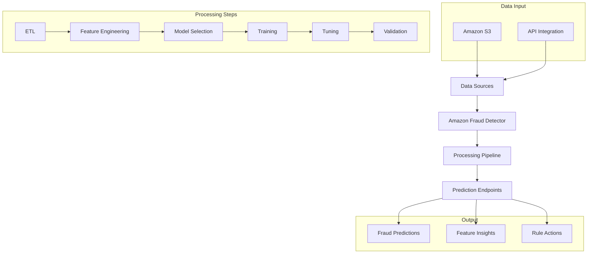
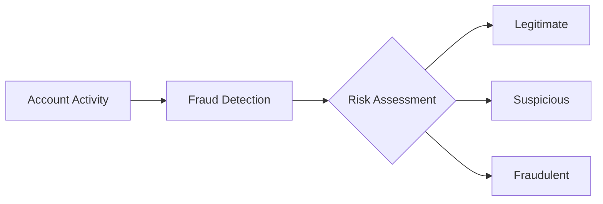
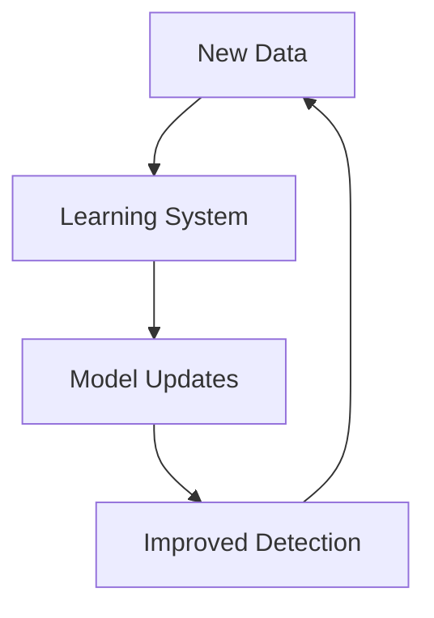

# Amazon Fraud Detector

## Tổng quan
Amazon Fraud Detector là dịch vụ ML được quản lý hoàn toàn, chuyên phát hiện các hoạt động gian lận. Dịch vụ tự động tạo và tối ưu models dựa trên dữ liệu của khách hàng.

## Kiến trúc & Quy trình

## Use Cases

### 1. Payment Fraud
- Online transactions
- Payment patterns
- Suspicious activities
- Risk assessment

### 2. Account Fraud

### 3. Trial Abuse
- Program misuse
- Multiple accounts
- Pattern detection
- Prevention strategies

### 4. Account Takeover
- Unauthorized access
- Behavior analysis
- Security measures
- Real-time detection

## Implementation Process

### 1. Setup Steps
1. Choose business use case
2. Create event type
3. Define entities
4. Configure data source
5. Set up IAM permissions

### 2. Model Development
- Automatic model selection
- Feature engineering
- Training optimization
- Performance validation

### 3. Deployment
- Review performance
- Deploy endpoints
- Monitor results
- Continuous learning

## Integration Features

### 1. Data Ingestion
- S3 integration
- API endpoints
- Real-time data
- Batch processing

### 2. SageMaker Integration
- Custom code
- Extended functionality
- Complex workflows
- Advanced customization

### 3. Rule-based Actions
- Custom rules
- Action triggers
- Response automation
- Alert systems

## Model Variables & Insights

### 1. Feature Importance
- Key indicators
- Risk factors
- Pattern analysis
- Correlation metrics

### 2. Continuous Learning

## Best Practices

### 1. Data Preparation
- Quality data
- Sufficient volume
- Balanced datasets
- Regular updates

### 2. Model Optimization
- Performance monitoring
- Threshold tuning
- Rule refinement
- Feedback integration

### 3. Operational Efficiency
- API monitoring
- Cost management
- Resource optimization
- Security compliance

## Security Considerations

### 1. Data Protection
- Encryption
- Access control
- Audit logging
- Compliance

### 2. API Security
- Authentication
- Authorization
- Rate limiting
- Monitoring