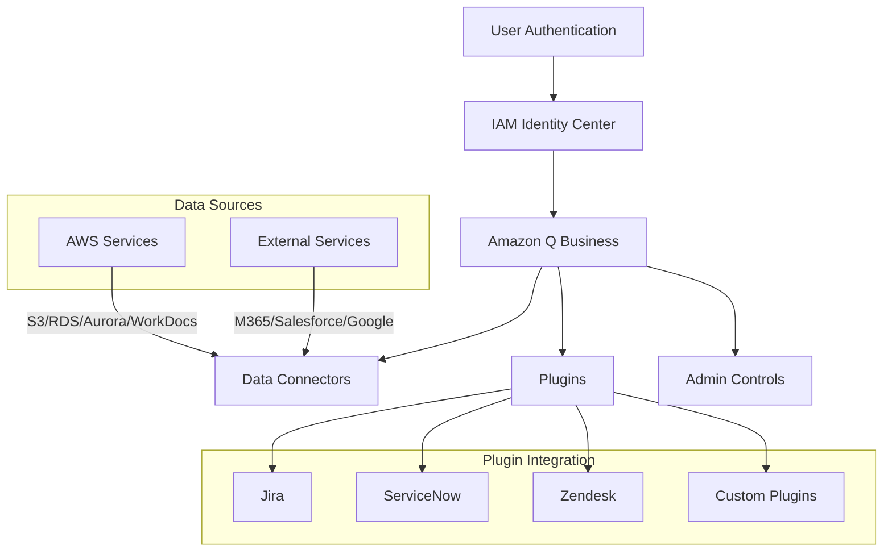
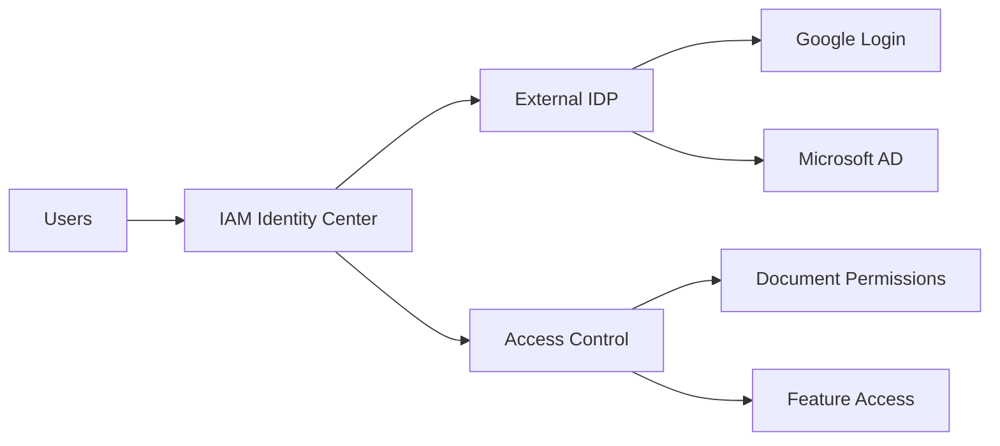
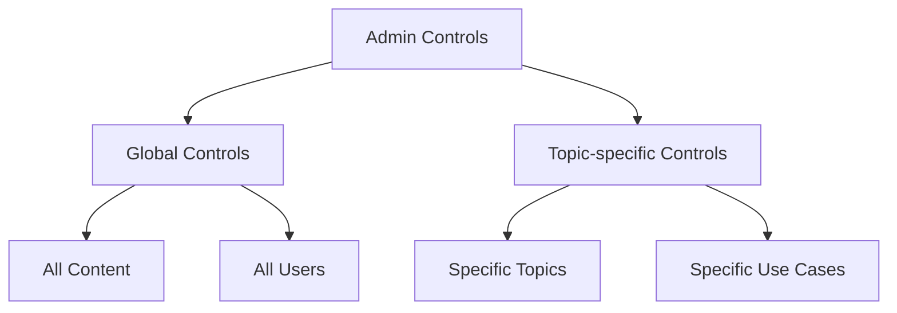

# Amazon Q Business

## Tổng quan
Amazon Q Business là trợ lý Gen-AI được quản lý hoàn toàn dành cho doanh nghiệp, được xây dựng trên Amazon Bedrock và tập trung vào dữ liệu nội bộ của công ty.

## Kiến trúc và Components



## Core Features

### 1. Data Connectors (RAG)
- **AWS Services**:
  * Amazon S3
  * Amazon RDS
  * Amazon Aurora
  * Amazon WorkDocs

- **External Services**:
  * Microsoft 365
  * Salesforce
  * Google Drive
  * Gmail
  * Slack
  * SharePoint

### 2. Authentication & Access Control



### 3. Plugin System
- Task automation
- Third-party integration
- Custom API connections
- Workflow automation

## Use Cases

### 1. Document & Knowledge Management
```text
Q: "What was discussed during the team meeting on 4/12?"
A: [Context from meeting notes with source citation]
```

### 2. HR & Administrative Tasks
- Job posting creation
- Social media content
- Time-off requests
- Meeting scheduling

### 3. Information Access
- Health plan details
- Company policies
- Internal documentation
- Team communications

## Admin Controls

### 1. Content Restrictions
- Blocked topics
- Restricted words
- Content filtering
- Usage policies

### 2. Information Sources
- Internal only
- External knowledge
- Combined sources
- Source prioritization

### 3. Control Levels


## Security & Compliance

### 1. Authentication
- IAM Identity Center integration
- External IDP support
- Single Sign-On
- Access management

### 2. Data Protection
- Document-level security
- Permission inheritance
- Encryption
- Audit logging

### 3. Compliance Controls
- Data residency
- Access policies
- Usage monitoring
- Policy enforcement

## Best Practices

### 1. Implementation
- Start with key data sources
- Define clear use cases
- Plan access controls
- Monitor usage patterns

### 2. Content Management
- Regular updates
- Source verification
- Quality control
- Content organization

### 3. User Management
- Clear access policies
- Training programs
- Usage guidelines
- Support processes