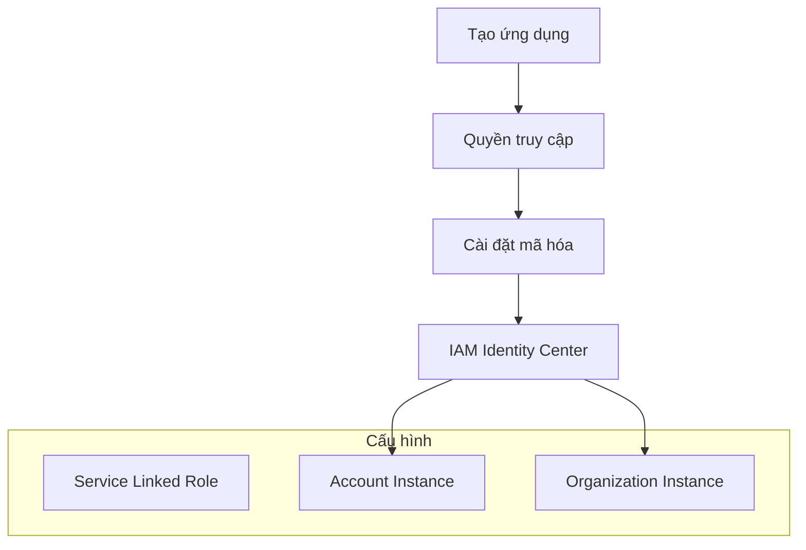
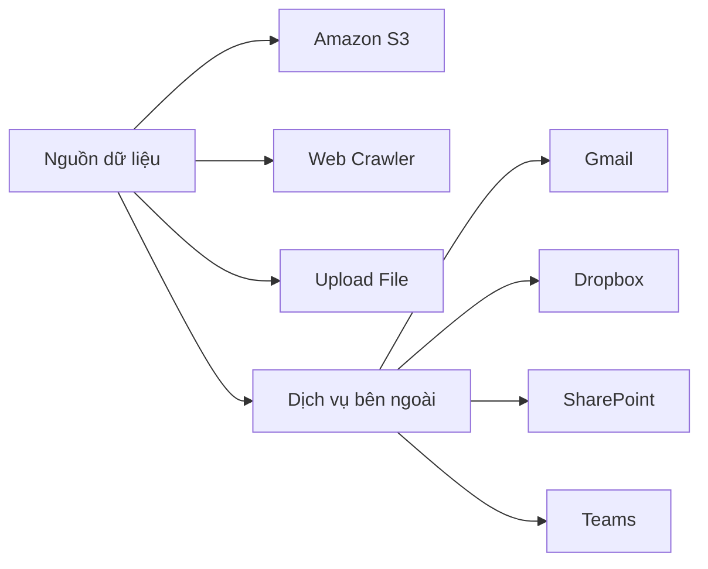
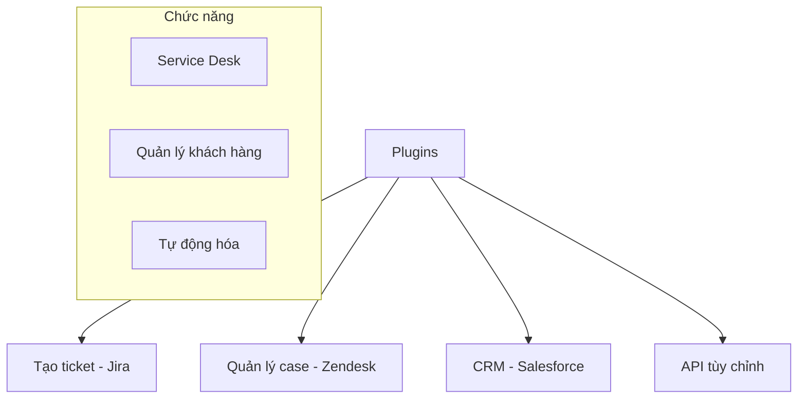

# Amazon Q Business - Hướng dẫn chi tiết

## Tổng quan
Amazon Q Business là trợ lý AI được quản lý hoàn toàn, được xây dựng cho doanh nghiệp để tận dụng dữ liệu nội bộ công ty thông qua công nghệ Gen-AI.

## Quy trình Thiết lập

### 1. Tạo Ứng dụng

### 2. Cấu hình Retriever
- **Lựa chọn Retriever**:
  * Native Retriever
  * Amazon Kendra

- **Cấu hình Index**:
  * Starter: Tối đa 100k tài liệu
  * Enterprise: Triển khai quy mô lớn
  * Đơn vị Index: 1-5 đơn vị (20k tài liệu/đơn vị)

### 3. Kết nối Nguồn Dữ liệu

## Quản lý Người dùng

### 1. Thiết lập IAM Identity Center
1. **Thêm người dùng**:
   - Tên người dùng
   - Xác thực email
   - Cài đặt mật khẩu
   - Cấu hình MFA

2. **Kiểm soát truy cập**:
   - Quản lý nhóm
   - Phân công người dùng
   - Cài đặt quyền

### 2. Gói Đăng ký
- **Q Business Lite**: 
  * Giá: $3/người dùng/tháng
  * Tính năng cơ bản

- **Q Business Pro**:
  * Giá: $20/người dùng/tháng
  * Tính năng nâng cao

- **Dùng thử**:
  * 60 ngày
  * Tối đa 50 người dùng
  * 750 giờ index/30 ngày

## Kiểm soát Admin

### 1. Kiểm soát Toàn cục
- Fallback LLM Knowledge
- Hạn chế phản hồi
- Lọc nội dung

### 2. Kiểm soát Theo Chủ đề
- Guardrails tùy chỉnh
- Hạn chế chủ đề
- Hướng dẫn nội dung

## Quản lý Nguồn Dữ liệu

### 1. Tích hợp S3
- Chọn bucket
- Cấu hình IAM role
- Cài đặt đồng bộ
- Mapping trường dữ liệu

### 2. Cấu hình Đồng bộ
- **Loại đồng bộ**:
  * Toàn bộ
  * Tăng dần
- **Lịch đồng bộ**:
  * Theo yêu cầu
  * Hàng giờ
  * Hàng ngày
  * Hàng tuần
  * Hàng tháng

## Tích hợp Plugin

### 1. Plugin Có sẵn

## Các Bước Thực hiện

### 1. Thiết lập Ban đầu
1. Tạo ứng dụng
2. Cấu hình retriever
3. Kết nối nguồn dữ liệu
4. Thiết lập người dùng

### 2. Quản lý Chi phí
- Theo dõi sử dụng
- Kiểm soát giờ index
- Phân bổ người dùng
- Tối ưu hóa tài nguyên

### 3. Tổ chức Nội dung
- Đồng bộ thường xuyên
- Kiểm tra nguồn
- Cập nhật nội dung
- Theo dõi hiệu suất

## Lưu ý Quan trọng

### 1. Bảo mật
- Cấu hình MFA
- Chính sách mật khẩu
- Quản lý phiên
- Kiểm soát truy cập

### 2. Hiệu suất
- Tối ưu index
- Quản lý tài nguyên
- Theo dõi sử dụng
- Báo cáo vấn đề