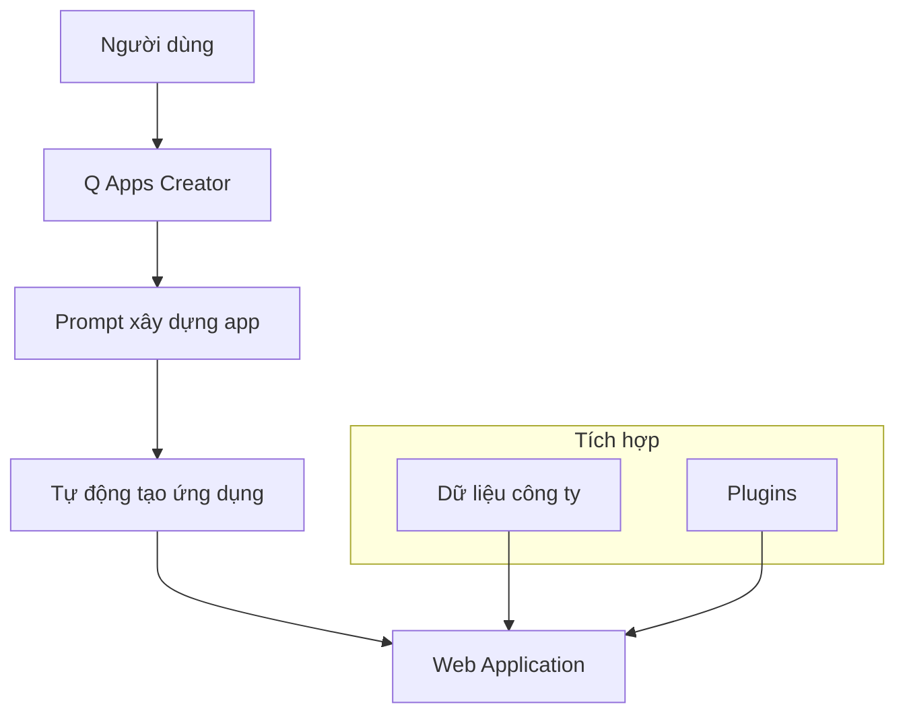
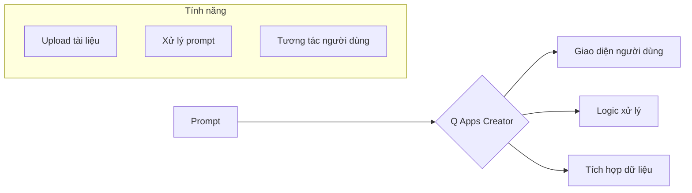

# Amazon Q Apps

## Tổng Quan
Amazon Q Apps là một thành phần của Q Business cho phép tạo các ứng dụng AI mà không cần viết code, chỉ cần sử dụng ngôn ngữ tự nhiên để mô tả ứng dụng mong muốn.

## Kiến Trúc Hệ Thống

## Quy Trình Tạo Ứng Dụng

### 1. Mô tả ứng dụng
- Sử dụng ngôn ngữ tự nhiên
- Xác định mục đích
- Chỉ định tính năng
- Yêu cầu đặc biệt

### 2. Tự động xây dựng

## Tính Năng Chính

### 1. No-Code Development
- Tạo ứng dụng bằng prompt
- Giao diện trực quan
- Tùy chỉnh dễ dàng
- Triển khai nhanh chóng

### 2. Tích Hợp Dữ Liệu
- Kết nối dữ liệu nội bộ
- Xử lý tài liệu
- Tìm kiếm thông tin
- Phân tích nội dung

### 3. Plugin Support
- Tích hợp các plugin sẵn có
- Mở rộng chức năng
- Tự động hóa quy trình
- Tùy chỉnh workflow

## Ứng Dụng Thực Tế

### 1. Tài Liệu & Tri Thức
- Quản lý tài liệu
- Tìm kiếm thông tin
- Tổng hợp nội dung
- Phân tích dữ liệu

### 2. Tự Động Hóa
- Xử lý form
- Quản lý workflow
- Tạo báo cáo
- Phân tích dữ liệu

### 3. Tương Tác Người Dùng
- Chatbot tùy chỉnh
- Hỗ trợ khách hàng
- FAQ tự động
- Phản hồi thông minh

## Lợi Ích

### 1. Cho Doanh Nghiệp
- Giảm thời gian phát triển
- Tiết kiệm chi phí
- Tăng hiệu quả
- Đổi mới nhanh chóng

### 2. Cho Người Dùng
- Dễ dàng sử dụng
- Không cần kỹ năng lập trình
- Tùy chỉnh linh hoạt
- Kết quả nhanh chóng

## Best Practices

### 1. Thiết Kế Ứng Dụng
- Xác định mục tiêu rõ ràng
- Mô tả chi tiết yêu cầu
- Tối ưu prompt
- Kiểm tra kết quả

### 2. Quản Lý Dữ Liệu
- Cập nhật thường xuyên
- Đảm bảo chất lượng
- Kiểm soát truy cập
- Bảo mật thông tin

### 3. Triển Khai
- Test kỹ lưỡng
- Thu thập feedback
- Cải thiện liên tục
- Đào tạo người dùng