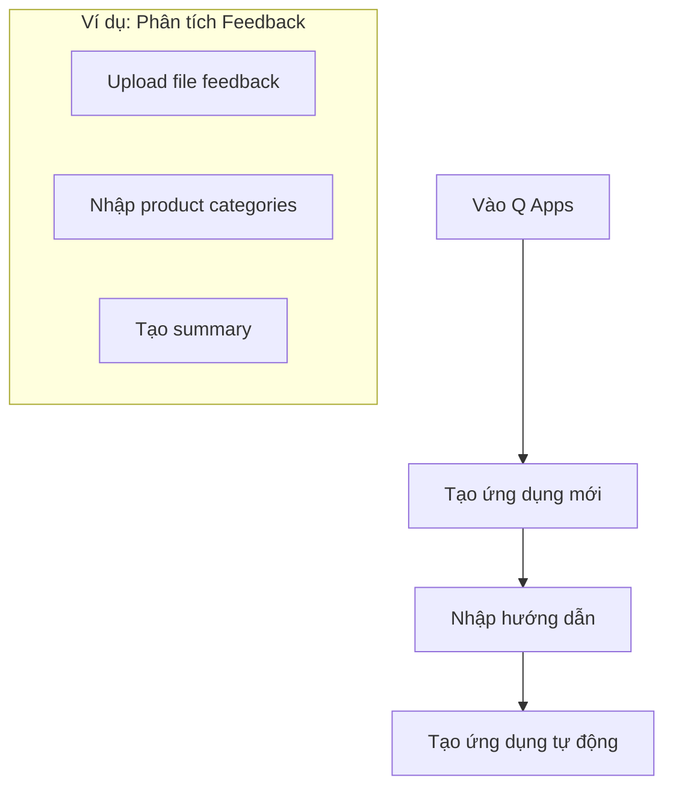
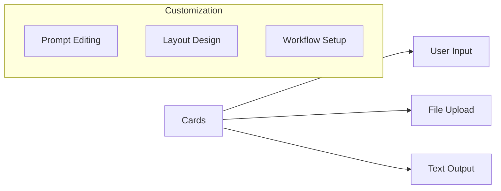
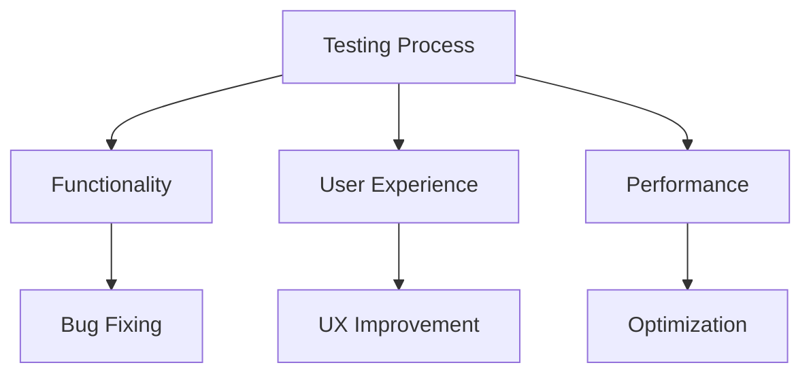
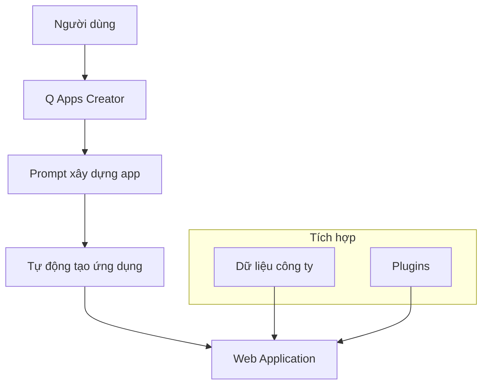
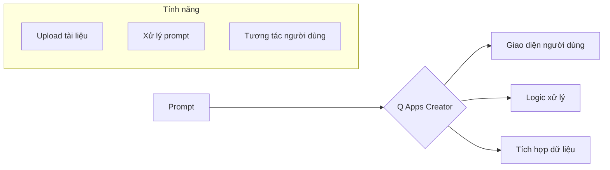

# Hướng dẫn Thực hành Amazon Q Apps

## Quy trình Tạo Ứng dụng

### 1. Khởi tạo Ứng dụng

### 2. Các Thành phần Giao diện

#### Input Components
1. **File Upload**
   - Tải lên tài liệu
   - Hỗ trợ nhiều định dạng
   - Xử lý dữ liệu

2. **Text Input**
   - Product categories
   - Parameters
   - Yêu cầu cụ thể

#### Output Components
- Text output
- Summary generation
- Analysis results
- Visualization options

## Tùy chỉnh Ứng dụng

### 1. Thêm Cards

### 2. Cấu hình Prompt
- Reference file: @Customer_Feedback_File
- Tham chiếu biến
- Tùy chỉnh output
- Định dạng kết quả

### 3. Data Source Settings
- Approved sources only
- LLM knowledge
- Combined sources
- Custom filters

## Quy trình Xuất bản

### 1. Kiểm tra Ứng dụng
1. Test functionality
2. Validate output
3. Optimize performance
4. User testing

### 2. Xuất bản
- Đặt tên ứng dụng
- Chọn category
- Publish to library
- Share with users

## Quản lý Ứng dụng

### 1. Library Management
- Organize apps
- Update versions
- Monitor usage
- User access

### 2. Maintenance
- Performance tracking
- Bug fixes
- Feature updates
- User feedback

## Best Practices

### 1. Thiết kế
- Clear instructions
- Intuitive interface
- Logical workflow
- Error handling

### 2. Testing

### 3. Deployment
- Phased rollout
- User training
- Documentation
- Support system

## Tips Quan trọng

### 1. Tối ưu Prompt
- Rõ ràng, cụ thể
- Tham chiếu chính xác
- Xử lý ngoại lệ
- Format output

### 2. User Experience
- Giao diện đơn giản
- Hướng dẫn rõ ràng
- Phản hồi nhanh
- Xử lý lỗi tốt

### 3. Hiệu suất
- Tối ưu file size
- Cache results
- Batch processing
- Resource management
Amazon Q Apps là một thành phần của Q Business cho phép tạo các ứng dụng AI mà không cần viết code, chỉ cần sử dụng ngôn ngữ tự nhiên để mô tả ứng dụng mong muốn.

## Kiến Trúc Hệ Thống

## Quy Trình Tạo Ứng Dụng

### 1. Mô tả ứng dụng
- Sử dụng ngôn ngữ tự nhiên
- Xác định mục đích
- Chỉ định tính năng
- Yêu cầu đặc biệt

### 2. Tự động xây dựng

## Tính Năng Chính

### 1. No-Code Development
- Tạo ứng dụng bằng prompt
- Giao diện trực quan
- Tùy chỉnh dễ dàng
- Triển khai nhanh chóng

### 2. Tích Hợp Dữ Liệu
- Kết nối dữ liệu nội bộ
- Xử lý tài liệu
- Tìm kiếm thông tin
- Phân tích nội dung

### 3. Plugin Support
- Tích hợp các plugin sẵn có
- Mở rộng chức năng
- Tự động hóa quy trình
- Tùy chỉnh workflow

## Ứng Dụng Thực Tế

### 1. Tài Liệu & Tri Thức
- Quản lý tài liệu
- Tìm kiếm thông tin
- Tổng hợp nội dung
- Phân tích dữ liệu

### 2. Tự Động Hóa
- Xử lý form
- Quản lý workflow
- Tạo báo cáo
- Phân tích dữ liệu

### 3. Tương Tác Người Dùng
- Chatbot tùy chỉnh
- Hỗ trợ khách hàng
- FAQ tự động
- Phản hồi thông minh

## Lợi Ích

### 1. Cho Doanh Nghiệp
- Giảm thời gian phát triển
- Tiết kiệm chi phí
- Tăng hiệu quả
- Đổi mới nhanh chóng

### 2. Cho Người Dùng
- Dễ dàng sử dụng
- Không cần kỹ năng lập trình
- Tùy chỉnh linh hoạt
- Kết quả nhanh chóng

## Best Practices

### 1. Thiết Kế Ứng Dụng
- Xác định mục tiêu rõ ràng
- Mô tả chi tiết yêu cầu
- Tối ưu prompt
- Kiểm tra kết quả

### 2. Quản Lý Dữ Liệu
- Cập nhật thường xuyên
- Đảm bảo chất lượng
- Kiểm soát truy cập
- Bảo mật thông tin

### 3. Triển Khai
- Test kỹ lưỡng
- Thu thập feedback
- Cải thiện liên tục
- Đào tạo người dùng