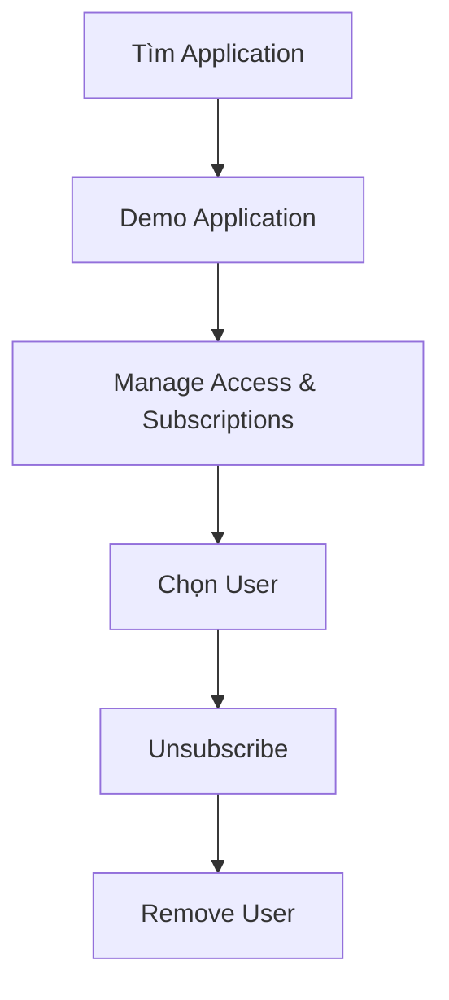
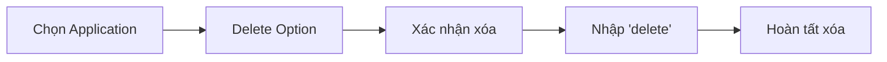

# Hướng dẫn Dọn dẹp Amazon Q Business

## Quy trình Hủy Đăng ký

### 1. Quản lý Người dùng

### 2. Các bước thực hiện
1. Vào Demo Application
2. Tìm phần Manage Access & Subscriptions
3. Chọn user cần hủy
4. Click Unsubscribe
5. Xóa user

## Xóa Ứng dụng

### 1. Quy trình Xóa

### 2. Ảnh hưởng
- Xóa Q Business
- Xóa Q Apps
- Xóa data sources
- Xóa cấu hình

## Kiểm tra Sau Xóa

### 1. Verify Cleanup
- Kiểm tra subscription status
- Xác nhận xóa application
- Kiểm tra billing
- Theo dõi costs

### 2. Best Practices
- Lưu documentation nếu cần
- Backup dữ liệu quan trọng
- Kiểm tra billing dashboard
- Monitor usage reports

## Lưu ý Quan trọng
- Thực hiện đúng quy trình
- Kiểm tra kỹ trước khi xóa
- Theo dõi chi phí sau xóa
- Lưu trữ thông tin cần thiết