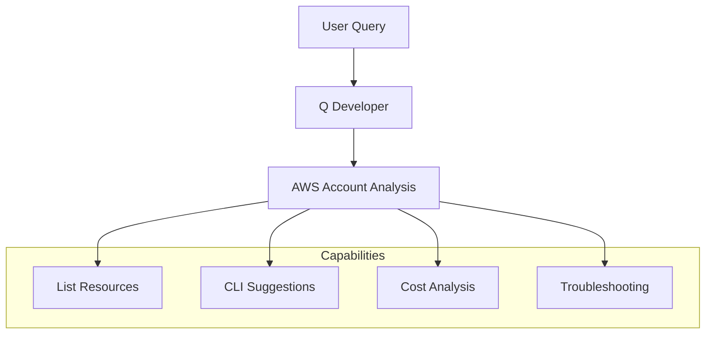
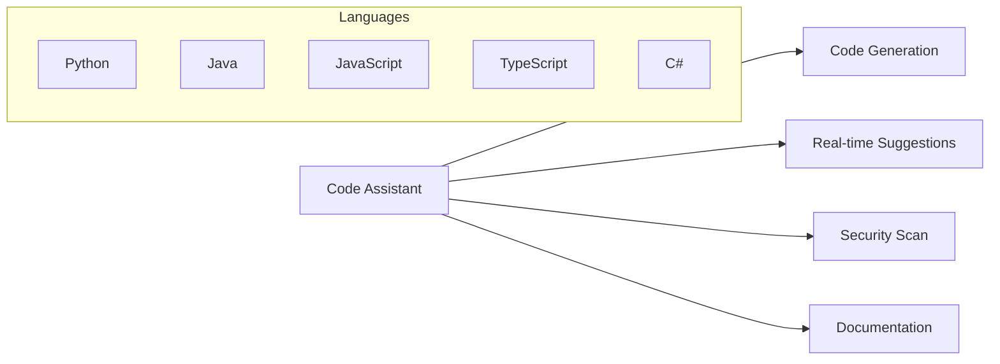

# Amazon Q Developer

## Tổng Quan
Amazon Q Developer là dịch vụ hai mảng chính: trợ lý AWS và trợ lý code, giúp nhà phát triển tương tác với AWS và viết code hiệu quả hơn.

## Trợ lý AWS

### 1. Tương tác với Tài khoản AWS


### 2. Ví dụ Tương tác
```text
Q: "List all Lambda functions"
A: "Bạn có 5 Lambda functions trong region us-east-1:
   - Function1
   - Function2
   - Function3..."

Q: "Change timeout of Test API1 to 10s"
A: [Cung cấp CLI command để thực hiện]

Q: "Top 3 highest cost services in Q1?"
A: "1. Amazon SageMaker
    2. Elastic Container Service
    3. AWS Config"
```

## Trợ lý Code

### 1. Tính năng Code


### 2. IDE Hỗ trợ
- Visual Studio Code
- Visual Studio
- JetBrains IDEs
- Các IDE khác

### 3. Chức năng chính
1. **Code Generation**
   ```python
   # Ví dụ: List files in S3 bucket
   def list_s3_files(bucket_name):
       s3_client = boto3.client('s3')
       response = s3_client.list_objects_v2(Bucket=bucket_name)
       files = [obj['Key'] for obj in response['Contents']]
       return files
   ```

2. **Code Analysis**
   - Security vulnerabilities
   - Best practices
   - Performance optimization
   - Debug suggestions

## Use Cases

### 1. AWS Management
- Query resources
- Analyze costs
- Generate CLI commands
- Troubleshoot issues

### 2. Development
- Code generation
- Real-time assistance
- Security scanning
- Documentation

### 3. Project Management
- Bootstrap projects
- Feature implementation
- Code optimization
- Best practices

## Best Practices

### 1. Tương tác AWS
- Queries rõ ràng
- Verify commands
- Check results
- Monitor changes

### 2. Code Development
- Review suggestions
- Test generated code
- Security awareness
- Documentation review

## Security & Performance

### 1. Bảo mật
- Code scanning
- Vulnerability detection
- Best practices
- Access control

### 2. Tối ưu hóa
- Code quality
- Performance tips
- Resource utilization
- Debug assistance

## Tips Sử dụng

### 1. Query Optimization
- Specific requests
- Clear context
- Verify results
- Feedback loop

### 2. Code Integration
- IDE setup
- Plugin configuration
- Feature utilization
- Regular updates

## So sánh với Alternatives

### 1. GitHub Copilot
- General purpose
- Broader language support
- Community-driven

### 2. Q Developer
- AWS specialized
- Deep integration
- Resource awareness