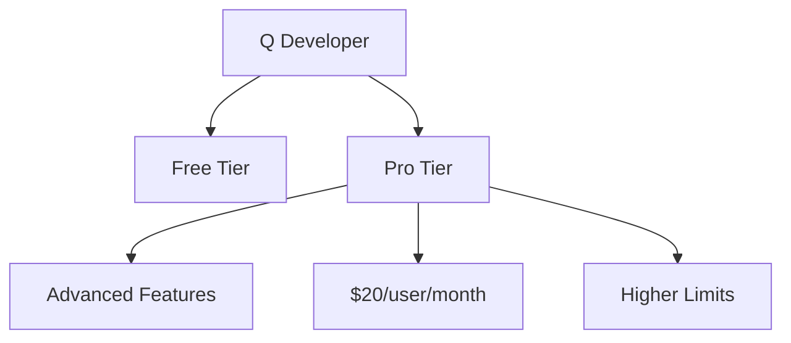
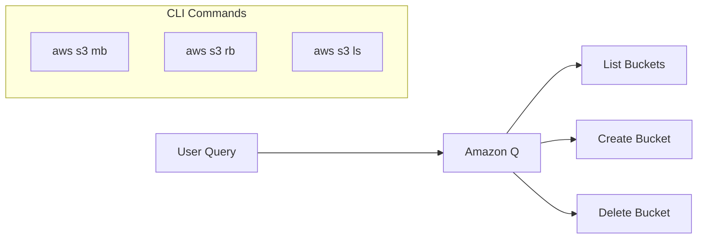
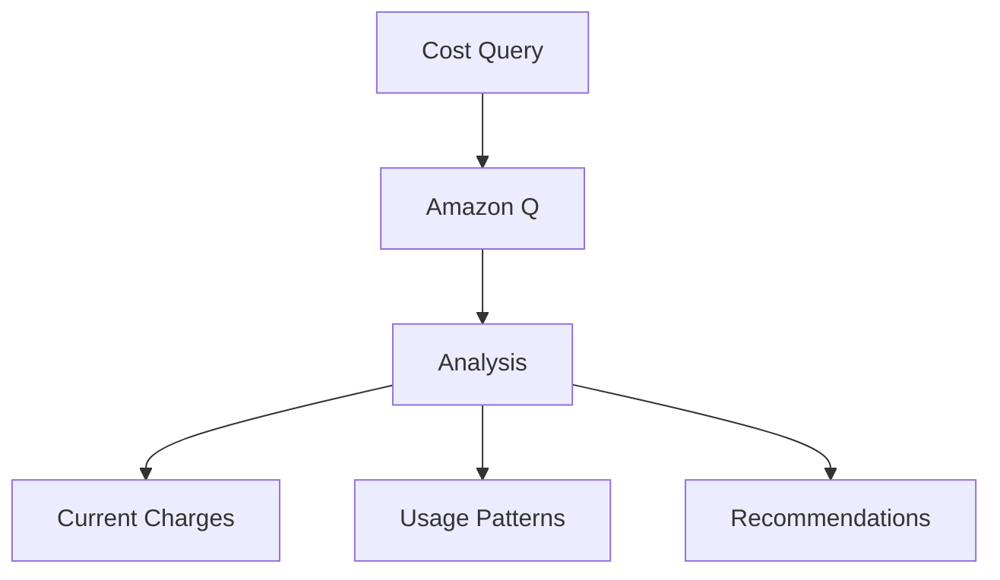

# Hướng dẫn Thực hành Amazon Q và Q Developer

## Pricing và Tính năng

### 1. Q Developer


## Tương tác với AWS Infrastructure

### 1. Truy cập Q
- Kết nối với IAM Identity Center
- Sử dụng từ AWS Console
- Cross-region data access

### 2. Tương tác với S3


### 3. Ví dụ Thực tế

#### List Buckets
```bash
Q: "List my S3 buckets"
A: "Bạn có 2 buckets:
   - my-demo-bucket-knowledge-base-stefane
   - stefane-demo-amazon-q"
```

#### Create Bucket
```bash
Q: "CLI code to create S3 bucket in us-east-1"
A: "aws s3 mb s3://stefane-demo-amazon-q --region us-east-1"
```

## Sử dụng CloudShell

### 1. Thực thi Lệnh
1. Mở CloudShell
2. Copy lệnh từ Q
3. Paste và execute
4. Verify kết quả

### 2. Verify Changes
- Kiểm tra qua Amazon Q
- Kiểm tra trực tiếp trong S3 Console
- Sử dụng CLI commands

## Phân tích Chi phí

### 1. Cost Analysis
- Truy vấn chi phí hiện tại
- Phân tích AWS charges
- Theo dõi sử dụng

### 2. Billing Insights


## Best Practices

### 1. Query Optimization
- Queries rõ ràng
- Specific requests
- Verify results
- Check permissions

### 2. CLI Usage
- Test commands trước
- Verify syntax
- Backup data
- Monitor changes

### 3. Security
- Permission checks
- Resource limits
- Access control
- Compliance guidelines

## Tips Quan trọng

### 1. Tương tác
- Sử dụng ngôn ngữ tự nhiên
- Kiểm tra kết quả
- Verify changes
- Document actions

### 2. CloudShell
- Kiểm tra region
- Test commands
- Save history
- Clean up resources

### 3. Cost Management
- Regular checks
- Monitor usage
- Optimize resources
- Review recommendations