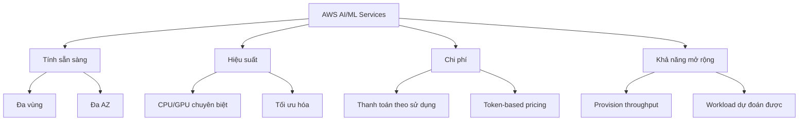

# AWS AI/ML Managed Services - Tổng quan

## Giới thiệu

AWS cung cấp nhiều dịch vụ AI/ML được quản lý, được thiết kế cho các trường hợp sử dụng cụ thể. Các dịch vụ này đã được đào tạo trước và sẵn sàng sử dụng, giúp tối ưu hóa thời gian và chi phí triển khai.

## Danh mục dịch vụ

### 1. Generative AI
- **Amazon Bedrock**: Nền tảng Gen AI tổng quát
- **Amazon Q Business**: Gen AI cho doanh nghiệp
- **Amazon Q Developer**: Gen AI cho nhà phát triển

### 2. Xử lý ngôn ngữ & văn bản
- **Amazon Comprehend**: Phân tích và hiểu văn bản
- **Amazon Translate**: Dịch đa ngôn ngữ
- **Amazon Textract**: Trích xuất văn bản từ tài liệu

### 3. Computer Vision
- **Amazon Rekognition**: Phân tích hình ảnh và video

### 4. Tìm kiếm & Chatbot
- **Amazon Kendra**: Tìm kiếm thông minh
- **Amazon Lex**: Xây dựng chatbot

### 5. Xử lý giọng nói
- **Amazon Polly**: Chuyển văn bản thành giọng nói
- **Amazon Transcribe**: Chuyển giọng nói thành văn bản

### 6. Các dịch vụ khác
- **Amazon Personalize**: Hệ thống đề xuất
- **AWS DeepRacer**: Học máy tăng cường
- **Amazon SageMaker**: Nền tảng ML toàn diện

## Lợi ích chính

### 1. Tính sẵn sàng và độ tin cậy
- Triển khai đa vùng (Multi-region)
- Hỗ trợ nhiều AZ (Availability Zones)
- Dự phòng tự động
- Khả năng chịu lỗi cao

### 2. Hiệu suất
- Sử dụng CPU/GPU chuyên biệt
- Tối ưu hóa cho từng use case
- Khả năng xử lý cao
- Độ trễ thấp

### 3. Mô hình chi phí linh hoạt
- Thanh toán theo mức sử dụng (Pay-per-use)
- Giá dựa trên token
- Không cần đầu tư phần cứng
- Tiết kiệm chi phí vận hành

### 4. Khả năng mở rộng
- Provision throughput cho workload dự đoán được
- Tự động mở rộng theo nhu cầu
- Không giới hạn về quy mô
- Đáp ứng nhanh với tải cao

## Ứng dụng thực tế

### Use cases phổ biến
1. **Xử lý văn bản tự động**
   - Phân tích sentiment
   - Trích xuất thông tin
   - Phân loại tài liệu

2. **Computer Vision**
   - Nhận diện khuôn mặt
   - Phát hiện vật thể
   - Phân tích nội dung

3. **Chatbot & Tương tác**
   - Hỗ trợ khách hàng
   - FAQ tự động
   - Virtual assistants

4. **Xử lý giọng nói**
   - Text-to-Speech
   - Speech-to-Text
   - Phân tích giọng nói

## Điểm cần lưu ý cho kỳ thi

1. **Kiến trúc dịch vụ**
   - Hiểu rõ đặc điểm từng dịch vụ
   - Nắm vững use cases phù hợp
   - Biết các giới hạn và hạn chế

2. **Chi phí và hiệu suất**
   - Mô hình pricing
   - Tối ưu hóa chi phí
   - Cách cải thiện hiệu suất

3. **Tích hợp và triển khai**
   - APIs và SDKs
   - Best practices
   - Security considerations