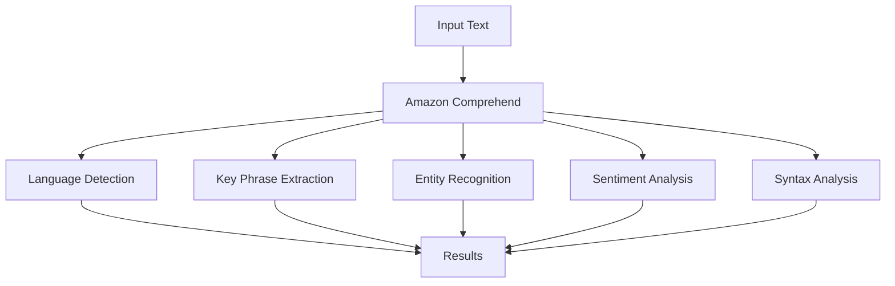

# Amazon Comprehend

## Tổng quan
Amazon Comprehend là dịch vụ xử lý ngôn ngữ tự nhiên (NLP) được quản lý hoàn toàn và serverless, sử dụng machine learning để tìm hiểu insights và mối quan hệ trong văn bản.

## Tính năng chính

### 1. Phân tích cơ bản


- **Nhận diện ngôn ngữ**: Tự động xác định ngôn ngữ của văn bản
- **Trích xuất cụm từ quan trọng**: Tìm các phrase chính trong văn bản
- **Phân tích sentiment**: Đánh giá cảm xúc (tích cực/tiêu cực)
- **Tokenization**: Phân tích cấu trúc câu
- **Topic modeling**: Phân nhóm văn bản theo chủ đề

### 2. Named Entity Recognition (NER)

#### Entities được hỗ trợ sẵn
- Người (People)
- Địa điểm (Places)
- Tổ chức (Organizations)
- Ngày tháng (Dates)
- Thương hiệu (Brands)
- Sự kiện (Events)

#### Ví dụ NER
```text
[PERSON]Zhang Wei[/PERSON] và [PERSON]John[/PERSON] làm việc tại [ORGANIZATION]Any Company Financial Services LLC[/ORGANIZATION]. Cuộc họp được tổ chức vào [DATE]31/07[/DATE].
```

### 3. Custom Classification

#### Đặc điểm
- Tự định nghĩa categories
- Phù hợp với nhu cầu cụ thể
- Train model với dữ liệu riêng

#### Quy trình triển khai
1. Chuẩn bị training data
2. Upload lên S3
3. Train custom classifier
4. Triển khai và sử dụng

### 4. Custom Entity Recognition

#### Mục đích
- Nhận diện entities đặc thù
- Ví dụ: số hợp đồng, mã khách hàng
- Phát hiện cụm từ quan trọng

#### Cách triển khai
1. Định nghĩa entities cần tìm
2. Cung cấp ví dụ training
3. Train custom recognizer
4. Áp dụng cho documents mới

## Use Cases

### 1. Phân tích tương tác khách hàng
- Emails
- Chat logs
- Social media
- Đánh giá trải nghiệm

### 2. Phân loại tài liệu
- Support requests
- Billing inquiries
- Complaints
- Feedback

### 3. Trích xuất thông tin
- Báo cáo
- Hợp đồng
- Tài liệu pháp lý
- Hồ sơ khách hàng

## Phương thức phân tích

### 1. Real-time Analysis
- Phân tích ngay lập tức
- Phù hợp cho tương tác trực tiếp
- API endpoints

### 2. Asynchronous Analysis
- Xử lý batch documents
- Tài liệu kích thước lớn
- Tối ưu chi phí

## Định dạng hỗ trợ
- Văn bản thuần (Text)
- PDF
- Word documents
- Images (với OCR)

## Best Practices

### 1. Chuẩn bị dữ liệu
- Clean text
- Định dạng nhất quán
- Đủ training data

### 2. Model Training
- Cân bằng categories
- Validate kết quả
- Monitor performance

### 3. Triển khai
- Start với pre-built models
- Test thoroughly
- Scale theo nhu cầu

## Security & Compliance
- IAM integration
- Encryption at rest
- Encryption in transit
- Compliance certifications