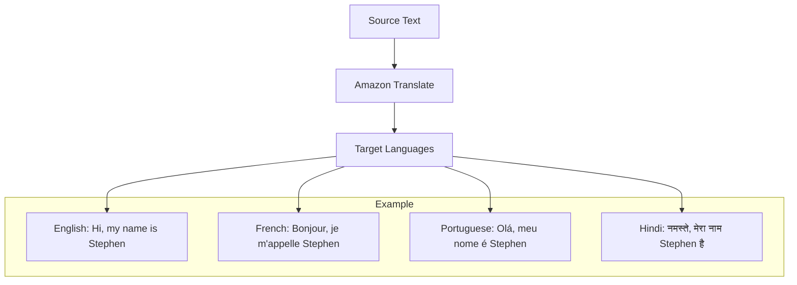

# Amazon Translate

## Tổng quan
Amazon Translate là dịch vụ dịch thuật tự nhiên và chính xác, cho phép doanh nghiệp địa phương hóa nội dung cho người dùng quốc tế một cách hiệu quả.

## Tính năng chính

### 1. Dịch thuật tự nhiên

### 2. Use Cases
- Địa phương hóa website
- Dịch ứng dụng
- Xử lý khối lượng văn bản lớn
- Giao tiếp đa ngôn ngữ

### 3. Đặc điểm
- Dịch thuật chính xác
- Hiệu quả với số lượng lớn
- Tự động hóa cao
- Tích hợp dễ dàng

## Ứng dụng thực tế

### 1. Content Management
- Dịch nội dung website
- Tài liệu marketing
- Hỗ trợ khách hàng
- Social media content

### 2. Business Communication
- Emails quốc tế
- Tài liệu kinh doanh
- Báo cáo đa ngôn ngữ
- Giao tiếp nội bộ

### 3. E-commerce
- Mô tả sản phẩm
- Reviews khách hàng
- Chính sách & điều khoản
- Thông tin vận chuyển

## Tích hợp và triển khai

### 1. API Integration
- RESTful API
- SDK support
- Batch processing
- Real-time translation

### 2. Supporting Services
- Amazon Polly cho text-to-speech
- Amazon Comprehend cho NLP
- Amazon Transcribe cho speech-to-text

## Best Practices

### 1. Tối ưu hiệu suất
- Cache phổ biến translations
- Batch processing cho volume lớn
- Monitoring quality

### 2. Cost Management
- Pay-per-use pricing
- Volume discounts
- Resource tagging

### 3. Quality Assurance
- Review translations
- Maintain glossaries
- Consistent terminology

## Security & Compliance
- Encryption in transit
- Encryption at rest
- IAM integration
- Compliance standards