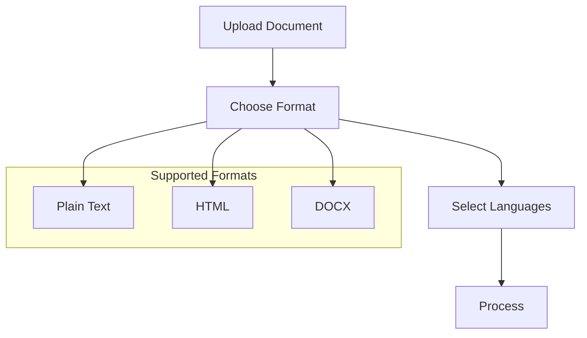
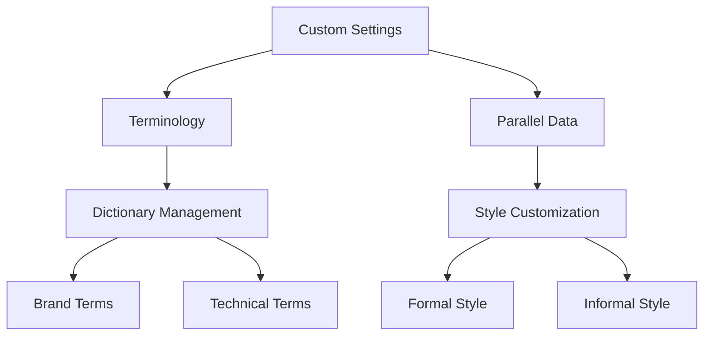
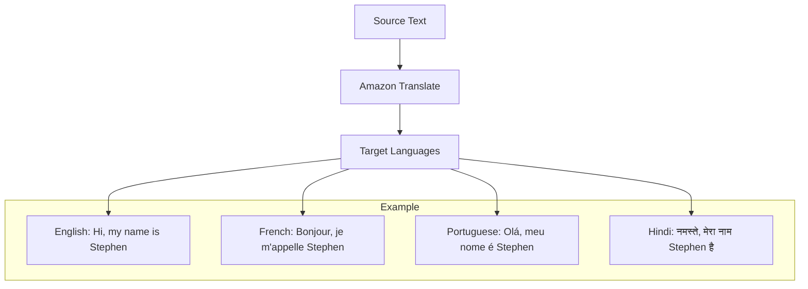

# Amazon Translate - Hướng dẫn chi tiết

## Demo và Tính năng

### 1. Dịch Cơ bản
- Chọn source và target language
- Nhập text cần dịch
- Kết quả real-time
- Neural network-powered

### 2. Document Translation


### 3. Batch Translation
- Input từ S3 bucket
- Multiple files
- Định dạng đa dạng
- Output vào S3 bucket chỉ định

### 4. Custom Terminology

#### Use Cases
- Brand names
- Character names
- Unique content
- Technical terms

#### Formats hỗ trợ
- CSV
- TSV
- TMX

### 5. Parallel Data (Custom Translation Style)

#### Ví dụ
```text
English: "How are you?"
French (Informal): "Ça va?"
French (Formal): "Comment allez-vous?"
```

#### Đặc điểm
- Context-aware
- Style customization
- Domain-specific

## Monitoring và Analytics

### 1. Metrics
- Successful translations
- Failed translations
- Performance tracking
- Quality monitoring

### 2. Custom Configuration


## Implementation Guide

### 1. Single Text Translation
1. Chọn source language
2. Chọn target language
3. Nhập text
4. Nhận kết quả ngay lập tức

### 2. Document Translation Process
1. Upload document
2. Chọn định dạng
3. Xác định ngôn ngữ
4. Chờ xử lý
5. Download kết quả

### 3. Batch Translation Setup
1. Chuẩn bị S3 bucket source
2. Upload documents
3. Configure job settings
4. Specify output location
5. Monitor progress

## Best Practices

### 1. Custom Terminology
- Maintain consistent dictionaries
- Regular updates
- Domain-specific terms
- Brand guidelines

### 2. Translation Style
- Define context clearly
- Document style guides
- Test different approaches
- Validate results

### 3. Batch Processing
- Organize files effectively
- Monitor job status
- Optimize file sizes
- Plan for scaling

## Performance Optimization

### 1. Resource Management
- Batch size optimization
- Parallel processing
- Cache management
- Error handling

### 2. Quality Assurance
- Review processes
- Feedback loops
- Style consistency
- Terminology accuracy
Amazon Translate là dịch vụ dịch thuật tự nhiên và chính xác, cho phép doanh nghiệp địa phương hóa nội dung cho người dùng quốc tế một cách hiệu quả.

## Tính năng chính

### 1. Dịch thuật tự nhiên


### 2. Use Cases
- Địa phương hóa website
- Dịch ứng dụng
- Xử lý khối lượng văn bản lớn
- Giao tiếp đa ngôn ngữ

### 3. Đặc điểm
- Dịch thuật chính xác
- Hiệu quả với số lượng lớn
- Tự động hóa cao
- Tích hợp dễ dàng

## Ứng dụng thực tế

### 1. Content Management
- Dịch nội dung website
- Tài liệu marketing
- Hỗ trợ khách hàng
- Social media content

### 2. Business Communication
- Emails quốc tế
- Tài liệu kinh doanh
- Báo cáo đa ngôn ngữ
- Giao tiếp nội bộ

### 3. E-commerce
- Mô tả sản phẩm
- Reviews khách hàng
- Chính sách & điều khoản
- Thông tin vận chuyển

## Tích hợp và triển khai

### 1. API Integration
- RESTful API
- SDK support
- Batch processing
- Real-time translation

### 2. Supporting Services
- Amazon Polly cho text-to-speech
- Amazon Comprehend cho NLP
- Amazon Transcribe cho speech-to-text

## Best Practices

### 1. Tối ưu hiệu suất
- Cache phổ biến translations
- Batch processing cho volume lớn
- Monitoring quality

### 2. Cost Management
- Pay-per-use pricing
- Volume discounts
- Resource tagging

### 3. Quality Assurance
- Review translations
- Maintain glossaries
- Consistent terminology

## Security & Compliance
- Encryption in transit
- Encryption at rest
- IAM integration
- Compliance standards