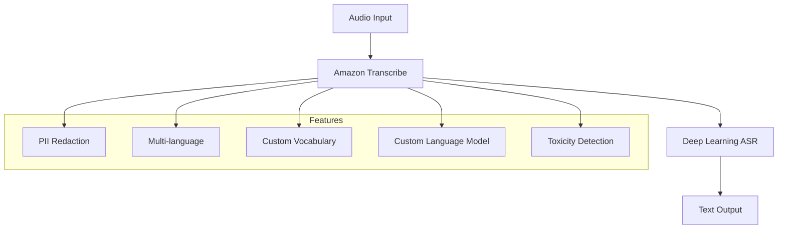
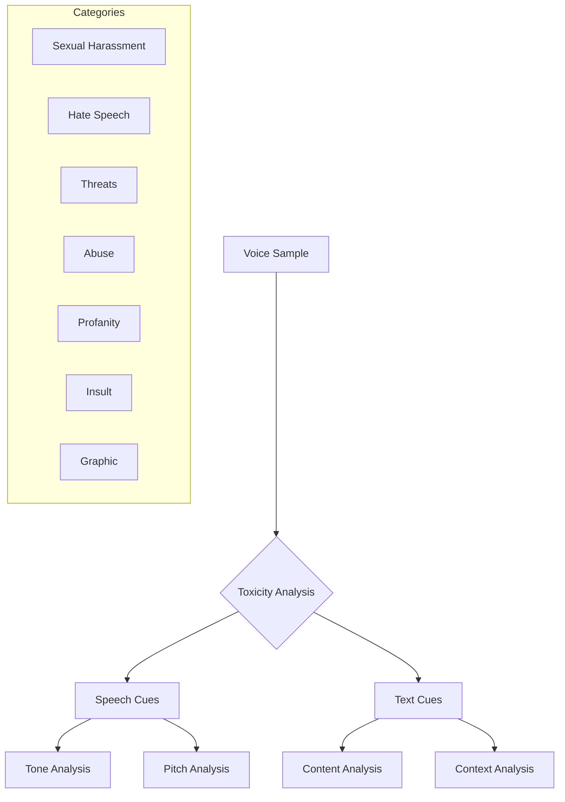

# Amazon Transcribe

## Tổng quan
Amazon Transcribe là dịch vụ chuyển đổi giọng nói thành văn bản tự động sử dụng deep learning ASR (Automatic Speech Recognition).

## Tính năng chính

### 1. Core Functionality


### 2. PII Redaction
- Tự động xóa thông tin nhạy cảm
  * Tên người dùng
  * Tuổi
  * SSN
  * Thông tin cá nhân khác

### 3. Nhận dạng ngôn ngữ tự động
- Hỗ trợ đa ngôn ngữ
- Nhận dạng chính xác
- Xử lý audio đa ngôn ngữ

## Cải thiện độ chính xác

### 1. Custom Vocabulary
- Thêm từ vựng đặc thù
- Brand names
- Acronyms
- Technical terms
- Pronunciation hints

#### Ví dụ
```text
Input Speech: "AWS Microservices"
Default Output: "USA my crow services"
With Custom Vocabulary: "AWS Microservices"
```

### 2. Custom Language Models
- Context-based learning
- Domain-specific training
- Improved accuracy
- Pattern recognition

## Toxicity Detection

### 1. Phương pháp phân tích


### 2. Speech Cues
- Tone of voice
- Pitch variations
- Emotional indicators
- Voice patterns

### 3. Text-based Cues
- Profanity detection
- Hate speech recognition
- Threat identification
- Content analysis

## Use Cases

### 1. Customer Service
- Call transcription
- Quality monitoring
- Compliance checking
- Analytics

### 2. Media Processing
- Closed captioning
- Subtitling
- Searchable archives
- Content indexing

### 3. Business Intelligence
- Meeting transcription
- Documentation
- Analysis
- Reporting

## Best Practices

### 1. Accuracy Optimization
- Combine custom vocabulary và language models
- Regular model updates
- Quality monitoring
- Feedback loops

### 2. Security & Compliance
- PII handling
- Data encryption
- Access controls
- Audit logging

### 3. Performance
- Audio quality requirements
- Batch processing
- Real-time transcription
- Resource optimization