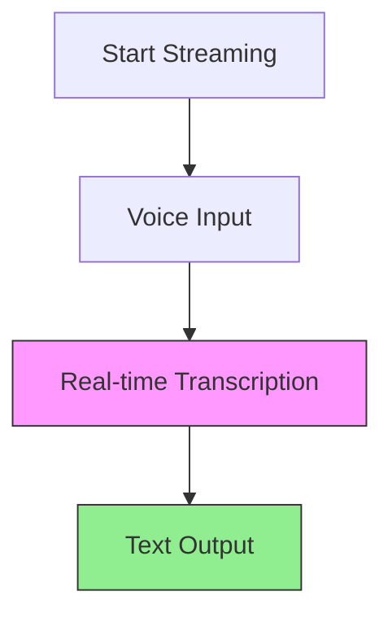
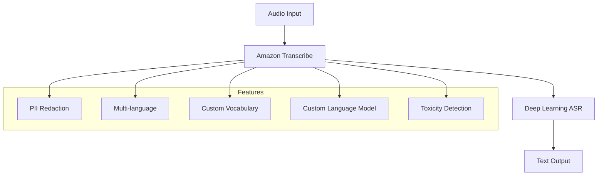
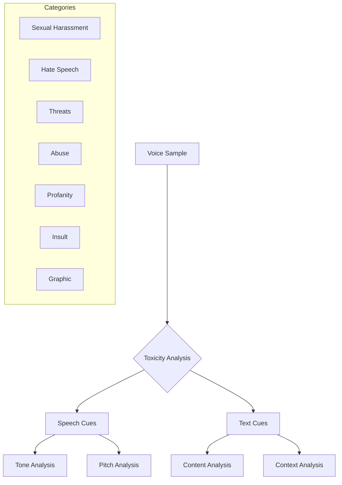

# Amazon Transcribe - Demo và Hướng dẫn thực hành

## Live Demo 

### 1. Basic Transcription


Input: "Hello, I really like this course"
Output: Chuyển đổi thành văn bản ngay lập tức

### 2. PII Redaction Demo

#### Cấu hình
- Enable PII identification
- Chọn loại PII cần redact
- Real-time redaction

#### Ví dụ
```text
Input: "Hello, my name is Stephane. I am 31 years old, and my phone number is 910-747-280"
Output: "Hello, my name is [PII]. I am [PII] years old, and my phone number is [PII]"
```

### 3. Multi-language Recognition

#### Supported Languages
- English (US)
- French
- Và nhiều ngôn ngữ khác

#### Demo
```text
English: "Hello, this is some recognition happening in English"
French: "Bonjour, ceci est une reconnaissance en français"
```

## Hướng dẫn thực hành

### 1. Bắt đầu Transcription
1. Chọn ngôn ngữ
2. Click "Start Streaming"
3. Nói vào microphone
4. Xem kết quả real-time

### 2. Cấu hình PII
1. Enable PII removal
2. Chọn loại thông tin cần ẩn
   - Tên
   - Tuổi
   - Số điện thoại
   - Thông tin cá nhân khác
3. Test với sample text

### 3. Multi-language Setup
1. Chọn multiple languages
2. Start streaming
3. Speak in different languages
4. Verify automatic detection

## Tips và Tricks

### 1. Chất lượng Audio
- Sử dụng microphone tốt
- Giảm noise background
- Nói rõ ràng

### 2. PII Handling
- Test trước với sample data
- Verify redaction accuracy
- Monitor output

### 3. Multi-language Use
- Practice language transitions
- Verify recognition accuracy
- Use clear pronunciation

## Best Practices

### 1. Real-time Usage
- Monitor latency
- Check accuracy
- Adjust settings as needed

### 2. Security
- Review PII settings
- Verify redaction
- Compliance check

### 3. Performance
- Optimize audio input
- Test different scenarios
- Monitor resource usage
Amazon Transcribe là dịch vụ chuyển đổi giọng nói thành văn bản tự động sử dụng deep learning ASR (Automatic Speech Recognition).

## Tính năng chính

### 1. Core Functionality


### 2. PII Redaction
- Tự động xóa thông tin nhạy cảm
  * Tên người dùng
  * Tuổi
  * SSN
  * Thông tin cá nhân khác

### 3. Nhận dạng ngôn ngữ tự động
- Hỗ trợ đa ngôn ngữ
- Nhận dạng chính xác
- Xử lý audio đa ngôn ngữ

## Cải thiện độ chính xác

### 1. Custom Vocabulary
- Thêm từ vựng đặc thù
- Brand names
- Acronyms
- Technical terms
- Pronunciation hints

#### Ví dụ
```text
Input Speech: "AWS Microservices"
Default Output: "USA my crow services"
With Custom Vocabulary: "AWS Microservices"
```

### 2. Custom Language Models
- Context-based learning
- Domain-specific training
- Improved accuracy
- Pattern recognition

## Toxicity Detection

### 1. Phương pháp phân tích


### 2. Speech Cues
- Tone of voice
- Pitch variations
- Emotional indicators
- Voice patterns

### 3. Text-based Cues
- Profanity detection
- Hate speech recognition
- Threat identification
- Content analysis

## Use Cases

### 1. Customer Service
- Call transcription
- Quality monitoring
- Compliance checking
- Analytics

### 2. Media Processing
- Closed captioning
- Subtitling
- Searchable archives
- Content indexing

### 3. Business Intelligence
- Meeting transcription
- Documentation
- Analysis
- Reporting

## Best Practices

### 1. Accuracy Optimization
- Combine custom vocabulary và language models
- Regular model updates
- Quality monitoring
- Feedback loops

### 2. Security & Compliance
- PII handling
- Data encryption
- Access controls
- Audit logging

### 3. Performance
- Audio quality requirements
- Batch processing
- Real-time transcription
- Resource optimization