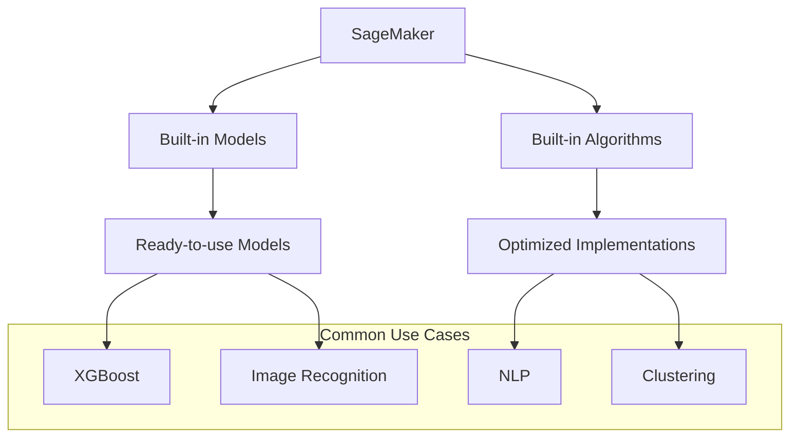
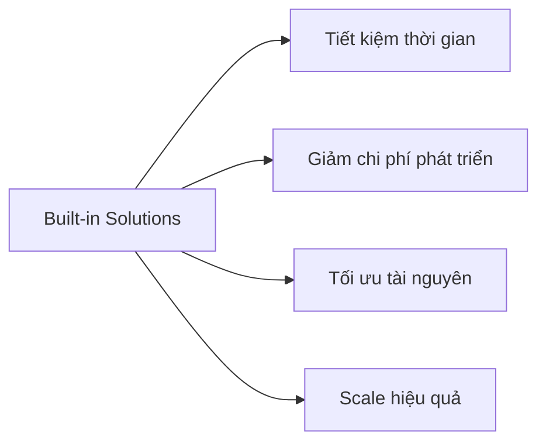

# Amazon SageMaker - Built-in Models và Algorithms

## Tổng quan
Amazon SageMaker cung cấp nhiều mô hình và thuật toán ML được tối ưu hóa sẵn, giúp người dùng triển khai các ứng dụng ML phổ biến mà không cần xây dựng từ đầu.

## Kiến trúc và Quy trình

## Built-in Models

### 1. XGBoost
- Hiệu quả cho nhiều bài toán
- Tối ưu hóa sẵn
- Dễ sử dụng
- Performance cao

### 2. Computer Vision
- Image classification
- Object detection
- Semantic segmentation
- Instance segmentation

### 3. Natural Language Processing
- Text classification
- Named entity recognition
- Language understanding
- Sentiment analysis

### 4. Time Series
- Forecasting
- Anomaly detection
- Pattern recognition
- Trend analysis

## Ưu điểm

### 1. Hiệu quả về chi phí

### 2. Performance
- Tối ưu hóa sẵn
- Được AWS test kỹ
- Best practices built-in
- Auto-scaling

### 3. Dễ sử dụng
- API đơn giản
- Documentation đầy đủ
- Example notebooks
- Community support

## Use Cases

### 1. Machine Learning
- Classification
- Regression
- Clustering
- Dimensionality reduction

### 2. Deep Learning
- Neural networks
- CNN/RNN
- Transfer learning
- Custom architectures

### 3. Specialized Tasks
- Recommendation systems
- Anomaly detection
- Time series analysis
- Text processing

## Best Practices

### 1. Model Selection
- Evaluate use case
- Check requirements
- Consider scale
- Test performance

### 2. Implementation
- Start with examples
- Use notebooks
- Monitor metrics
- Optimize costs

### 3. Production
- Deploy efficiently
- Monitor performance
- Scale appropriately
- Maintain security

## Getting Started

### 1. Setup Process
1. Chọn use case
2. Select built-in solution
3. Prepare data
4. Train và evaluate
5. Deploy và monitor

### 2. Development Tips
- Sử dụng example notebooks
- Test thoroughly
- Monitor costs
- Scale gradually

## Security & Compliance

### 1. Data Protection
- Encryption at rest
- Encryption in transit
- Access control
- Audit logging

### 2. Compliance Features
- Regulatory compliance
- Security best practices
- Access management
- Monitoring tools