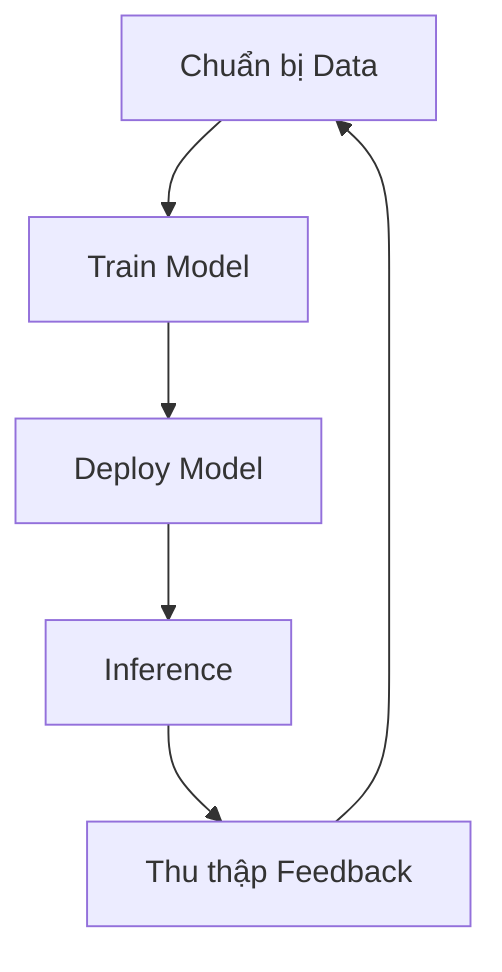
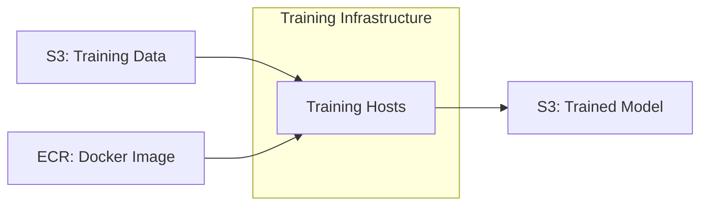
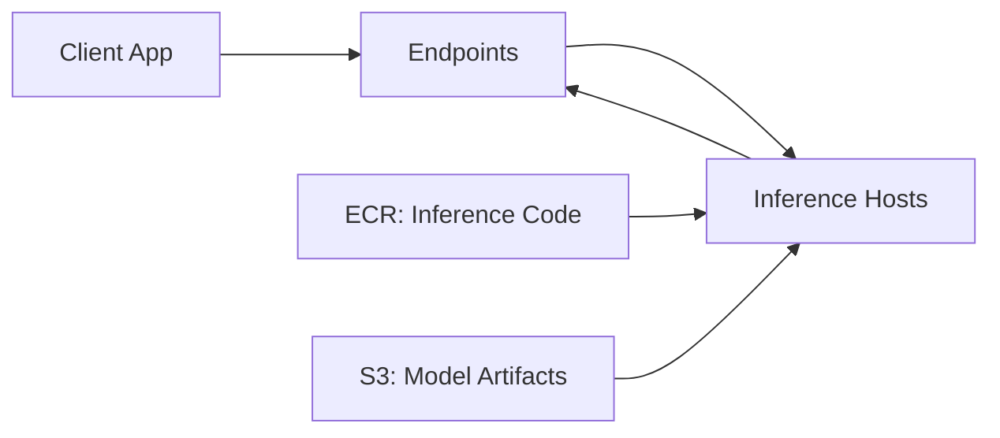
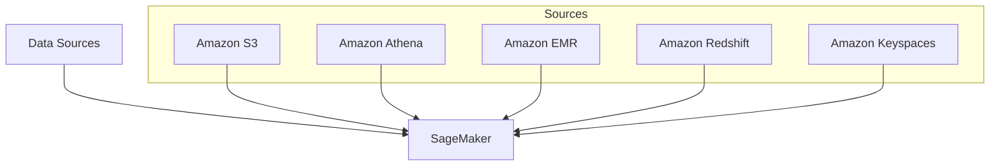
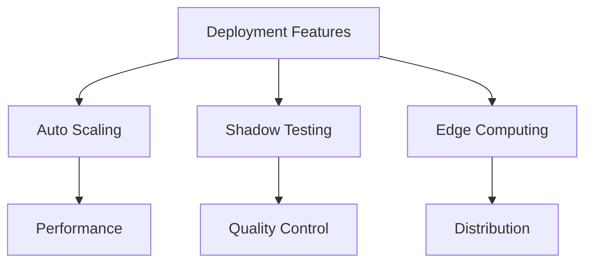

# Amazon SageMaker - Tổng quan và Workflow

## Machine Learning Workflow

### 1. Quy trình Tổng thể

## Kiến trúc Cơ bản

### 1. Training Process

### 2. Inference Process

## Phương thức Làm việc

### 1. SageMaker Notebook
- EC2 instance based
- Tích hợp S3
- Hỗ trợ frameworks:
  * scikit-learn
  * PySpark
  * TensorFlow
  * Built-in models

### 2. Console Interface
- Quản lý training jobs
- Monitor performance
- Endpoint management
- Resource control

## Data Preparation

### 1. Data Sources

### 2. Processing Options
- Apache Spark integration
- Jupyter notebooks
- Built-in processing
- Custom containers

## Training Options

### 1. Built-in Algorithms
- Pre-built Docker images
- Optimized performance
- Multiple frameworks support
- Easy deployment

### 2. Custom Training
- Custom code
- Framework support:
  * TensorFlow
  * PyTorch
  * MXNet
  * scikit-learn
  * XGBoost
  * Hugging Face

## Deployment Options

### 1. Endpoint Types
- Persistent endpoints
- Batch transform
- Inference pipelines
- Edge deployment (Neo)

### 2. Advanced Features

## Best Practices

### 1. Data Management
- Format optimization
- S3 integration
- Pre-processing
- Validation

### 2. Training Strategy
- Resource allocation
- Parameter tuning
- Model evaluation
- Performance monitoring

### 3. Deployment
- Endpoint optimization
- Scaling strategy
- Cost management
- Monitoring system

## Security & Compliance

### 1. Data Protection
- S3 encryption
- In-transit security
- Access control
- Audit logging

### 2. Resource Management
- IAM roles
- VPC configuration
- Network isolation
- Monitoring tools