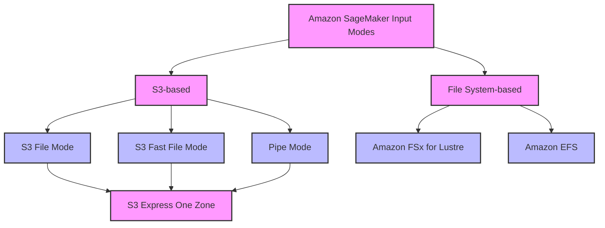

# Tổng quan về các chế độ đầu vào trong Amazon SageMaker

## Giới thiệu

Amazon SageMaker cung cấp nhiều chế độ đầu vào khác nhau để đưa dữ liệu vào quá trình huấn luyện mô hình. Việc lựa chọn chế độ đầu vào phù hợp rất quan trọng, đặc biệt khi làm việc với tập dữ liệu lớn, vì nó ảnh hưởng trực tiếp đến:
- Thời gian huấn luyện
- Yêu cầu lưu trữ
- Hiệu suất tổng thể của hệ thống

## Các chế độ đầu vào chính

### 1. S3 File Mode (Chế độ mặc định)
**Đặc điểm:**
- Sao chép toàn bộ dữ liệu từ S3 vào thư mục cục bộ trong container Docker
- Phù hợp với tập dữ liệu nhỏ
- Đơn giản, dễ sử dụng

**Hạn chế:**
- Phải đợi quá trình sao chép hoàn tất
- Cần đủ không gian lưu trữ trong container
- Tạo dữ liệu dư thừa

### 2. S3 Fast File Mode (Khuyến nghị sử dụng)
**Ưu điểm:**
- Streaming dữ liệu trực tiếp từ S3
- Không cần đợi tải xuống dữ liệu
- Hỗ trợ truy cập ngẫu nhiên
- Tiết kiệm không gian lưu trữ
- Phương pháp được ưa chuộng hiện nay

### 3. Pipe Mode
**Đặc điểm:**
- Stream dữ liệu tuần tự từ S3
- Đơn giản hơn Fast File Mode
- Vẫn được hỗ trợ nhưng đã bị thay thế phần lớn bởi Fast File Mode

## Các giải pháp lưu trữ bổ sung

### 1. Amazon S3 Express One Zone
**Đặc điểm:**
- Tương thích với tất cả các chế độ (File, Fast File, Pipe)
- Hiệu năng cao
- Chỉ tồn tại trong một availability zone
- Phù hợp khi không cần dự phòng dữ liệu

### 2. Amazon FSx for Lustre
**Ưu điểm:**
- Hiệu năng cực cao
- Hỗ trợ hàng trăm GB throughput
- Hàng triệu IOPS
- Độ trễ thấp

**Yêu cầu:**
- Giới hạn trong một availability zone
- Bắt buộc sử dụng VPC
- Phù hợp cho các mô hình ngôn ngữ lớn (LLM)

### 3. Amazon EFS
**Đặc điểm:**
- Tích hợp dễ dàng nếu dữ liệu đã có sẵn trong EFS
- Yêu cầu sử dụng VPC

## Sơ đồ tổng quan

## Hướng dẫn lựa chọn

1. **Cho tập dữ liệu nhỏ:**
   - Sử dụng S3 File Mode
   - Đơn giản, dễ triển khai

2. **Cho tập dữ liệu lớn:**
   - Ưu tiên sử dụng S3 Fast File Mode
   - Cân nhắc S3 Express One Zone nếu không cần dự phòng

3. **Cho dự án quy mô cực lớn (như LLM):**
   - Sử dụng Amazon FSx for Lustre
   - Đảm bảo setup VPC phù hợp

4. **Khi dữ liệu đã có trong EFS:**
   - Sử dụng Amazon EFS
   - Đảm bảo cấu hình VPC đúng

## Lưu ý quan trọng
- Việc lựa chọn chế độ đầu vào có thể ảnh hưởng đáng kể đến hiệu suất huấn luyện
- Cần cân nhắc kỹ các yếu tố: kích thước dữ liệu, yêu cầu về tốc độ, chi phí và độ phức tạp trong triển khai
- Fast File Mode là lựa chọn cân bằng và phổ biến nhất hiện nay
- Có thể kết hợp với S3 Express One Zone để tối ưu hiệu năng