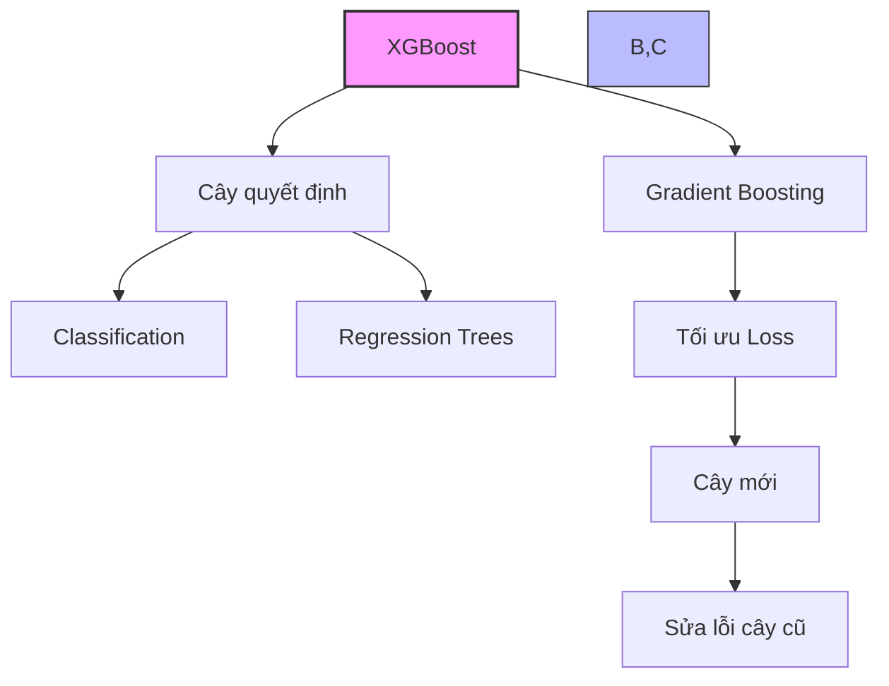

# XGBoost trong Amazon SageMaker - Tổng Quan và Triển Khai

## 1. Tổng quan

XGBoost (Extreme Gradient Boosting) là một thuật toán mạnh mẽ dựa trên nguyên lý boosting với các đặc điểm:
- Sử dụng tập hợp các cây quyết định (decision trees)
- Xây dựng cây mới để sửa lỗi của các cây trước
- Sử dụng gradient descent để tối thiểu hóa loss
- Hỗ trợ cả classification và regression (regression trees)



## 2. Đặc điểm triển khai trong SageMaker

### Nguồn gốc:
- Dựa trên phiên bản mã nguồn mở
- Được AWS mở rộng và tùy chỉnh

### Định dạng đầu vào:
- CSV
- LibSVM
- RecordIO-wrapped protobuf (mới)
- Parquet (mới)

### Phương thức triển khai:
1. **Trong Notebook:**
   - Sử dụng trực tiếp qua SageMaker XGBoost
   - Serialization/deserialization qua pickle (Python)

2. **Như thuật toán tích hợp:**
   - Sử dụng Docker image từ ECR
   - Triển khai trên fleet training hosts

## 3. Hyperparameters Quan Trọng

### Kiểm soát overfitting:
- `subsample`: Tỷ lệ mẫu sử dụng
- `eta`: Step size shrinkage
- `max_depth`: Độ sâu tối đa của cây (mặc định: 6)

### Regularization:
- `gamma`: Minimum loss reduction
- `alpha`: L1 regularization
- `lambda`: L2 regularization

### Tối ưu hóa và cân bằng:
- `eval_metric`: Metric đánh giá (error, RMSE, AUC)
- `scale_pos_weight`: Cân bằng trọng số positive/negative

## 4. Yêu cầu phần cứng và tối ưu hóa

### CPU Training:
- Memory-bound (không phải compute-bound)
- Khuyến nghị: Instance M5

### GPU Training (từ version 1.2):
1. **Single GPU:**
   - Instance types: P2, P3, G4, G5
   - Yêu cầu: `tree_method = gpu_hist`

2. **Distributed GPU (từ version 1.5 - Tháng 5/2023):**
   ```mermaid
   graph LR
       A[Distributed GPU] --> B[tree_method = gpu_hist]
       A --> C[use_dask_gpu_training = true]
       A --> D[distribution = fully_replicated]
       
       style A fill:#f9f,stroke:#333,stroke-width:2px
   ```
   - Hỗ trợ cluster các instance GPU
   - Chỉ hỗ trợ đầu vào CSV hoặc Parquet
   - Tự động phân chia dữ liệu training

## 5. Best Practices

### Chọn Instance Type:
1. **Cho dữ liệu nhỏ/vừa:**
   - CPU: M5 instances
   - Single GPU: P2/P3 instances

2. **Cho dữ liệu lớn:**
   - Cluster G4/G5 instances
   - Distributed GPU training

### Ngăn chặn Overfitting:
1. Điều chỉnh `subsample`
2. Giảm `eta`
3. Giới hạn `max_depth`
4. Tăng `alpha`/`lambda`

### Xử lý dữ liệu không cân bằng:
1. Sử dụng `scale_pos_weight`
2. Công thức: sum(negative_cases)/sum(positive_cases)

## 6. Lưu ý quan trọng cho kỳ thi

1. **Về định dạng dữ liệu:**
   - Hỗ trợ nhiều định dạng (CSV, LibSVM, RecordIO, Parquet)
   - Distributed GPU chỉ hỗ trợ CSV và Parquet

2. **Về hyperparameters:**
   - Hiểu cách ngăn overfitting
   - Nắm được các tham số regularization
   - Biết cách xử lý dữ liệu không cân bằng

3. **Về phần cứng:**
   - CPU training là memory-bound
   - Hiểu các yêu cầu cho GPU training
   - Nắm được cấu hình cho distributed training