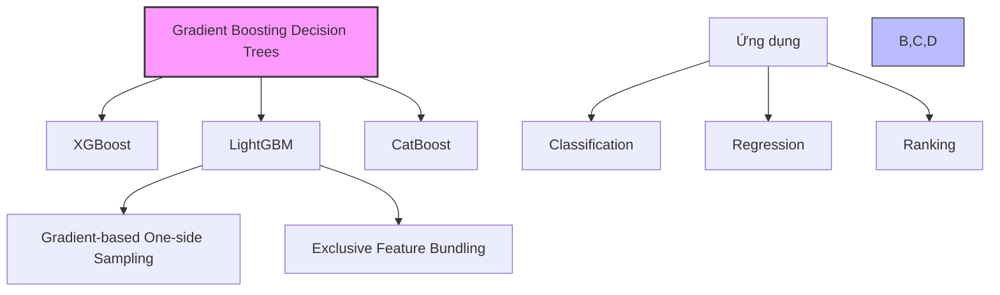
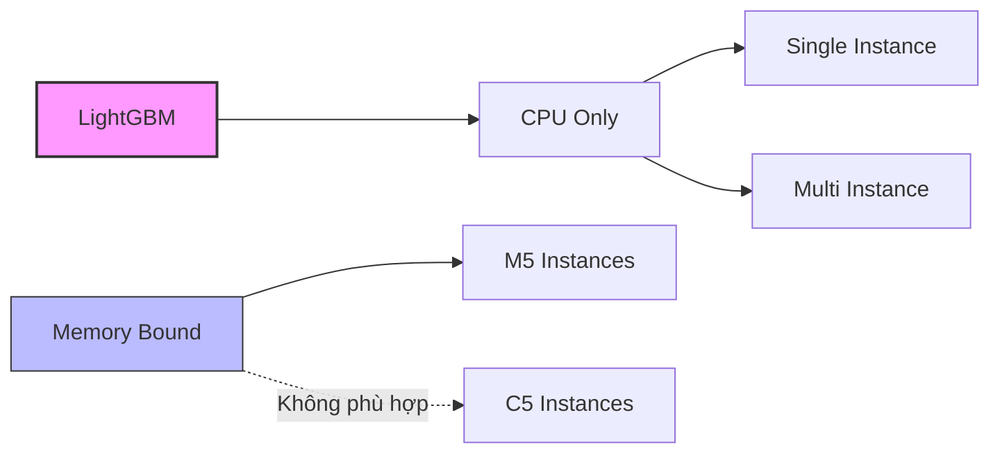

# LightGBM trong Amazon SageMaker

## 1. Tổng quan

LightGBM là một thuật toán gradient boosting decision tree với các đặc điểm:
- Dựa trên ensemble learning
- Kết hợp nhiều cây quyết định đơn giản
- Mở rộng với các tính năng độc đáo:
  - Gradient-based One-side Sampling
  - Exclusive Feature Bundling

## 2. Định dạng dữ liệu

### Yêu cầu:
- Format: Text CSV
- Sử dụng cho cả training và inference
- Có thể cung cấp dữ liệu validation (tùy chọn)

## 3. Hyperparameters Quan trọng

### Cấu trúc cây:
- `num_leaves`: Số lá tối đa trên mỗi cây
- `max_depth`: Độ sâu tối đa của cây
- `min_data_in_leaf`: Lượng dữ liệu tối thiểu trong một lá
  - Quan trọng để xử lý overfitting

### Tốc độ học và sampling:
- `learning_rate`: Tốc độ học
- `feature_fraction`: Tỷ lệ features được chọn cho mỗi cây
- `bagging_fraction`: Tỷ lệ dữ liệu được sampling ngẫu nhiên
- `bagging_freq`: Tần suất thực hiện random sampling

## 4. Yêu cầu phần cứng

### Đặc điểm:

1. **Giới hạn CPU:**
   - Chỉ hỗ trợ CPU
   - Không hỗ trợ GPU

2. **Phân tán:**
   - Hỗ trợ single/multi-instance
   - Cấu hình qua `instance_count`

3. **Lựa chọn instance:**
   - Memory-bound algorithm
   - Khuyến nghị: M5 instances (General purpose)
   - Không khuyến nghị: C5 instances (Compute optimized)

## 5. So sánh với các thuật toán tương tự

### Điểm chung:
- Đều là gradient boosting decision trees
- Sử dụng ensemble learning
- Hỗ trợ classification và regression

### Điểm khác biệt:
1. **So với XGBoost:**
   - Định dạng đầu vào hạn chế hơn
   - Không hỗ trợ GPU
   - Có các tính năng sampling độc đáo

2. **So với CatBoost:**
   - Tương tự về nguyên lý cơ bản
   - Khác biệt trong cách xử lý features

## 6. Lưu ý quan trọng cho kỳ thi

1. **Về thuật toán:**
   - Thuộc họ gradient boosting decision trees
   - Có thể xử lý classification, regression, ranking

2. **Về phần cứng:**
   - Chỉ hỗ trợ CPU
   - Memory-bound
   - Nên dùng M5 instances

3. **Về hyperparameters:**
   - `min_data_in_leaf`: Quan trọng cho xử lý overfitting
   - Có thể điều chỉnh sampling thông qua `bagging` parameters

## 7. Best Practices

### Lựa chọn instance:
1. Ưu tiên general purpose instances (M5)
2. Đảm bảo đủ memory cho xử lý

### Xử lý overfitting:
1. Điều chỉnh `min_data_in_leaf`
2. Sử dụng validation set
3. Điều chỉnh `bagging` parameters

### Tối ưu hiệu năng:
1. Cân nhắc distributed training với nhiều instances
2. Điều chỉnh `bagging_freq` phù hợp với dữ liệu