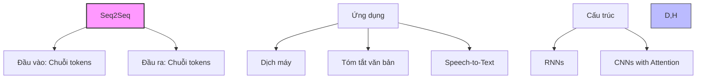
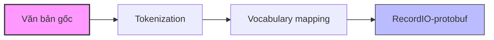
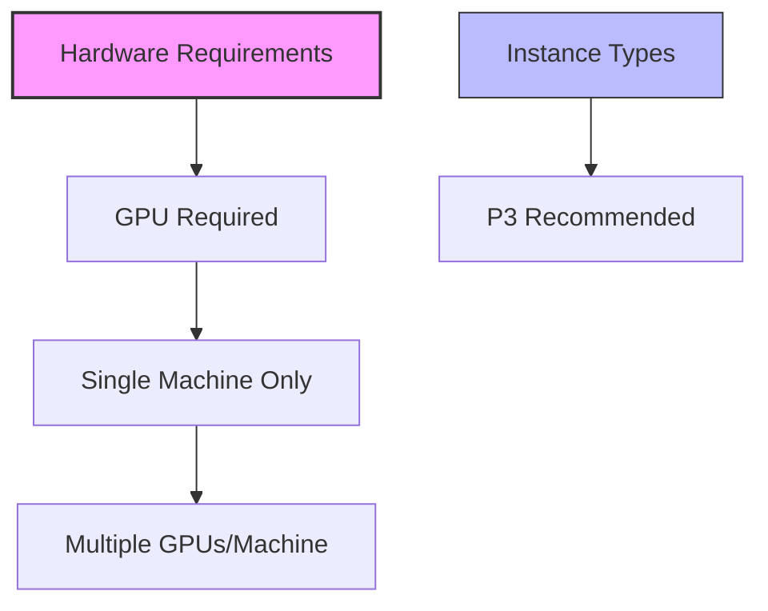

# Sequence-to-Sequence (Seq2Seq) trong Amazon SageMaker

## 1. Tổng quan

## 2. Yêu cầu đầu vào

### Định dạng dữ liệu:
- RecordIO-protobuf format
- Tokens dạng số nguyên (integers)
- Cần cung cấp:
  1. Training data (đã tokenize)
  2. Validation data
  3. Vocabulary file (ánh xạ từ -> số)

### Quá trình chuẩn bị dữ liệu:

## 3. Cấu trúc và hoạt động

### Kiến trúc:
1. **RNNs:**
   - Phù hợp với dữ liệu tuần tự
   - Xử lý dependencies dài

2. **CNNs with Attention:**
   - Phương pháp thay thế
   - Hiệu quả với một số loại dữ liệu tuần tự

## 4. Hyperparameters

### Cơ bản:
- batch_size
- optimizer_type (Adam, SGD, RMSprop)
- learning_rate
- num_layers

### Metrics đặc biệt:
1. **BLEU score:**
   - So sánh với nhiều bản dịch tham chiếu
   - Linh hoạt trong đánh giá độ chính xác

2. **Perplexity:**
   - Metric cross-entropy
   - Phù hợp cho bài toán dịch máy

## 5. Yêu cầu phần cứng

### Đặc điểm:
- Chỉ hỗ trợ single machine training
- Hỗ trợ multiple GPUs trên cùng máy
- Khuyến nghị: P3 instances với nhiều GPU

## 6. Tối ưu hóa và triển khai

### Sử dụng mô hình pre-trained:
- Có sẵn cho nhiều cặp ngôn ngữ
- Tiết kiệm thời gian training
- Phù hợp cho nhiều ứng dụng thực tế

### Training data:
- Sử dụng public datasets sẵn có
- Không cần tự xây dựng từ điển
- Tiết kiệm thời gian chuẩn bị dữ liệu

## 7. Lưu ý quan trọng cho kỳ thi

1. **Về định dạng dữ liệu:**
   - Bắt buộc RecordIO-protobuf
   - Tokens phải là integers
   - Cần vocabulary file

2. **Về metrics:**
   - BLEU score cho dịch máy
   - Perplexity là metric phổ biến

3. **Về phần cứng:**
   - Chỉ single machine
   - Cần GPU (P3 recommended)
   - Hỗ trợ multiple GPUs/machine

## 8. Best Practices

### Training hiệu quả:
1. Sử dụng pre-trained models khi có thể
2. Tận dụng public datasets
3. Sử dụng instance với nhiều GPU

### Đánh giá mô hình:
1. Sử dụng BLEU score cho dịch máy
2. Theo dõi perplexity
3. Validation set đa dạng