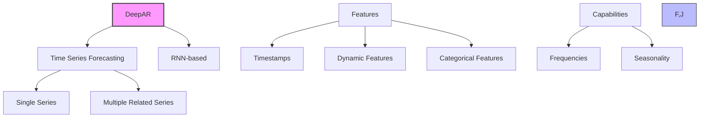
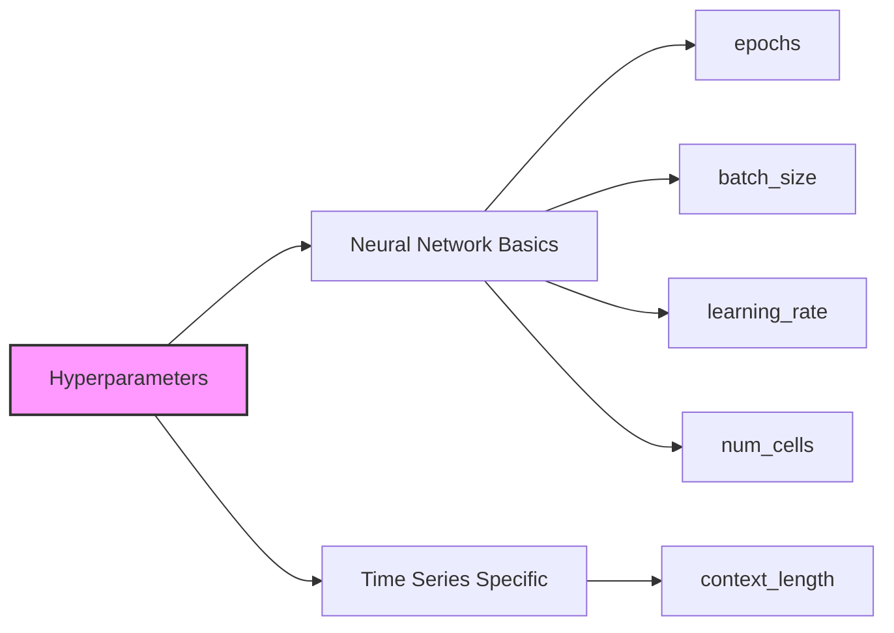

# DeepAR trong Amazon SageMaker - Dự đoán chuỗi thời gian

## 1. Tổng quan



## 2. Định dạng dữ liệu đầu vào

### Formats hỗ trợ:
- JSON Lines (có thể nén gzip)
- Parquet (hiệu năng tốt hơn)

### Cấu trúc dữ liệu:
```json
{
    "start": "timestamp_start",
    "target": [value1, value2, ...],
    "dynamic_features": [feature1, feature2, ...],  // Tùy chọn
    "categorical_features": [cat1, cat2, ...]       // Tùy chọn
}
```

## 3. Đặc điểm hoạt động

### Xử lý dữ liệu:
1. **Toàn bộ chuỗi thời gian:**
   - Sử dụng cho training, testing, inference
   - Học từ toàn bộ lịch sử dữ liệu

2. **Multiple time series:**
   - Học từ nhiều chuỗi thời gian liên quan
   - Phát hiện mối quan hệ giữa các chuỗi

### Giới hạn:
- Độ dài dự đoán tối đa: 400 điểm dữ liệu
- Mô hình có độ trễ 1 năm (cho seasonality)

## 4. Hyperparameters



### Cơ bản:
- epochs: Số vòng training
- batch_size: Kích thước batch
- learning_rate: Tốc độ học
- num_cells: Số neurons

### Đặc biệt:
- context_length: Số điểm thời gian mô hình xem xét trước khi dự đoán
  - Có thể nhỏ hơn chu kỳ seasonality
  - Mô hình vẫn có thể học seasonality 1 năm

## 5. Yêu cầu phần cứng

### Training:
1. **CPU Instances (Khuyến nghị ban đầu):**
   - ml.c4.2xlarge
   - ml.c4.4xlarge

2. **GPU Instances (Khi cần):**
   - Cho mô hình lớn
   - Batch size > 512

### Inference:
- Chỉ hỗ trợ CPU instances

### Khả năng mở rộng:
- Single machine
- Multi-machine (distributed)

## 6. Best Practices

### Lựa chọn instance:
1. **Bắt đầu với CPU:**
   - Tiết kiệm chi phí
   - Phù hợp hầu hết trường hợp

2. **Chuyển sang GPU khi:**
   - Mô hình rất lớn
   - Batch size > 512
   - Cần tăng tốc training

### Tuning:
- Có thể cần instance mạnh hơn cho tuning
- Sau khi tuning, có thể giảm cấu hình cho production

## 7. Lưu ý quan trọng cho kỳ thi

1. **Về dữ liệu:**
   - Luôn sử dụng toàn bộ chuỗi thời gian
   - Có thể train nhiều chuỗi liên quan cùng lúc

2. **Về instance types:**
   - Bắt đầu với CPU
   - GPU chỉ cần cho mô hình lớn
   - Inference chỉ dùng CPU

3. **Về dự đoán:**
   - Giới hạn 400 điểm dự đoán
   - Học được seasonality dài hạn (1 năm)

## 8. Ưu điểm và hạn chế

### Ưu điểm:
- Học được từ nhiều chuỗi thời gian liên quan
- Phát hiện frequencies và seasonality
- Hỗ trợ dynamic và categorical features
- Khả năng mở rộng tốt

### Hạn chế:
- Giới hạn độ dài dự đoán
- Có độ trễ trong học seasonality
- GPU chỉ hữu ích trong một số trường hợp