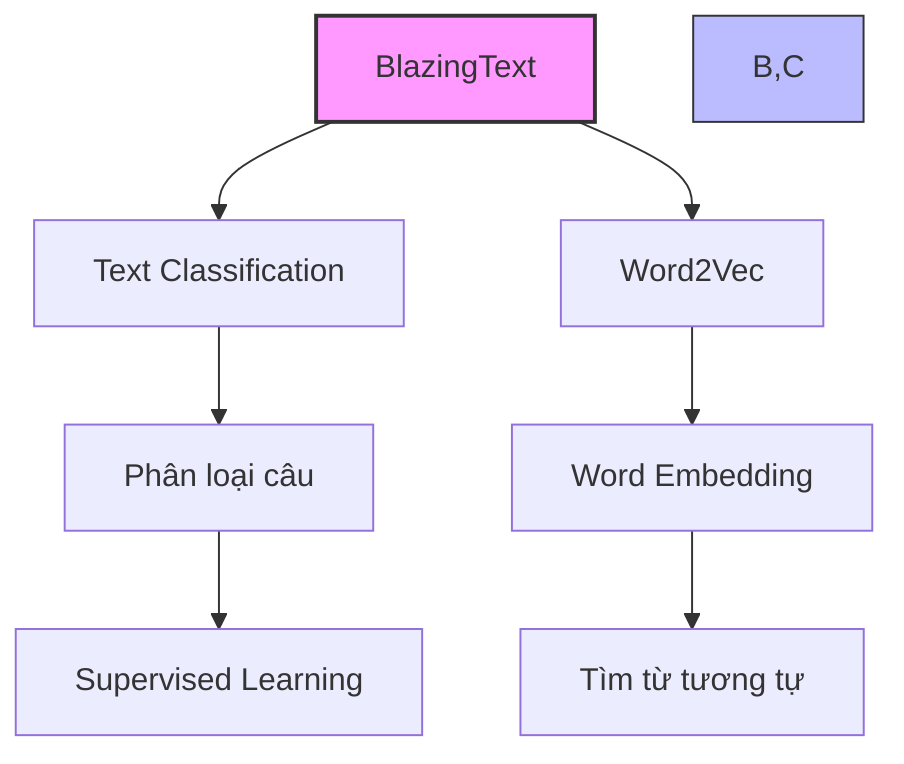
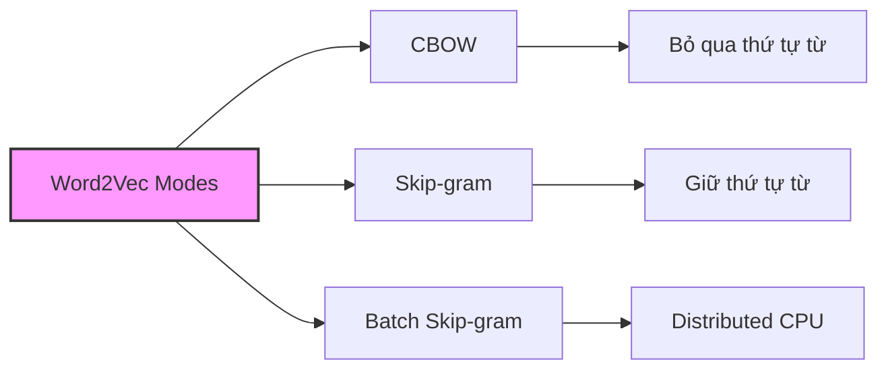

# BlazingText trong Amazon SageMaker

## 1. Tổng quan



## 2. Hai chức năng chính

### 1. Text Classification:
- Dự đoán nhãn cho câu
- Chỉ xử lý câu, không xử lý document
- Học có giám sát (supervised)
- Ứng dụng: web search, information retrieval

### 2. Word2Vec:
- Tạo vector biểu diễn từ
- Từ tương tự có vector gần nhau
- Chỉ xử lý từ, không xử lý câu/document
- Thường là thành phần của các hệ thống NLP lớn hơn

## 3. Định dạng đầu vào

### Text Classification Mode:
```
__label__4 linux ready for prime time , experts say .
__label__2 microsoft releases new software update .
```

#### Yêu cầu:
- Một câu mỗi dòng 
- Bắt đầu với "__label__" và nhãn
- Tokenized (có khoảng trắng giữa các từ và dấu câu)
- Lowercase

### Word2Vec Mode:
- File text đơn giản
- Một câu training mỗi dòng

### Augmented Manifest Text Format:
```json
{"source": "linux ready for prime time , experts say .", "label": 4}
{"source": "microsoft releases new software update .", "label": 2}
```

## 4. Các chế độ Word2Vec



### 1. CBOW (Continuous Bag of Words):
- Bỏ qua thứ tự từ trong câu
- Xem như "túi từ" không có cấu trúc

### 2. Skip-gram:
- Giữ thứ tự từ
- Sử dụng n-grams

### 3. Batch Skip-gram:
- Phân tán được trên nhiều CPU
- Phù hợp cho scale lớn

## 5. Hyperparameters

### Word2Vec Mode:
- mode (cbow/skip-gram/batch-skip-gram)
- learning_rate
- window_size
- vector_dim
- negative_samples

### Text Classification Mode:
- epochs
- learning_rate
- word_ngrams
- vector_dim

## 6. Yêu cầu phần cứng

### Word2Vec:
1. **CBOW & Skip-gram:**
   - P3 instances
   - Single CPU/GPU
   - Chỉ single machine

2. **Batch Skip-gram:**
   - Multiple CPU instances
   - Không dùng GPU
   - Phân tán được

### Text Classification:
1. **Dữ liệu < 2GB:**
   - C5 instances

2. **Dữ liệu > 2GB:**
   - P2.xlarge
   - P3.2xlarge

## 7. Lưu ý quan trọng cho kỳ thi

1. **Giới hạn phạm vi:**
   - Text Classification: chỉ xử lý câu, không xử lý document
   - Word2Vec: chỉ xử lý từ, không xử lý câu/document

2. **Định dạng đầu vào:**
   - Format "__label__" cho text classification
   - Tokenization và lowercase là bắt buộc

3. **Hardware:**
   - Batch Skip-gram: CPU distributed
   - Các mode khác: single machine

## 8. Best Practices

### Chuẩn bị dữ liệu:
1. Tokenize kỹ lưỡng
2. Chuyển về lowercase
3. Tách dấu câu bằng khoảng trắng

### Lựa chọn mode:
1. **Text Classification:**
   - Cho phân loại câu
   - Supervised learning

2. **Word2Vec:**
   - CBOW: Khi thứ tự từ không quan trọng
   - Skip-gram: Khi thứ tự từ quan trọng
   - Batch Skip-gram: Khi cần scale lớn

### Lựa chọn instance:
1. Dựa vào kích thước dữ liệu
2. Cân nhắc khả năng phân tán với Batch Skip-gram