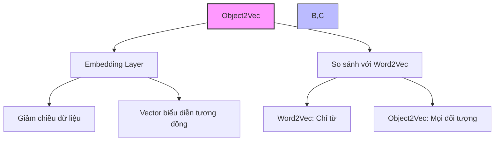
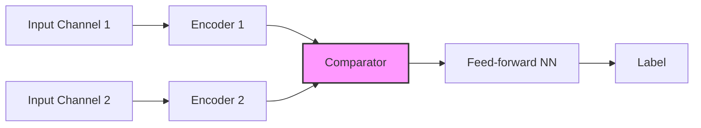
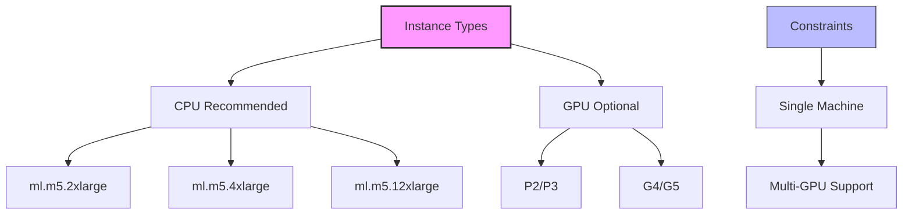

# Object2Vec trong Amazon SageMaker

## 1. Tổng quan

## 2. Ứng dụng

### Phân tích tương đồng:
- Tìm nearest neighbors
- Clustering và visualization
- Genre prediction
- Recommender systems:
  - Similar items
  - Similar users

## 3. Kiến trúc và hoạt động

### Các loại Encoder:
1. Average Pooled Embeddings
2. CNN
3. Bidirectional LSTM

### Đặc điểm dữ liệu:
- Tokenize thành integers
- Làm việc với cặp (pairs):
  - Cặp câu
  - Label-sequence
  - Customer pairs
  - Product pairs
  - User-item pairs

## 4. Hyperparameters

### Neural Network:
- dropout
- early_stopping
- epochs
- learning_rate
- batch_size
- num_layers
- activation_function
- optimizer
- weight_decay

### Encoder:
- encoder1_network
- encoder2_network
- Lựa chọn: CNN/LSTM/Pooled Embedding

## 5. Yêu cầu phần cứng

### Training:

1. **CPU Options (Khuyến nghị ban đầu):**
   - ml.m5.2xlarge
   - ml.m5.4xlarge
   - ml.m5.12xlarge

2. **GPU Options:**
   - P2.xlarge (khởi đầu)
   - P2/P3 series
   - G4/G5 series

### Inference:
- Khuyến nghị: ml.p3.2xlarge
- Environment variable: inference_preferred_mode
  - Tối ưu cho encoder embeddings

## 6. Giới hạn và đặc điểm

### Giới hạn:
- Chỉ training trên single machine
- Hỗ trợ multi-GPU trên cùng máy

### Ưu điểm:
- Linh hoạt với nhiều loại đối tượng
- Đa dạng ứng dụng
- Nhiều lựa chọn encoder

## 7. Best Practices

### Lựa chọn instance:
1. **Bắt đầu với CPU:**
   - ml.m5.2xlarge
   - Nâng cấp khi cần

2. **Khi cần GPU:**
   - Bắt đầu với P2.xlarge
   - Nâng cấp lên P3/G4/G5 nếu cần

### Tối ưu hóa:
1. **Training:**
   - Thử nghiệm các loại encoder
   - Điều chỉnh hyperparameters

2. **Inference:**
   - Sử dụng inference_preferred_mode
   - Tối ưu cho encoder embeddings

## 8. Lưu ý quan trọng cho kỳ thi

1. **So với Word2Vec:**
   - Tổng quát hơn
   - Xử lý được nhiều loại đối tượng

2. **Kiến trúc:**
   - Hai input channels
   - Nhiều lựa chọn encoder
   - Feed-forward NN comparator

3. **Hardware:**
   - Single machine only
   - Multi-GPU support
   - CPU recommended first