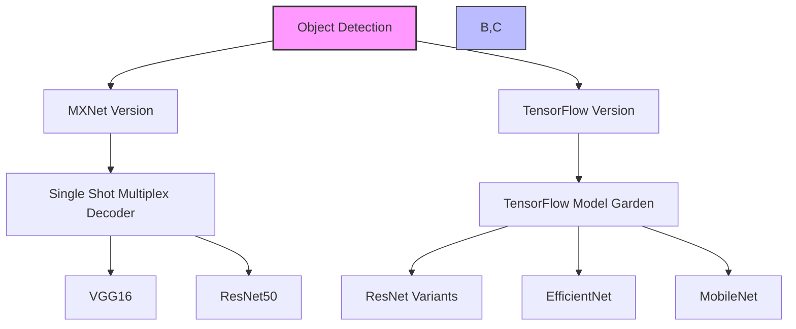
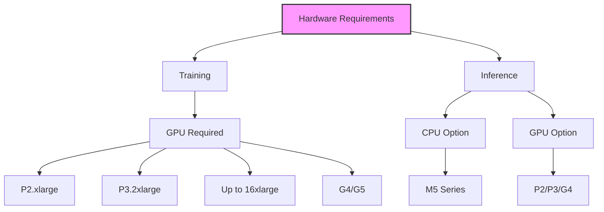

# Object Detection trong Amazon SageMaker

## 1. Tổng quan



## 2. Chức năng chính

### Nhiệm vụ:
- Nhận diện đối tượng trong ảnh
- Xác định vị trí (bounding boxes)
- Phân loại đối tượng
- Cung cấp confidence scores

### Kết quả đầu ra:
```json
{
    "objects": [
        {
            "class": "wine_glass",
            "confidence": 0.95,
            "bbox": [x1, y1, x2, y2]
        },
        {
            "class": "laptop",
            "confidence": 0.89,
            "bbox": [x3, y3, x4, y4]
        }
    ]
}
```

## 3. Hai phiên bản chính

### 1. Object Detection MXNet:
- CNN với SSD (Single Shot Multiplex Decoder)
- Mô hình base: VGG16 hoặc ResNet50
- Hỗ trợ transfer learning
- Tính năng chống overfitting:
  - Flip
  - Rescale
  - Jitter

### 2. Object Detection TensorFlow:
- Nhiều lựa chọn mô hình từ TensorFlow Model Garden
- Linh hoạt trong cấu hình
- Các mô hình hỗ trợ:
  - ResNet variants
  - EfficientNet
  - MobileNet

## 4. Định dạng đầu vào

### MXNet:
1. **MXNet RecordIO format**
2. **Image format (JPEG/PNG)**
   ```json
   {
       "image_info": {
           "width": 800,
           "height": 600
       },
       "annotations": [
           {
               "category": "wine_glass",
               "bbox": [100, 200, 150, 300]
           }
       ]
   }
   ```

### TensorFlow:
- Tùy thuộc vào mô hình được chọn
- Cần tham khảo tài liệu cụ thể của mô hình

## 5. Hyperparameters

### MXNet:
- minibatch_size
- learning_rate
- optimizer

### TensorFlow:
- batch_size
- learning_rate
- optimizer_type

## 6. Yêu cầu phần cứng



### Training:
1. **GPU Instances:**
   - P2.xlarge (cơ bản)
   - P3.2xlarge (khuyến nghị)
   - Lên đến 16xlarge
   - G4/G5 series

2. **Khả năng mở rộng:**
   - Multi-GPU instance
   - Multiple GPU instances

### Inference:
1. **CPU:**
   - M5 series

2. **GPU:**
   - P2/P3 series
   - G4 series

## 7. Best Practices

### Training:
1. **Chọn phiên bản:**
   - MXNet: Khi cần đơn giản, rõ ràng
   - TensorFlow: Khi cần nhiều lựa chọn mô hình

2. **Transfer Learning:**
   - Sử dụng pre-trained models khi có thể
   - Tiết kiệm thời gian training

### Inference:
1. **CPU vs GPU:**
   - CPU (M5): Cho workload nhẹ
   - GPU: Cho throughput cao

## 8. Lưu ý quan trọng cho kỳ thi

1. **Về phiên bản:**
   - MXNet: SSD với VGG16/ResNet50
   - TensorFlow: Nhiều lựa chọn mô hình

2. **Về định dạng:**
   - MXNet: RecordIO hoặc image + JSON
   - TensorFlow: Phụ thuộc mô hình

3. **Về hardware:**
   - Training: Bắt buộc GPU
   - Inference: Linh hoạt CPU/GPU