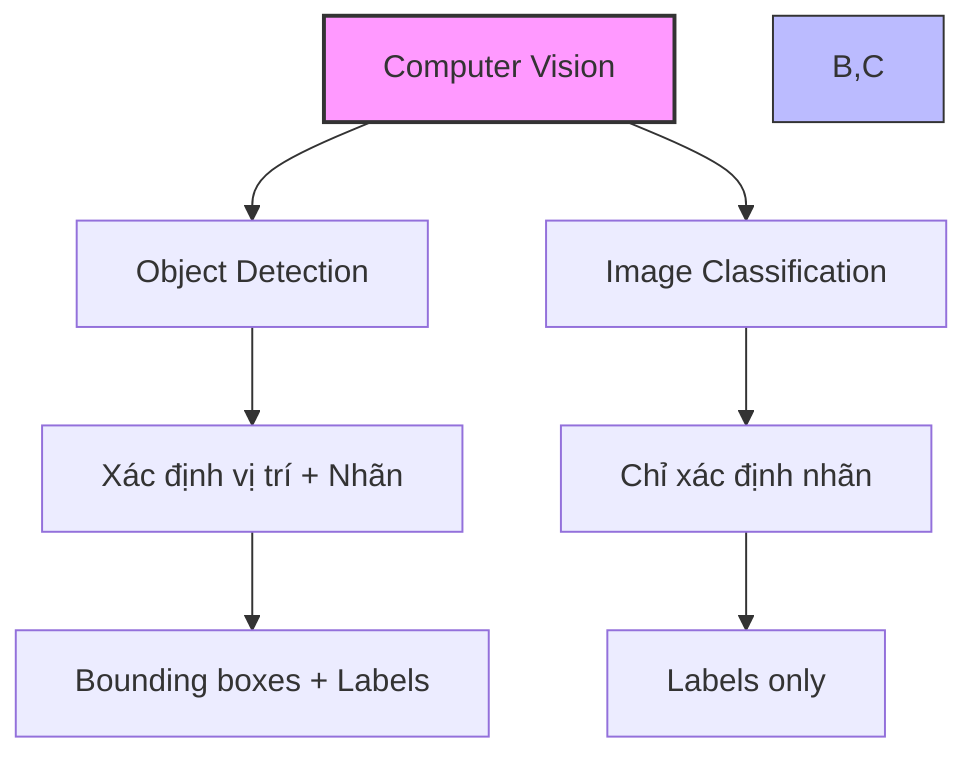
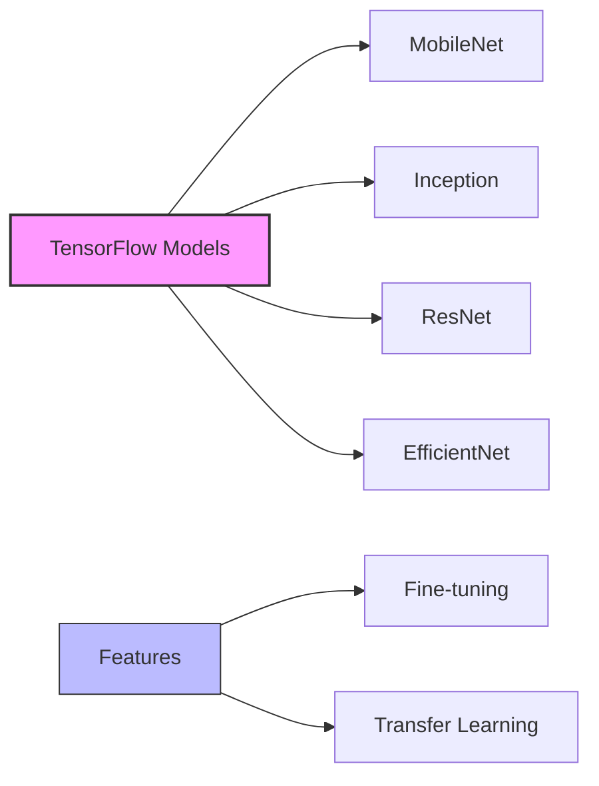
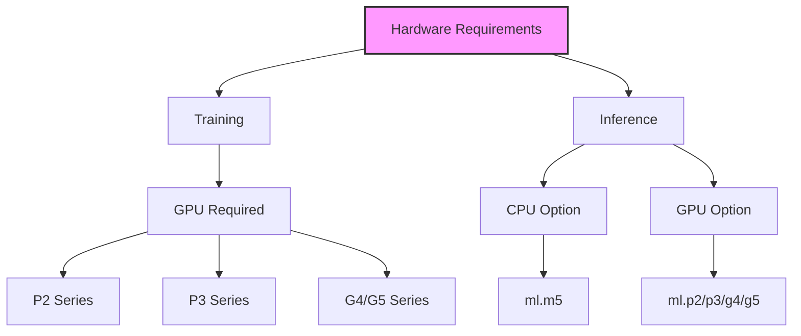

# Image Classification trong Amazon SageMaker

## 1. So sánh với Object Detection

## 2. Hai phiên bản chính

### 1. Image Classification MXNet:
- Full training mode (random weights)
- Transfer learning mode (pre-trained weights)
- Mặc định: 3 channels (RGB), 224x224 pixels
- Tương thích ImageNet dataset

### 2. Image Classification TensorFlow:

## 3. Chế độ Training

### MXNet:
1. **Full Training:**
   - Khởi tạo random weights
   - Training từ đầu

2. **Transfer Learning:**
   - Pre-trained weights
   - Random weights cho fully connected layer cuối
   - Fine-tuning với dữ liệu mới

### TensorFlow:
- Tùy chọn nhiều mô hình từ TensorFlow Hub
- Có thể fine-tune classification layer
- Mở rộng nhận diện đối tượng mới

## 4. Hyperparameters

### Cơ bản:
- batch_size
- learning_rate
- optimizer

### Optimizer-specific:
- weight_decay
- beta1
- beta2
- epsilon
- gamma

## 5. Yêu cầu phần cứng

### Training:
1. **GPU Instances:**
   - ml.p2.xlarge
   - ml.p3.2xlarge
   - ml.g4dn.xlarge
   - ml.g5.xlarge

2. **Scaling Options:**
   - Multi-GPU instances
   - Multiple GPU instances

### Inference:
1. **CPU:**
   - ml.m5 series

2. **GPU:**
   - ml.p2/p3 series
   - ml.g4/g5 series

## 6. Best Practices

### Chọn phiên bản:
1. **MXNet:**
   - Khi cần đơn giản, rõ ràng
   - Phù hợp với ImageNet

2. **TensorFlow:**
   - Khi cần nhiều lựa chọn mô hình
   - Cần tính năng đặc biệt

### Transfer Learning:
1. **Khi nào dùng:**
   - Dữ liệu training ít
   - Muốn tận dụng pre-trained weights
   - Thời gian training hạn chế

2. **Cách thực hiện:**
   - Giữ pre-trained weights
   - Train lại fully connected layer
   - Fine-tune với dữ liệu mới

## 7. Lưu ý quan trọng cho kỳ thi

1. **So với Object Detection:**
   - Image Classification: chỉ nhãn
   - Object Detection: nhãn + vị trí

2. **Về phiên bản:**
   - MXNet: cấu trúc cố định, 224x224
   - TensorFlow: linh hoạt, nhiều mô hình

3. **Về hardware:**
   - Training: bắt buộc GPU
   - Inference: linh hoạt CPU/GPU

## 8. Ưu và nhược điểm

### Ưu điểm:
- Đơn giản hơn Object Detection
- Nhẹ hơn về tính toán
- Phù hợp nhiều ứng dụng

### Nhược điểm:
- Không có thông tin vị trí
- Ít thông tin chi tiết hơn
- Không phù hợp khi cần xác định vị trí đối tượng