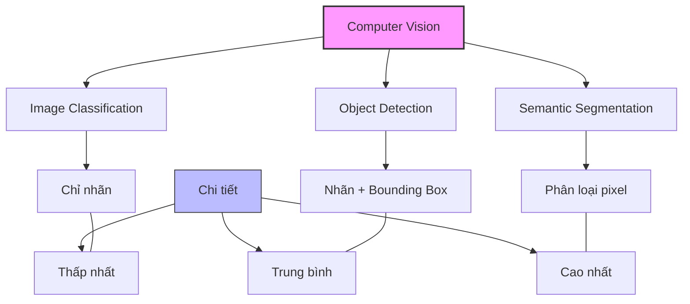
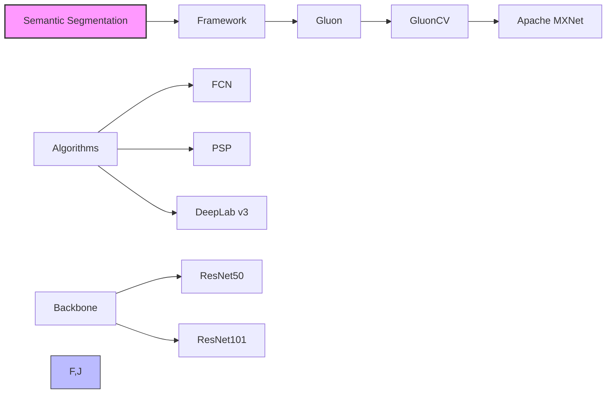
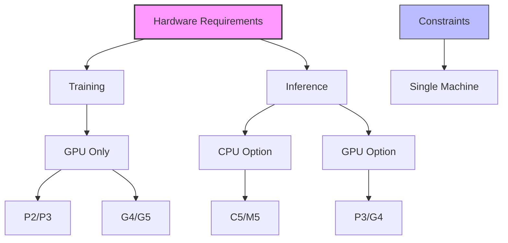

# Semantic Segmentation trong Amazon SageMaker

## 1. So sánh các kỹ thuật Computer Vision

## 2. Đặc điểm và ứng dụng

### Mức độ chi tiết:
- Phân loại từng pixel trong ảnh
- Tạo segmentation mask
- Map pixel tới nhãn tương ứng

### Ứng dụng:
1. Xe tự lái
2. Chẩn đoán y tế
3. Robot sensing

## 3. Kiến trúc và Thuật toán

### Thuật toán hỗ trợ:
1. FCN (Fully Convolutional Network)
2. PSP (Pyramid Scene Parsing)
3. DeepLab v3

### Backbone Networks:
- ResNet50
- ResNet101
- Pre-trained trên ImageNet

## 4. Định dạng dữ liệu

### Training:
1. **Input:**
   - JPEG/PNG files
   - Annotations
   - Label maps
   - Augmented manifest image format (pipe mode)

2. **Yêu cầu:**
   - Training data
   - Validation data

### Inference:
- Chấp nhận JPEG images

## 5. Training Modes

### 1. Full Training:
- Training từ đầu
- Tập dữ liệu tùy chỉnh

### 2. Incremental Training:
- Bắt đầu với ImageNet
- Mở rộng với objects mới

## 6. Hyperparameters

### Cơ bản:
- epochs
- learning_rate
- batch_size
- optimizer

### Đặc biệt:
- algorithm (FCN/PSP/DeepLab)
- backbone (ResNet50/ResNet101)

## 7. Yêu cầu phần cứng

### Training:
1. **Chỉ GPU:**
   - ml.p2 series
   - ml.p3 series
   - ml.g4dn series
   - ml.g5 series

2. **Giới hạn:**
   - Single machine only

### Inference:
1. **CPU:**
   - ml.c5 series
   - ml.m5 series

2. **GPU:**
   - ml.p3 series
   - ml.g4 series

## 8. Best Practices

### Lựa chọn thuật toán:
1. **FCN:** Nhanh, đơn giản
2. **PSP:** Cân bằng
3. **DeepLab v3:** Chi tiết cao

### Tối ưu hiệu năng:
1. **Sử dụng pipe mode:**
   - Stream dữ liệu từ S3
   - Tăng hiệu suất training

2. **Lựa chọn backbone:**
   - ResNet50: Nhanh hơn
   - ResNet101: Chi tiết hơn

## 9. Lưu ý quan trọng cho kỳ thi

1. **So sánh với các kỹ thuật khác:**
   - Chi tiết nhất (pixel-level)
   - Tốn nhiều tài nguyên nhất

2. **Về hardware:**
   - Training: Chỉ GPU, single machine
   - Inference: Linh hoạt CPU/GPU

3. **Về thuật toán:**
   - 3 lựa chọn: FCN, PSP, DeepLab
   - 2 backbone: ResNet50/101