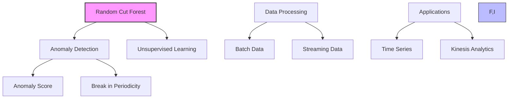
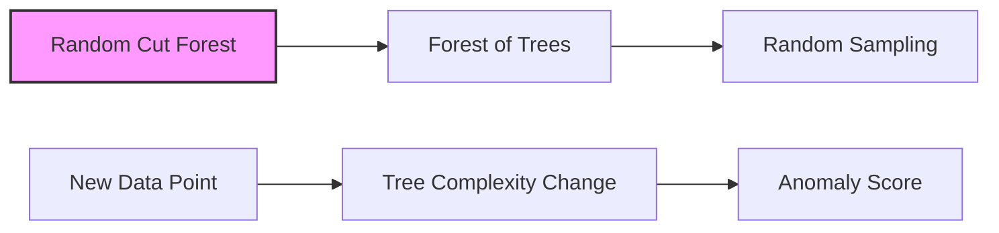
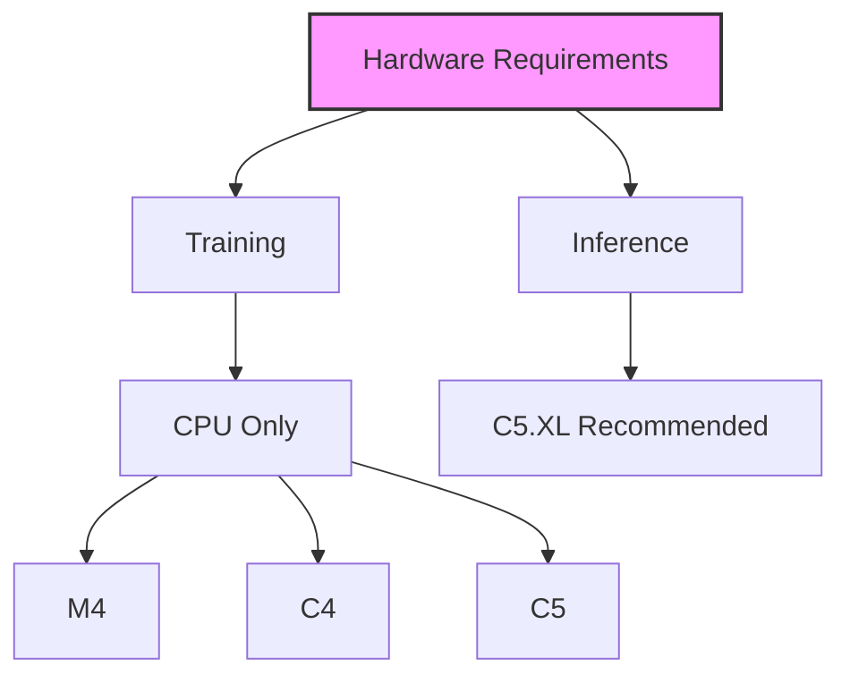

# Random Cut Forest trong Amazon SageMaker

## 1. Tổng quan

## 2. Đặc điểm chính

### Loại thuật toán:
- Unsupervised learning
- Phát hiện bất thường (anomaly detection)
- Phát triển bởi Amazon

### Khả năng:
- Gán điểm bất thường (anomaly score)
- Phát hiện đứt gãy chu kỳ
- Phát hiện dữ liệu không phân loại được

## 3. Cách hoạt động

### Quy trình:
1. Tạo forest từ các decision trees
2. Mỗi tree là một phân vùng của training data
3. Đánh giá sự thay đổi độ phức tạp khi thêm điểm mới
4. Nhiều thay đổi = Khả năng cao là bất thường

## 4. Định dạng đầu vào

### Supported formats:
1. CSV
2. RecordIO-protobuf

### Chế độ đầu vào:
- File mode
- Pipe mode

### Test Channel (tùy chọn):
- Đánh giá accuracy
- Tính precision, recall, F1
- Dùng cho dữ liệu đã gán nhãn

## 5. Hyperparameters

### Chính:
1. **num_trees:**
   - Số lượng cây
   - Càng nhiều càng giảm nhiễu

2. **num_samples_per_tree:**
   - Số mẫu trên mỗi cây
   - Công thức: 1/num_samples_per_tree ≈ tỷ lệ anomaly/normal

## 6. Yêu cầu phần cứng

### Training:
- Không sử dụng GPU
- CPU instances:
  - M4
  - C4
  - C5

### Inference:
- Khuyến nghị: C5.XL

## 7. Tích hợp và Ứng dụng

### Amazon Kinesis Analytics:
- Phát hiện bất thường real-time
- Xử lý dữ liệu streaming

### Loại dữ liệu:
1. **Batch processing:**
   - Xử lý dữ liệu theo lô
   - Phân tích lịch sử

2. **Stream processing:**
   - Xử lý real-time
   - Phát hiện bất thường ngay lập tức

## 8. Best Practices

### Tuning hiệu quả:
1. **Số lượng cây:**
   - Tăng để giảm nhiễu
   - Cân bằng với hiệu năng

2. **Số mẫu trên cây:**
   - Dựa vào tỷ lệ anomaly dự kiến
   - Điều chỉnh theo data distribution

### Lựa chọn instance:
1. **Cho training:**
   - Bắt đầu với C5
   - Scale theo kích thước dữ liệu

2. **Cho inference:**
   - Sử dụng C5.XL
   - Tối ưu cho production

## 9. Lưu ý quan trọng cho kỳ thi

1. **Về thuật toán:**
   - Thuật toán của Amazon
   - Unsupervised learning
   - Phát hiện bất thường

2. **Về dữ liệu:**
   - Hỗ trợ batch và streaming
   - Không cần labeled data

3. **Về triển khai:**
   - CPU only
   - Integration với Kinesis
   - Đơn giản nhưng hiệu quả