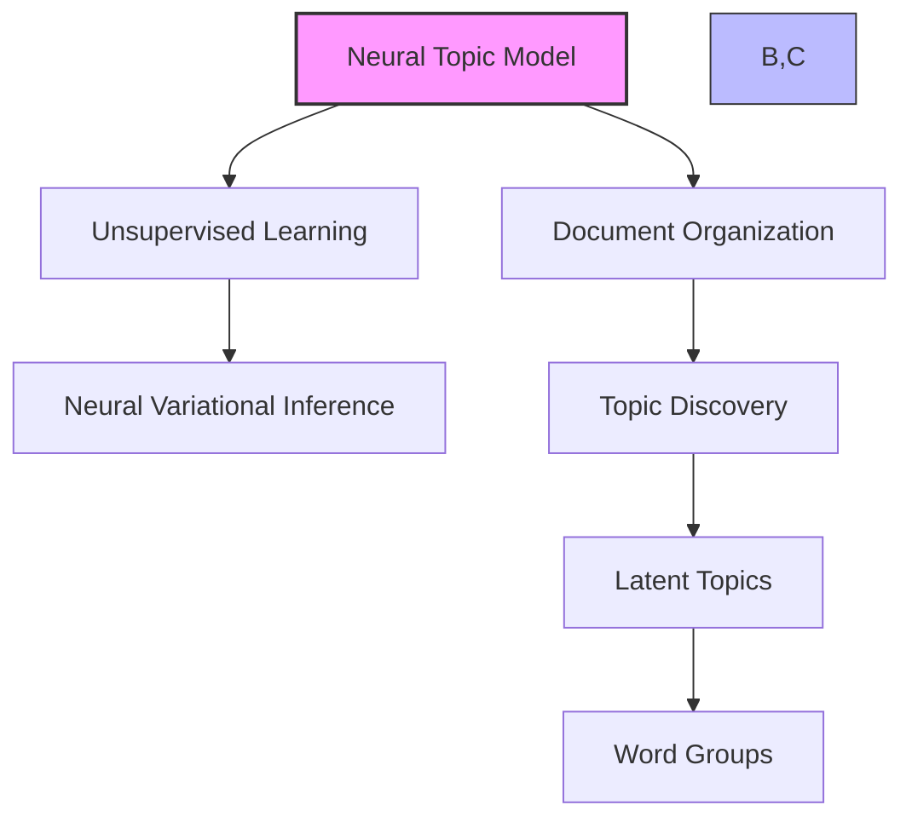
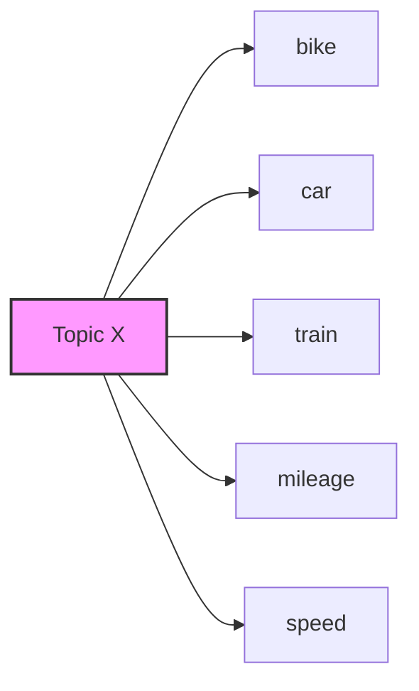
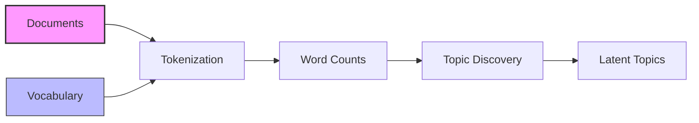
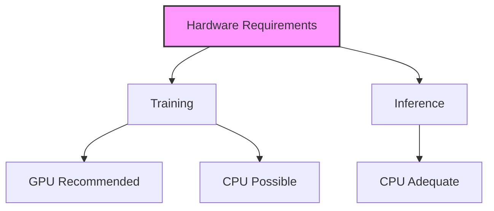

# Neural Topic Model trong Amazon SageMaker

## 1. Tổng quan

## 2. Đặc điểm và ứng dụng

### Mục tiêu:
- Tổ chức tài liệu thành chủ đề
- Phát hiện mối quan hệ ngữ nghĩa
- Nhóm từ liên quan

### Ví dụ:

### Lưu ý:
- Chủ đề là "latent" (ẩn)
- Không có tên chủ đề rõ ràng
- Cần người dùng giải thích

## 3. Định dạng dữ liệu đầu vào

### Formats hỗ trợ:
1. RecordIO-protobuf
2. CSV

### Yêu cầu dữ liệu:
1. **Tokenization:**
   - Chuyển đổi từ thành integers
   - Cần vocabulary file

2. **Vocabulary file:**
   - Map từ -> số
   - Đặt trong auxiliary channel

### Chế độ đầu vào:
- File mode
- Pipe mode (hiệu quả hơn)

## 4. Quy trình xử lý

### Các bước:
1. Tokenize văn bản
2. Đếm từ trong vocabulary
3. Phát hiện chủ đề
4. Tạo biểu diễn latent

## 5. Hyperparameters

### Cơ bản:
- num_topics (quan trọng nhất)
- batch_size 
- learning_rate

### Ảnh hưởng num_topics:
1. **Số lớn:**
   - Chủ đề chi tiết hơn
   - Phân loại mịn hơn

2. **Số nhỏ:**
   - Chủ đề tổng quát
   - Nhóm lớn hơn

## 6. Yêu cầu phần cứng

### Training:
- GPU khuyến nghị
- CPU có thể dùng (chậm hơn)

### Inference:
- CPU đủ dùng
- Tiết kiệm chi phí

## 7. So sánh với các phương pháp khác

### Vs TF-IDF:
- TF-IDF: Tìm kiếm từ cụ thể
- NTM: Nhóm chủ đề high-level

### Vs Supervised Learning:
- Không cần labeled data
- Tự động phát hiện chủ đề
- Linh hoạt hơn

## 8. Best Practices

### Lựa chọn num_topics:
1. Bắt đầu với số nhỏ
2. Tăng dần theo nhu cầu
3. Đánh giá kết quả sau mỗi lần thử

### Chuẩn bị dữ liệu:
1. Tokenize cẩn thận
2. Xây dựng vocabulary đầy đủ
3. Sử dụng pipe mode cho hiệu năng

### Đánh giá kết quả:
1. Kiểm tra coherence của topics
2. Xác nhận grouping hợp lý
3. Test với validation data

## 9. Lưu ý quan trọng cho kỳ thi

1. **Về thuật toán:**
   - Unsupervised learning
   - Neural variational inference
   - Không tạo tên chủ đề

2. **Về dữ liệu:**
   - Cần tokenization
   - Cần vocabulary file
   - Hỗ trợ cả file/pipe mode

3. **Về hyperparameters:**
   - num_topics là quan trọng nhất
   - batch_size và learning_rate cho neural network