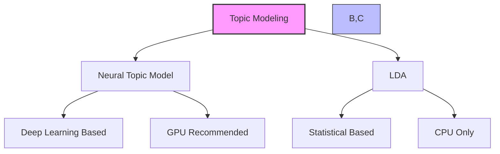
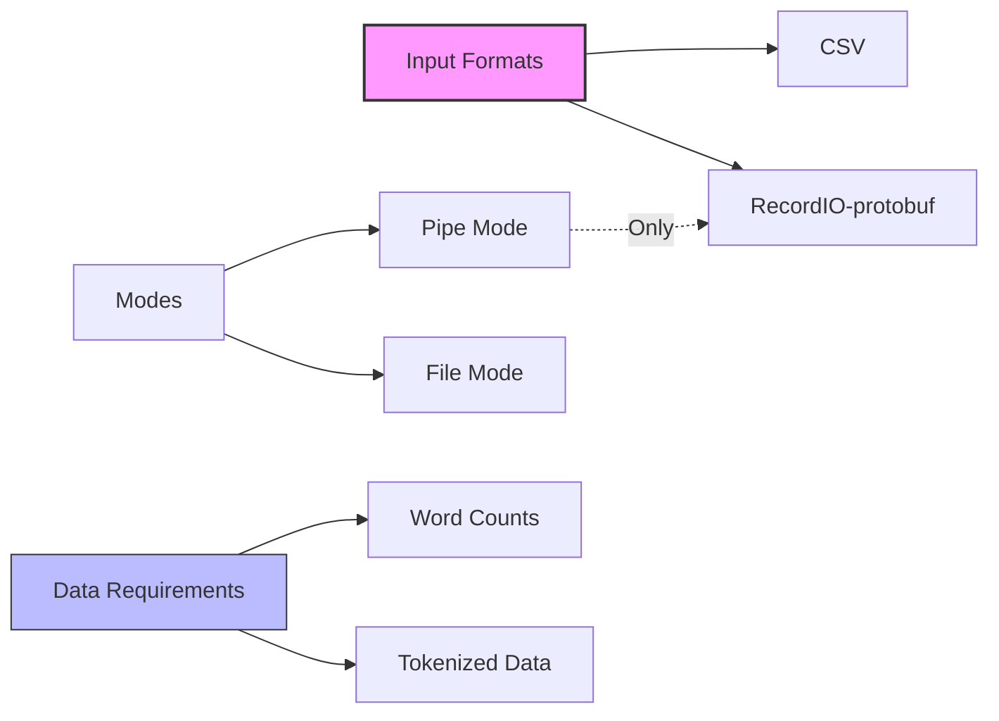
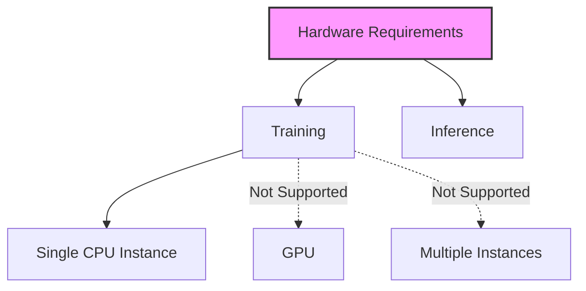

# LDA (Latent Dirichlet Allocation) trong Amazon SageMaker

## 1. So sánh với Neural Topic Model

## 2. Đặc điểm và ứng dụng

### Chính:
- Unsupervised learning
- Không sử dụng neural network
- Single CPU instance

### Ứng dụng:
1. **Phân tích văn bản:**
   - Phát hiện chủ đề
   - Nhóm tài liệu

2. **Ứng dụng khác:**
   - Clustering khách hàng theo mua sắm
   - Phân tích hài hòa trong âm nhạc
   - Bất kỳ dữ liệu nào có thể nhóm theo đặc điểm chung

## 3. Định dạng dữ liệu

### Yêu cầu:
1. **Tokenization:**
   - Chuyển từ thành integers
   - Đếm số lần xuất hiện

2. **Channels:**
   - Training channel (bắt buộc)
   - Test channel (tùy chọn)

## 4. Metrics và đánh giá

### Chính:
- Per-word log likelihood

### Test Channel:
- Đo độ chính xác (optional)
- Không ảnh hưởng đến mô hình

## 5. Hyperparameters

### Quan trọng nhất:
1. **num_topics:**
   - Điều chỉnh số lượng chủ đề
   - Kiểm soát mức độ chi tiết

2. **alpha0:**
   - Concentration parameter
   - Ảnh hưởng đến topic mixtures:
     - Nhỏ: sparse mixtures
     - Lớn: uniform mixtures

## 6. Yêu cầu phần cứng

### Đặc điểm:
- Chỉ dùng CPU
- Single instance
- Không hỗ trợ distributed training

## 7. So sánh với Neural Topic Model

### Giống nhau:
- Unsupervised learning
- Topic discovery
- Tokenized input
- num_topics parameter

### Khác nhau:
1. **Cơ chế:**
   - LDA: Statistical approach
   - NTM: Deep learning

2. **Hardware:**
   - LDA: Single CPU
   - NTM: GPU recommended

3. **Hyperparameters:**
   - LDA: Ít parameter hơn
   - NTM: Nhiều parameter deep learning

## 8. Best Practices

### Lựa chọn num_topics:
1. Bắt đầu với số nhỏ
2. Tăng dần theo nhu cầu
3. Đánh giá per-word log likelihood

### Điều chỉnh alpha0:
1. Thử nghiệm các giá trị
2. Quan sát topic distributions
3. Tối ưu theo ứng dụng

### Chuẩn bị dữ liệu:
1. Tokenize cẩn thận
2. Tính word counts chính xác
3. Sử dụng RecordIO cho pipe mode

## 9. Lưu ý quan trọng cho kỳ thi

1. **Đặc điểm chính:**
   - Không dùng deep learning
   - Chỉ dùng CPU
   - Single instance only

2. **Hyperparameters:**
   - num_topics là quan trọng nhất
   - alpha0 ảnh hưởng đến topic distributions

3. **Ứng dụng:**
   - Không chỉ cho văn bản
   - Có thể dùng cho nhiều loại clustering