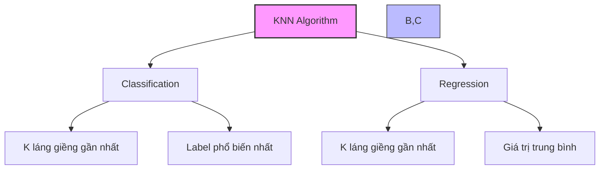
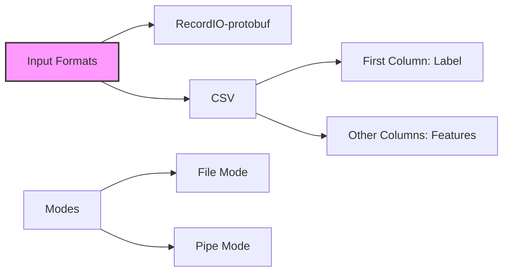
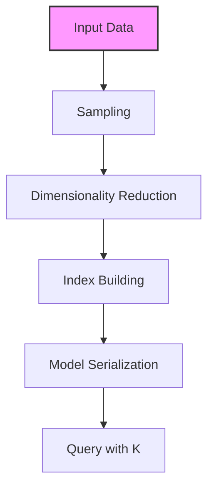
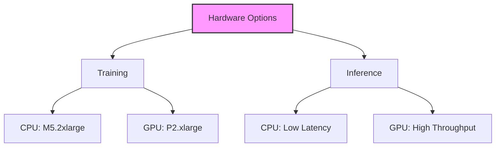

# K-Nearest Neighbors trong Amazon SageMaker

## 1. Nguyên lý cơ bản

## 2. Cải tiến của SageMaker

### Xử lý dữ liệu lớn:
1. **Sampling:**
   - Lấy mẫu thông minh
   - Giải quyết vấn đề scale

2. **Dimensionality Reduction:**
   - Giảm số chiều dữ liệu
   - Tránh curse of dimensionality

3. **Indexing:**
   - Xây dựng index nhanh
   - Tối ưu hóa truy vấn runtime

## 3. Định dạng dữ liệu

### Channels:
1. **Training channel:**
   - Chứa dữ liệu huấn luyện
   - Bắt buộc

2. **Test channel:**
   - Đo accuracy/MSE
   - Tùy chọn

## 4. Quy trình xử lý

## 5. Hyperparameters

### Chính:
1. **k:**
   - Số láng giềng xem xét
   - Ảnh hưởng trực tiếp đến kết quả

2. **sample_size:**
   - Kích thước mẫu
   - Cân bằng accuracy và performance

### Tuning k:
- Bắt đầu với k nhỏ
- Tăng dần và theo dõi
- Dừng khi diminishing returns

## 6. Yêu cầu phần cứng

### Training:
- CPU: ml.m5.2xlarge
- GPU: ml.p2.xlarge

### Inference:
1. **CPU:**
   - Độ trễ thấp
   - Phù hợp real-time

2. **GPU:**
   - Throughput cao
   - Phù hợp batch processing

## 7. Use Cases

### Classification:
- Label phổ biến nhất từ k láng giềng
- Ví dụ: phân loại spam

### Regression:
- Giá trị trung bình từ k láng giềng
- Ví dụ: dự đoán giá nhà

## 8. Best Practices

### Chuẩn bị dữ liệu:
1. **Feature scaling:**
   - Normalize các features
   - Đồng nhất khoảng cách

2. **Feature selection:**
   - Loại bỏ features không quan trọng
   - Giảm nhiễu

### Chọn k:
1. **Số lẻ:**
   - Tránh tie trong classification
   - Thường bắt đầu với √n

2. **Cross-validation:**
   - Thử nhiều giá trị k
   - Chọn k tối ưu

## 9. Lưu ý quan trọng cho kỳ thi

1. **Về thuật toán:**
   - Đơn giản nhất
   - Hỗ trợ cả classification và regression
   - SageMaker nâng cao với sampling và dimensionality reduction

2. **Về hardware:**
   - Hỗ trợ cả CPU và GPU
   - CPU: độ trễ thấp
   - GPU: throughput cao

3. **Về hyperparameters:**
   - k là quan trọng nhất
   - sample_size ảnh hưởng đến hiệu năng