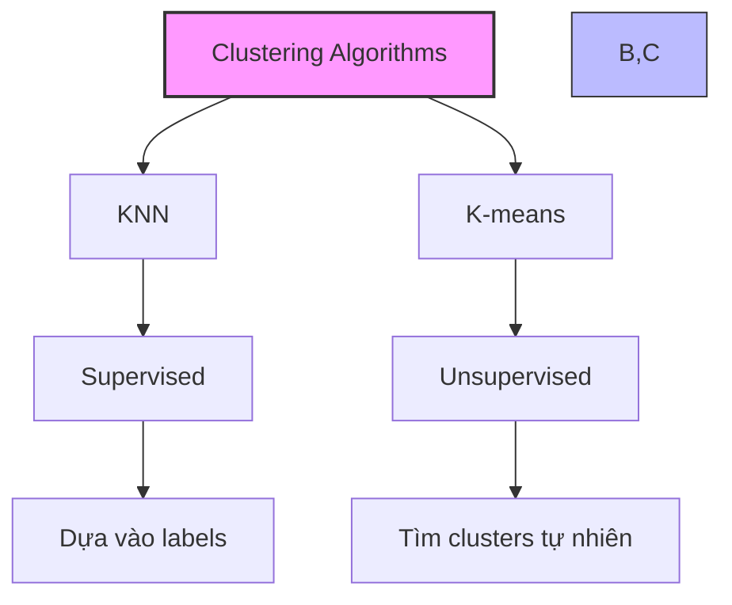
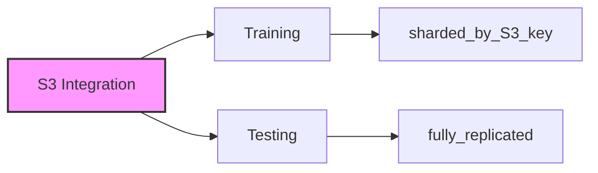
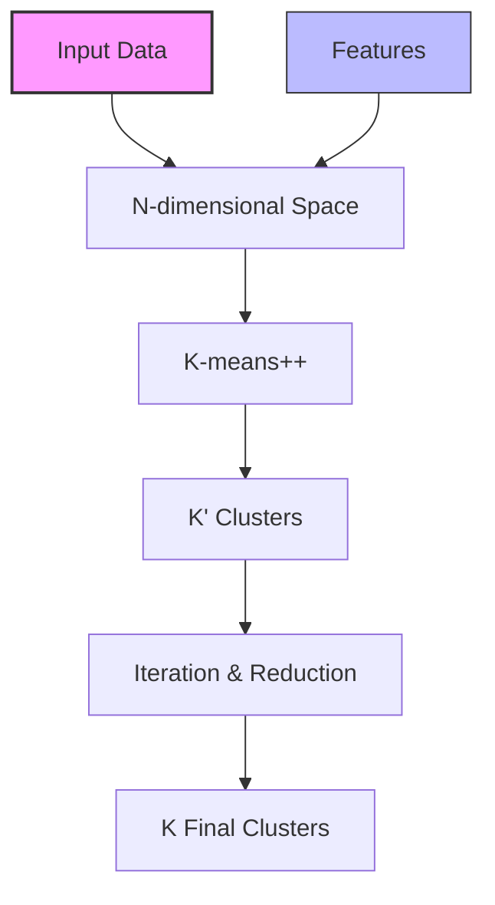
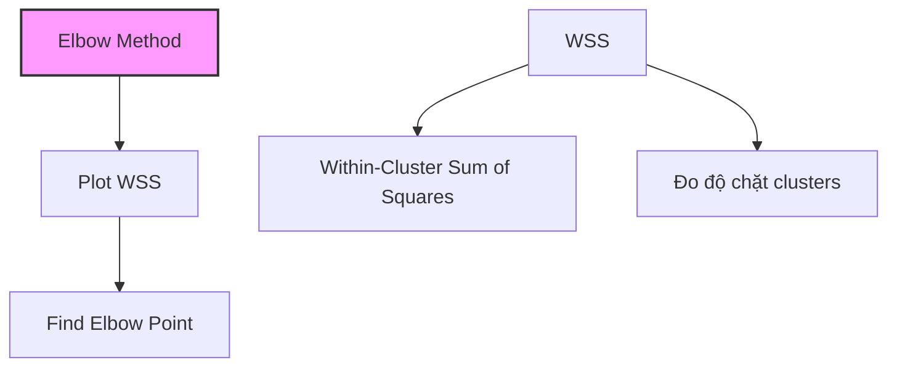

# K-means trong Amazon SageMaker

## 1. So sánh với KNN

## 2. Cải tiến của SageMaker

### Web-scale K-means:
1. **Extra Cluster Centers:**
   - K' = K × X (X: extra_center_factor)
   - Bắt đầu với nhiều clusters hơn
   - Thu gọn dần về K clusters

2. **K-means++:**
   - Khởi tạo cluster centers thông minh
   - Centers khởi tạo cách xa nhau
   - Sử dụng Lloyd's method

## 3. Định dạng dữ liệu

### Formats:
- RecordIO-protobuf
- CSV

### Modes:
- File mode
- Pipe mode

### S3 Integration:

## 4. Quy trình xử lý

### Steps:
1. Map data to n-dimensional space
2. Khởi tạo K' clusters với K-means++
3. Lặp và tối ưu centers
4. Thu gọn về K clusters

## 5. Hyperparameters

### Chính:
1. **k:**
   - Số clusters cuối cùng
   - Quan trọng nhất

2. **extra_center_factor:**
   - Hệ số mở rộng clusters
   - K' = K × X

3. **mini_batch_size:**
   - Kích thước batch xử lý

4. **init_method:**
   - random
   - k-means++

## 6. Chọn k (Elbow Method)

### Quy trình:
1. Thử nhiều giá trị k
2. Tính WSS cho mỗi k
3. Tìm điểm "khuỷu tay"

## 7. Yêu cầu phần cứng

### Training:
1. **CPU (Khuyến nghị):**
   - Standard instances

2. **GPU (Tùy chọn):**
   - ml.g4dn.xlarge
   - Chỉ 1 GPU/instance
   - P2/P3/G4 series

### Inference:
- Hỗ trợ cả CPU và GPU
- P2/P3/G4 series

## 8. Best Practices

### Chuẩn bị dữ liệu:
1. **Feature scaling:**
   - Normalize features
   - Chuẩn hóa khoảng cách

2. **Feature selection:**
   - Chọn features phù hợp
   - Giảm nhiễu

### Tối ưu hiệu năng:
1. **S3 Integration:**
   - Training: sharded_by_S3_key
   - Testing: fully_replicated

2. **Batch processing:**
   - Điều chỉnh mini_batch_size
   - Cân bằng memory và speed

## 9. Lưu ý quan trọng cho kỳ thi

1. **So với KNN:**
   - K-means: unsupervised
   - KNN: supervised

2. **Cải tiến SageMaker:**
   - Extra cluster centers
   - K-means++
   - Web-scale capability

3. **Hardware:**
   - CPU khuyến nghị
   - GPU: chỉ 1 GPU/instance

4. **S3 Integration:**
   - Training: sharded
   - Testing: replicated