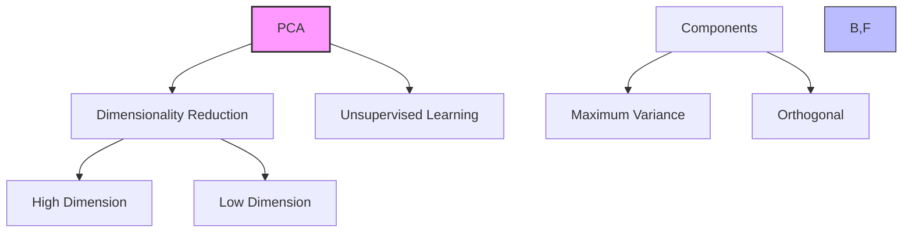
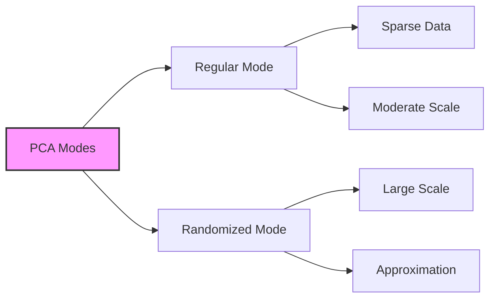
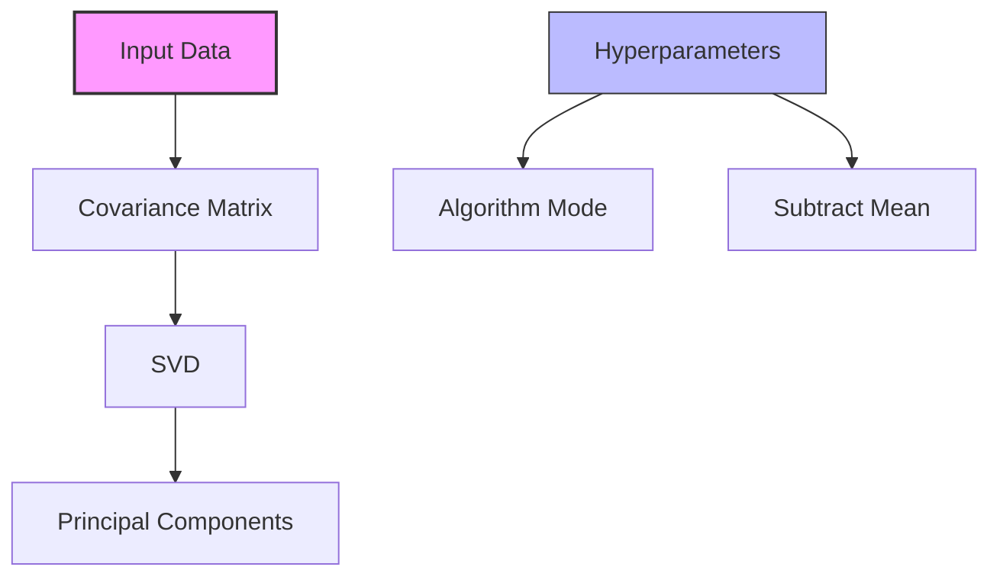

# Principal Component Analysis trong Amazon SageMaker

## 1. Tổng quan

## 2. Nguyên lý hoạt động

### Mục tiêu:
- Giảm chiều dữ liệu
- Giữ lại thông tin quan trọng nhất
- Tránh curse of dimensionality

### Principal Components:
1. **Component 1:**
   - Biến thiên lớn nhất
   - Thông tin quan trọng nhất

2. **Component 2:**
   - Biến thiên lớn thứ hai
   - Trực giao với component 1

## 3. Modes hoạt động

### Regular Mode:
- Dữ liệu thưa
- Số lượng features vừa phải
- Số lượng observations vừa phải

### Randomized Mode:
- Scale tốt hơn
- Dùng thuật toán xấp xỉ
- Phù hợp dữ liệu lớn

## 4. Quy trình xử lý

### Steps:
1. Tạo covariance matrix
2. Áp dụng SVD (Singular Value Decomposition)
3. Trích xuất principal components

## 5. Định dạng dữ liệu

### Formats:
- RecordIO-protobuf
- CSV

### Modes:
- File mode
- Pipe mode

## 6. Hyperparameters

### Chính:
1. **algorithm_mode:**
   - regular
   - randomized

2. **subtract_mean:**
   - Unbias data
   - Chuẩn hóa trước xử lý

## 7. Yêu cầu phần cứng

### Hỗ trợ:
- CPU instances
- GPU instances

### Lựa chọn:
- Phụ thuộc vào dữ liệu
- Cần thử nghiệm cả hai

## 8. Best Practices

### Chọn mode:
1. **Regular mode khi:**
   - Dữ liệu thưa
   - Scale vừa phải

2. **Randomized mode khi:**
   - Dữ liệu dày đặc
   - Scale lớn

### Chuẩn bị dữ liệu:
1. **Feature scaling:**
   - Normalize features
   - Quan trọng cho PCA

2. **subtract_mean:**
   - Cân nhắc unbias
   - Tăng độ chính xác

## 9. Ưu điểm và Ứng dụng

### Ưu điểm:
1. **Unsupervised:**
   - Không cần labeled data
   - Tự động tìm components

2. **Hiệu quả:**
   - Giảm chiều tối ưu
   - Giữ thông tin quan trọng

### Ứng dụng:
1. **Visualization:**
   - Giảm xuống 2D/3D
   - Trực quan hóa dữ liệu

2. **Feature Engineering:**
   - Giảm số features
   - Input cho các mô hình khác

## 10. Lưu ý quan trọng cho kỳ thi

1. **Về thuật toán:**
   - Dimensionality reduction
   - Unsupervised learning
   - Dựa trên variance

2. **Về modes:**
   - Regular: dữ liệu thưa/vừa
   - Randomized: dữ liệu lớn

3. **Về hardware:**
   - Hỗ trợ cả CPU/GPU
   - Cần thử nghiệm để chọn