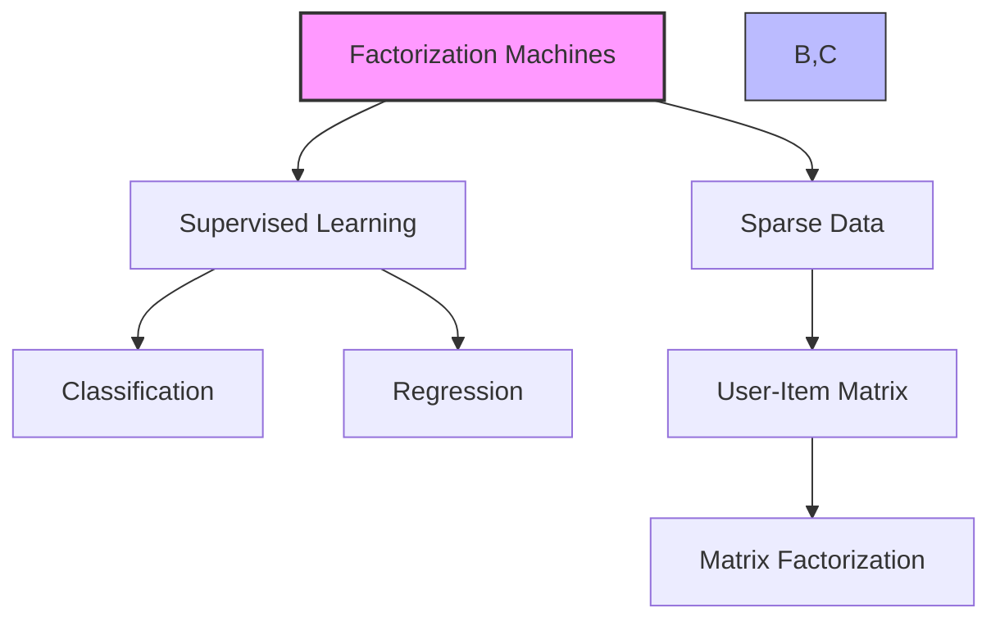
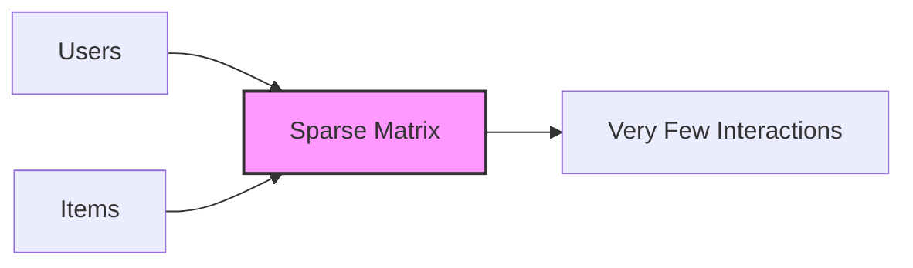
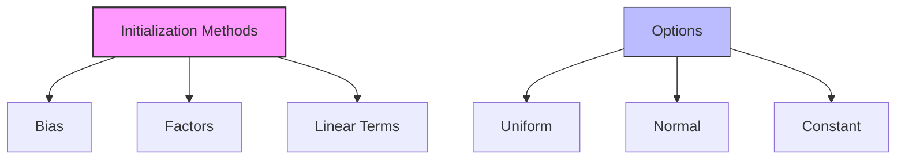

# Factorization Machines trong Amazon SageMaker

## 1. Tổng quan

## 2. Đặc điểm dữ liệu thưa

### Ví dụ:
1. **Recommender Systems:**

- Nhiều sản phẩm
- Ít tương tác user-item
- Phần lớn ma trận trống

2. **Click Prediction:**
- Rất nhiều trang web
- User chỉ click một số ít
- Dự đoán click tiếp theo

## 3. Cách hoạt động

### Ma trận hóa:
1. **Input:**
   - Ma trận user-item thưa
   - Chứa ratings/interactions

2. **Process:**
   - Phân tích ma trận
   - Tìm factors
   - Dự đoán các giá trị thiếu

3. **Output:**
   - Dự đoán tương tác mới
   - Classifications/Ratings

## 4. Định dạng dữ liệu

### Yêu cầu:
- RecordIO-protobuf format
- Float32 data
- Không hỗ trợ CSV (không phù hợp với dữ liệu thưa)

### Cấu trúc:
- Pairwise interactions
- 2 chiều (ví dụ: users × items)

## 5. Hyperparameters

### Initialization methods:
1. **Bias:**
   - uniform/normal/constant

2. **Factors:**
   - uniform/normal/constant

3. **Linear terms:**
   - uniform/normal/constant

## 6. Yêu cầu phần cứng

### Training:
1. **CPU (Khuyến nghị):**
   - Phù hợp với dữ liệu thưa
   - Hiệu quả hơn

2. **GPU:**
   - Chỉ có lợi với dense data
   - Không khuyến nghị cho sparse data

## 7. Ứng dụng chính

### 1. Recommender Systems:
- Gợi ý sản phẩm
- Gợi ý nội dung
- Personalization

### 2. Click Prediction:
- Dự đoán hành vi user
- Tối ưu quảng cáo
- Web analytics

## 8. Best Practices

### Xử lý dữ liệu:
1. **Dữ liệu thưa:**
   - Sử dụng format phù hợp
   - Tối ưu lưu trữ

2. **Feature engineering:**
   - Xây dựng pairs hiệu quả
   - Chuẩn hóa features

### Lựa chọn hardware:
1. **Ưu tiên CPU:**
   - Phù hợp với sparse data
   - Tiết kiệm chi phí

2. **Tránh GPU:**
   - Không cần thiết cho sparse data
   - Lãng phí tài nguyên

## 9. Lưu ý quan trọng cho kỳ thi

1. **Về thuật toán:**
   - Chuyên biệt cho sparse data
   - Supervised learning
   - Hỗ trợ classification/regression

2. **Về ứng dụng:**
   - Recommender systems
   - Click prediction
   - Pairwise interactions

3. **Về dữ liệu:**
   - Chỉ RecordIO-protobuf
   - Không dùng CSV
   - Format Float32

4. **Về hardware:**
   - CPU tốt hơn GPU
   - GPU chỉ cho dense data