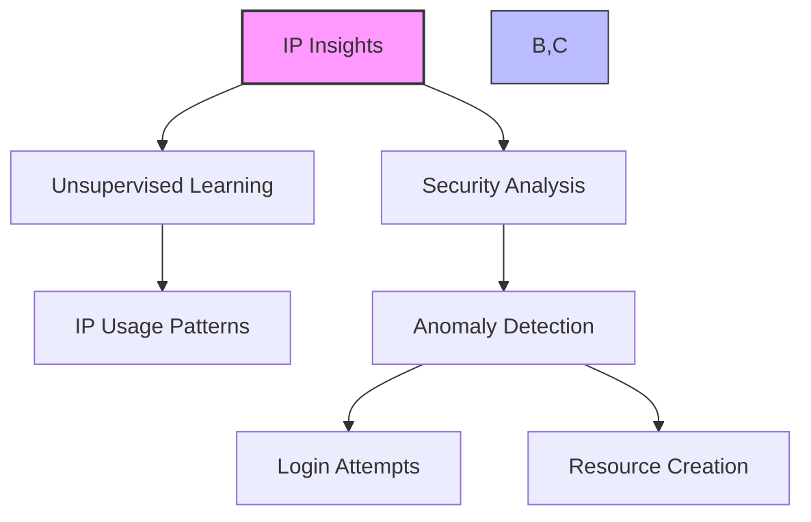
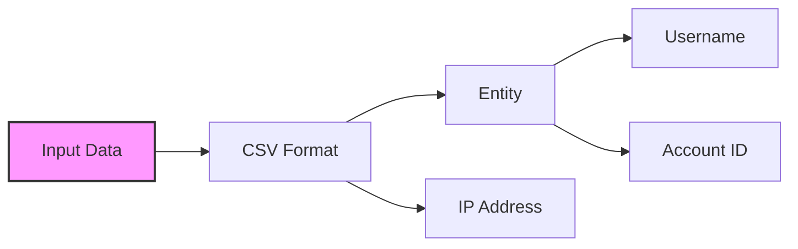
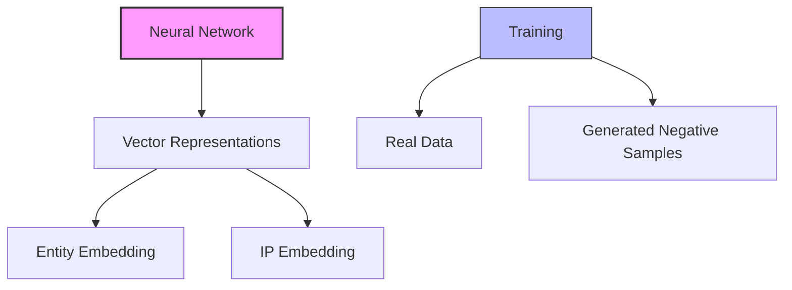
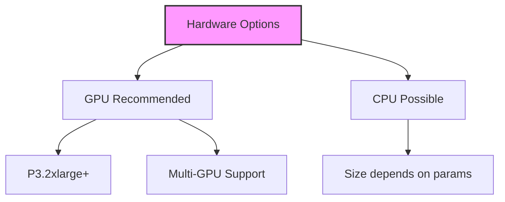

# IP Insights trong Amazon SageMaker

## 1. Tổng quan

## 2. Đặc điểm và ứng dụng

### Mục tiêu:
- Phát hiện hành vi bất thường từ IP
- Phân tích web logs
- Bảo mật hệ thống

### Use Cases:
1. **Login Security:**
   - Phát hiện login từ IP bất thường
   - Cảnh báo xâm nhập

2. **Resource Monitoring:**
   - Theo dõi tạo tài nguyên
   - Phát hiện hoạt động đáng ngờ

## 3. Cấu trúc dữ liệu

### Format:
- CSV đơn giản
- Hai cột: Entity, IP
- Không cần preprocessing phức tạp

## 4. Kiến trúc và hoạt động

### Quy trình:
1. Hash và embed entities
2. Tạo vector representations
3. Tự động sinh negative samples
4. So sánh patterns

## 5. Hyperparameters

### Neural Network:
- epochs
- learning_rate
- batch_size

### Specific:
1. **num_entity_vectors:**
   - Hash size
   - Khuyến nghị: 2 × số unique entities

2. **vector_dim:**
   - Kích thước embedding vectors
   - Cẩn thận overfitting

## 6. Yêu cầu phần cứng

### Khuyến nghị:
- GPU (P3.2xlarge hoặc cao hơn)
- Hỗ trợ multiple GPUs/machine

## 7. Xử lý dữ liệu không cân bằng

### Automatic Sampling:
1. **Real Data:**
   - Normal IP patterns
   - Legitimate usage

2. **Generated Data:**
   - Random entity-IP pairs
   - Simulated anomalies

## 8. Best Practices

### Tuning Hash Size:
1. Đếm unique entities
2. Nhân đôi số lượng
3. Set num_entity_vectors

### Vector Dimension:
1. Bắt đầu nhỏ
2. Tăng dần theo nhu cầu
3. Theo dõi overfitting

### Hardware Selection:
1. Ưu tiên GPU
2. Scale theo kích thước dữ liệu

## 9. Lưu ý quan trọng cho kỳ thi

1. **Về thuật toán:**
   - Unsupervised learning
   - Dùng neural network
   - Phát hiện anomaly IP

2. **Về dữ liệu:**
   - CSV đơn giản
   - Entity + IP
   - Tự động tạo negative samples

3. **Về hardware:**
   - GPU recommended
   - P3.2xlarge+
   - Multi-GPU support

## 10. Đặc điểm nổi bật

### Ưu điểm:
1. Đơn giản hóa input
2. Tự động sinh negative samples
3. Scale tốt với GPU

### Hạn chế:
1. Cần hash size đủ lớn
2. Có thể overfitting với vector_dim lớn
3. Yêu cầu phần cứng mạnh