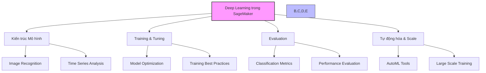
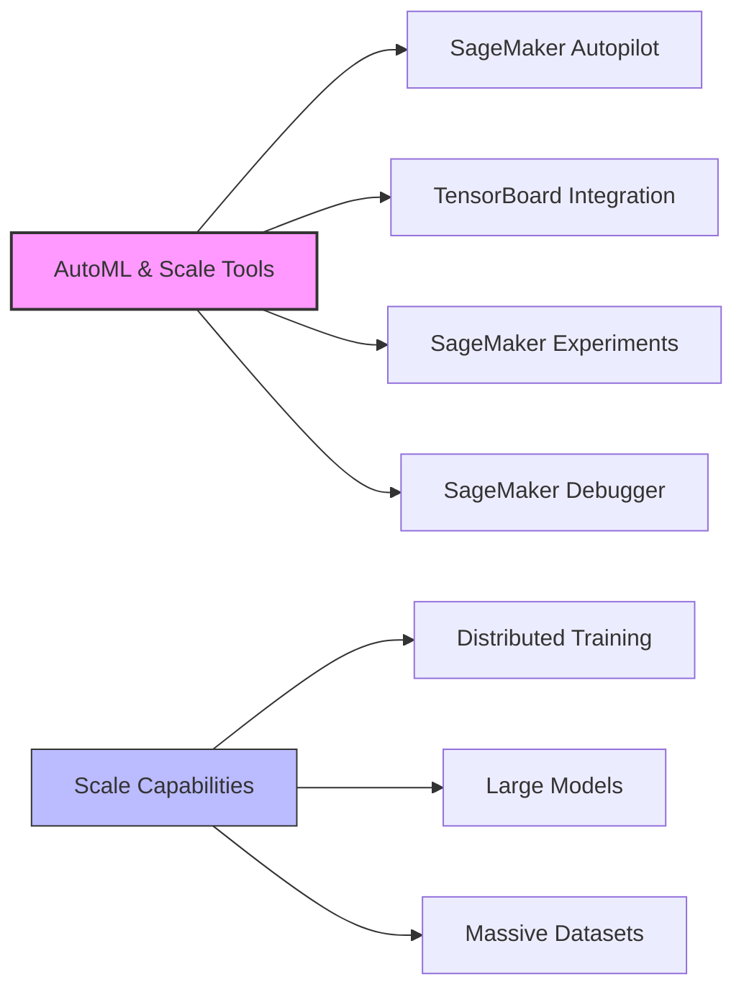
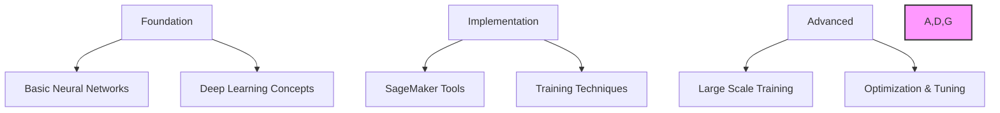

# Deep Learning trong Amazon SageMaker - Tổng quan

## 1. Cấu trúc kiến thức

## 2. Các thành phần chính

### 2.1 Kiến trúc Mô hình
- Image Recognition Networks
- Time Series Networks
- Deep Neural Architectures

### 2.2 Training & Tuning
- Model Optimization
- Hyperparameter Tuning
- Training Strategies

### 2.3 Evaluation Methods
- Classification Metrics
- Performance Measurement
- Model Validation

### 2.4 Công cụ tự động và Scale

## 3. Công cụ và tích hợp

### 3.1 SageMaker Autopilot
- Tự động ML pipeline
- Model selection
- Hyperparameter optimization

### 3.2 TensorBoard
- Visualization
- Training monitoring
- Performance analysis

### 3.3 SageMaker Experiments
- Experiment tracking
- Version control
- Result comparison

### 3.4 SageMaker Debugger
- Real-time monitoring
- Debug training issues
- Optimization suggestions

## 4. Large Scale Training

### 4.1 Distributed Training
- Multi-GPU
- Multi-node
- Data parallelism

### 4.2 Large Models
- Model parallelism
- Memory optimization
- Pipeline parallelism

### 4.3 Massive Datasets
- Efficient data loading
- Streaming data
- Data optimization

## 5. Best Practices

### 5.1 Model Development
1. **Architecture Selection:**
   - Phù hợp với bài toán
   - Cân nhắc computational cost
   - Khả năng scale

2. **Training Strategy:**
   - Batch size optimization
   - Learning rate scheduling
   - Regularization techniques

### 5.2 Optimization
1. **Resource Usage:**
   - GPU utilization
   - Memory management
   - I/O optimization

2. **Cost Management:**
   - Instance selection
   - Training time optimization
   - Resource scaling

## 6. Lộ trình học tập

### 6.1 Foundation
- Deep learning basics
- Neural network architectures
- Training fundamentals

### 6.2 Implementation
- SageMaker tools
- Practical training
- Evaluation methods

### 6.3 Advanced Topics
- Large scale deployment
- Advanced optimization
- Custom solutions

## 7. Chú ý quan trọng

1. **Về kiến trúc:**
   - Hiểu các mô hình cơ bản
   - Nắm vững use cases
   - Biết cách chọn mô hình

2. **Về training:**
   - Optimization techniques
   - Resource management
   - Monitoring & debugging

3. **Về scale:**
   - Distributed training
   - Large model training
   - Data management