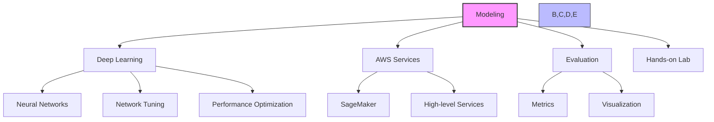
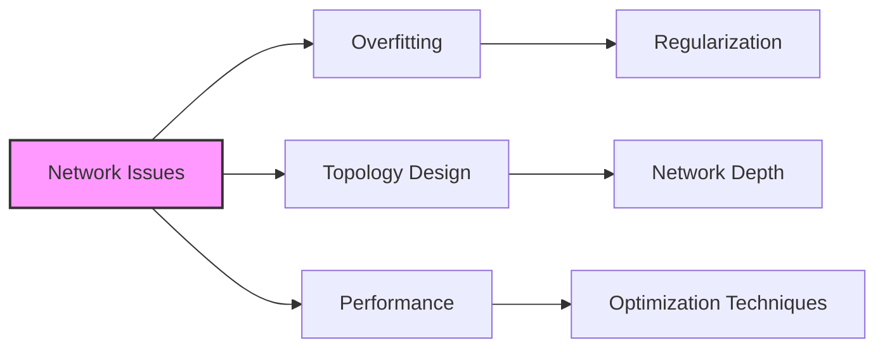
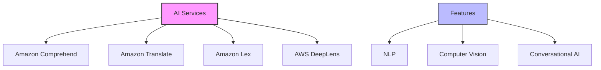
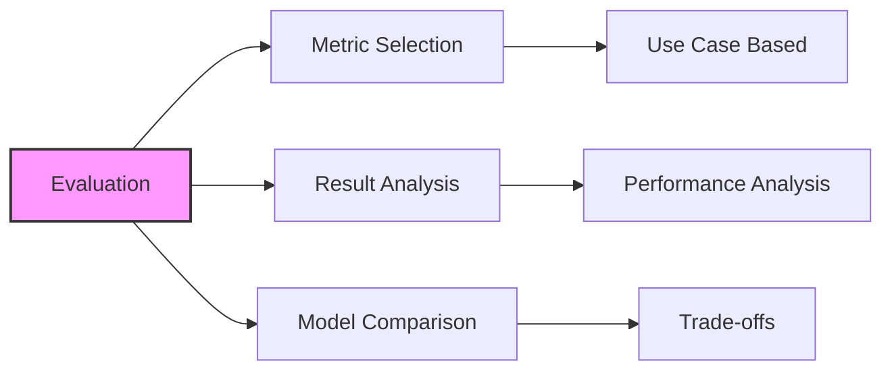

# Tổng quan về Modeling trong AWS Machine Learning

## 1. Cấu trúc nội dung

## 2. Deep Learning Foundations

### 2.1 Neural Networks
- Kiến trúc cơ bản
- Convolutional Neural Networks (CNN)
- Recurrent Neural Networks (RNN)

### 2.2 Network Optimization

## 3. AWS Services Deep Dive

### 3.1 Amazon SageMaker
1. **Built-in Algorithms:**
   - Các thuật toán sẵn có
   - Use cases phù hợp
   - Configuration & tuning

2. **Automatic Model Tuning:**
   - Hyperparameter optimization
   - Search strategies
   - Resource management

### 3.2 High-level AI Services

## 4. Model Evaluation

### 4.1 Metrics & Measures
1. **Core Metrics:**
   - Accuracy
   - Precision
   - Recall
   - F1 Score

2. **Visualization Tools:**
   - Confusion Matrix
   - ROC Curve
   - Performance Plots

### 4.2 Interpretation

## 5. Hands-on Lab: CNN

### 5.1 Implementation
1. **Network Design:**
   - Kiến trúc CNN
   - Layer configuration
   - Data preprocessing

2. **Training Process:**
   - Batch processing
   - Monitoring progress
   - Error handling

### 5.2 Optimization
1. **Regularization:**
   - Dropout
   - Batch normalization
   - Weight decay

2. **Hyperparameter Tuning:**
   - Learning rate
   - Batch size
   - Network architecture

## 6. Trọng tâm cho kỳ thi

### 6.1 Lý thuyết
1. **Deep Learning:**
   - Hiểu sâu về neural networks
   - Các kỹ thuật optimization
   - Xử lý overfitting

2. **AWS Services:**
   - SageMaker capabilities
   - AI service features
   - Integration patterns

### 6.2 Thực hành
1. **Model Evaluation:**
   - Chọn metrics phù hợp
   - Phân tích kết quả
   - Đánh giá hiệu năng

2. **Implementation:**
   - Configuration tối ưu
   - Resource utilization
   - Performance tuning

## 7. Tips học tập

1. **Tập trung vào:**
   - Concepts cơ bản về deep learning
   - AWS services và capabilities
   - Model evaluation metrics
   - Real-world optimization

2. **Thực hành:**
   - Labs với CNN
   - SageMaker experiments
   - Metric analysis
   - Performance tuning

3. **Chuẩn bị cho exam:**
   - Nắm vững evaluation metrics
   - Hiểu rõ AWS services
   - Practice với real-world scenarios