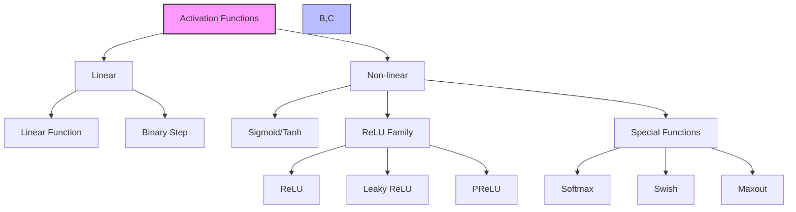
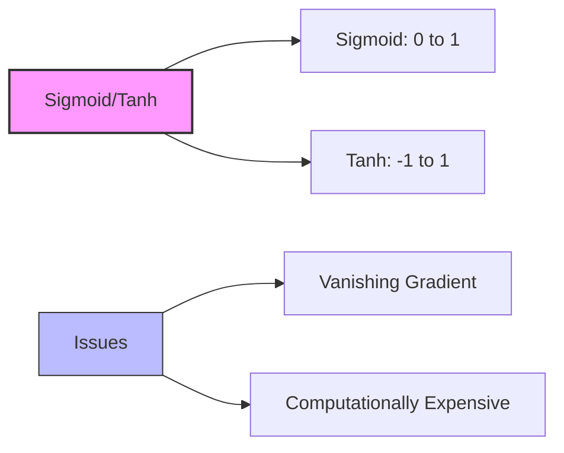
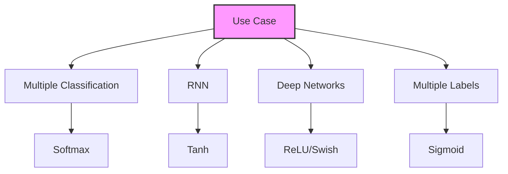

# Activation Functions trong Neural Networks

## 1. Tổng quan và Phân loại

## 2. Linear Activation Functions

### 2.1 Linear Function
- **Đặc điểm:** Output = Input
- **Vấn đề:**
  - Không học được mẫu phức tạp
  - Không hỗ trợ backpropagation
  - Vô nghĩa với multiple layers

### 2.2 Binary Step
- **Đặc điểm:** Output chỉ 0 hoặc 1
- **Vấn đề:**
  - Không xử lý được multiple classification
  - Đạo hàm vô cùng tại điểm chuyển
  - Không ổn định về mặt toán học

## 3. Non-linear Activation Functions

### 3.1 Sigmoid và Tanh

### 3.2 ReLU Family

1. **ReLU:**
   - Đơn giản và hiệu quả
   - Tính toán nhanh
   - Vấn đề "dying ReLU"

2. **Leaky ReLU:**
   - Giải quyết dying ReLU
   - Slope âm nhỏ
   - Slope cố định

3. **PReLU:**
   - Slope âm học được
   - Phức tạp hơn
   - Tốn nhiều tài nguyên

### 3.3 Special Functions

1. **Softmax:**
   - Dùng cho output layer
   - Multiple classification
   - Chuyển đổi sang probabilities

2. **Swish:**
   - Phát triển bởi Google
   - Tốt cho deep networks (>40 layers)
   - Smooth curve

3. **Maxout:**
   - Output là max của inputs
   - Gấp đôi parameters
   - Tốn kém về tính toán

## 4. Hướng dẫn lựa chọn

### 4.1 Quy trình lựa chọn:
1. **Output layer:**
   - Multiple classification → Softmax
   - Multiple labels → Sigmoid

2. **Hidden layers:**
   - RNN → Tanh
   - Basic → ReLU
   - Performance issues → Leaky ReLU
   - Deep networks → Swish

## 5. Lưu ý quan trọng cho kỳ thi

1. **Hiểu rõ:**
   - Vấn đề của linear functions
   - Ưu điểm của non-linear functions
   - Use cases của mỗi loại

2. **Nhớ rằng:**
   - ReLU là lựa chọn phổ biến nhất
   - Softmax cho classification
   - Tanh cho RNN
   - Sigmoid cho multiple labels

3. **Không cần:**
   - Chi tiết công thức toán học
   - Cách implement
   - Các biến thể ít phổ biến