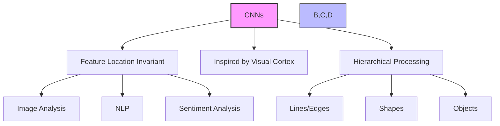
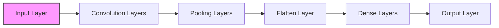
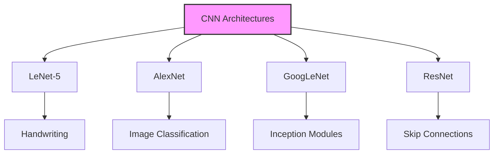

# Convolutional Neural Networks (CNNs) - Từ lý thuyết đến thực hành

## 1. Tổng quan và nguyên lý



### 1.1 Đặc điểm chính:
- Tìm patterns bất kể vị trí
- Xử lý theo phân cấp
- Dựa trên cơ chế thị giác sinh học

### 1.2 Ứng dụng:
1. **Computer Vision:**
   - Nhận diện đối tượng
   - Phân tích hình ảnh
   - Xử lý video

2. **Xử lý ngôn ngữ:**
   - Machine translation
   - Sentiment analysis
   - Text classification

## 2. Cấu trúc và hoạt động



### 2.1 Các layer chính:

1. **Convolution Layer:**
   - Chia nhỏ dữ liệu
   - Tìm patterns cục bộ
   - Áp dụng filters

2. **Pooling Layer:**
   - Giảm kích thước
   - Giữ thông tin quan trọng
   - Tăng hiệu suất

3. **Dense Layer:**
   - Xử lý đặc trưng
   - Classification
   - Decision making

## 3. Triển khai với Keras/TensorFlow

### 3.1 Cấu trúc dữ liệu:
```python
# Image data shape
width × height × channels  # channels: 1 (grayscale) or 3 (RGB)
```

### 3.2 Layer types:
1. **Convolution:**
   - Conv1D/2D/3D
   - Kernel size
   - Filters

2. **Pooling:**
   - MaxPooling1D/2D/3D
   - Stride
   - Pool size

3. **Chuyển đổi:**
   - Flatten
   - Dense
   - Dropout

## 4. Các kiến trúc phổ biến



### 4.1 So sánh:
1. **LeNet-5:**
   - Đơn giản
   - Handwriting recognition
   - Ít layers

2. **AlexNet:**
   - Deeper network
   - Image classification
   - Better performance

3. **GoogLeNet:**
   - Inception modules
   - Optimized architecture
   - Complex patterns

4. **ResNet:**
   - Skip connections
   - Very deep
   - State-of-the-art

## 5. Hyperparameters và Tuning

### 5.1 Key Parameters:
1. **Network Structure:**
   - Layer count
   - Units per layer
   - Activation functions

2. **Convolution:**
   - Kernel size
   - Stride
   - Padding

3. **Training:**
   - Batch size
   - Learning rate
   - Optimizers

## 6. Thách thức và giải pháp

### 6.1 Performance:
1. **Computational:**
   - GPU acceleration
   - Batch processing
   - Memory optimization

2. **Data:**
   - Data collection
   - Augmentation
   - Preprocessing

### 6.2 Optimization:
1. **Architecture:**
   - Use proven models
   - Transfer learning
   - Fine-tuning

2. **Resource:**
   - GPU utilization
   - Memory management
   - Batch sizing

## 7. Lưu ý cho AWS/SageMaker

1. **ResNet focus:**
   - ResNet-50 phổ biến
   - Built-in support
   - Pre-trained models

2. **Implementation:**
   - GPU instances
   - Distributed training
   - Model optimization

## 8. Best Practices

1. **Architecture Selection:**
   - Dựa vào use case
   - Cân nhắc resources
   - Start simple

2. **Training Strategy:**
   - Data preparation
   - Incremental complexity
   - Monitor performance

3. **Optimization:**
   - GPU utilization
   - Memory management
   - Batch optimization