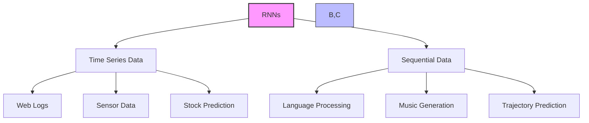
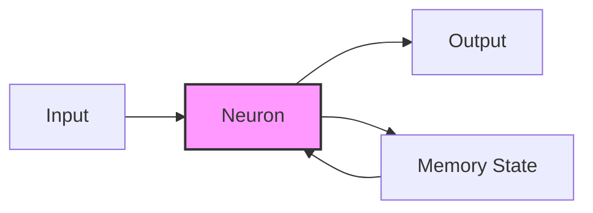
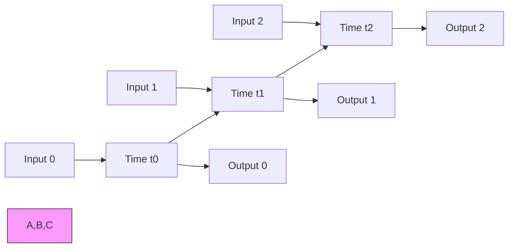
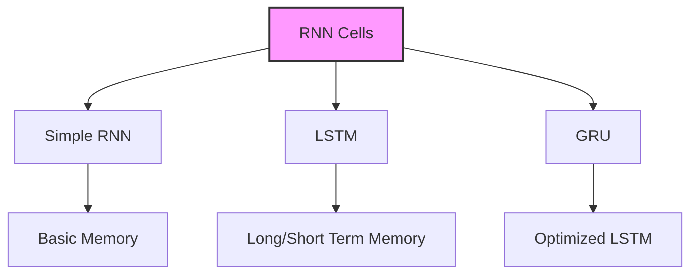
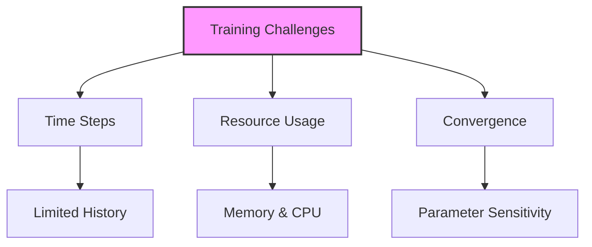

# Recurrent Neural Networks (RNNs) - Kiến trúc và ứng dụng

## 1. Tổng quan và ứng dụng

## 2. Cấu trúc và hoạt động

### 2.1 Recurrent Neuron

### 2.2 Unrolled in Time

## 3. Kiến trúc và biến thể

### 3.1 Input-Output Patterns
1. **Sequence to Sequence:**
   - Time series prediction
   - Machine translation

2. **Sequence to Vector:**
   - Sentiment analysis
   - Text classification

3. **Vector to Sequence:**
   - Image captioning
   - Music generation

4. **Encoder-Decoder:**
   - Language translation
   - Text summarization

### 3.2 Cell Types

1. **Simple RNN:**
   - Basic memory cell
   - Diluted history
   - Short-term memory

2. **LSTM (Long Short-Term Memory):**
   - Separate state tracking
   - Better long-term memory
   - Complex structure

3. **GRU (Gated Recurrent Unit):**
   - Simplified LSTM
   - Good performance
   - Faster training

## 4. Training và thách thức

### 4.1 Backpropagation Through Time

### 4.2 Optimization Techniques:
1. **Truncated Backpropagation:**
   - Giới hạn time steps
   - Giảm computational cost
   - Trade-off accuracy

2. **Cell Selection:**
   - LSTM for long dependencies
   - GRU for performance
   - Simple RNN for basic tasks

## 5. Ứng dụng thực tế

### 5.1 Language Processing:
1. **Machine Translation:**
   - Sequence to sequence
   - Encoder-decoder architecture
   - Context preservation

2. **Text Generation:**
   - Character/word level
   - Temperature control
   - Creative applications

### 5.2 Time Series:
1. **Financial:**
   - Stock prediction
   - Risk analysis
   - Trend detection

2. **IoT/Sensors:**
   - Anomaly detection
   - Predictive maintenance
   - Real-time monitoring

## 6. Best Practices

### 6.1 Architecture Selection:
1. **Cell Type:**
   - LSTM cho dependencies dài
   - GRU cho hiệu năng
   - Simple RNN cho tasks đơn giản

2. **Topology:**
   - Layer count
   - Unit count
   - Dropout rates

### 6.2 Training Strategy:
1. **Data Preparation:**
   - Sequence length
   - Batch size
   - Data normalization

2. **Resource Management:**
   - Memory optimization
   - GPU utilization
   - Batch processing

## 7. Lưu ý quan trọng

1. **Về kiến trúc:**
   - Chọn cell type phù hợp
   - Cân nhắc sequence length
   - Tối ưu memory usage

2. **Về training:**
   - Truncated backpropagation
   - Parameter sensitivity
   - Convergence monitoring

3. **Về performance:**
   - Resource intensive
   - Long training times
   - Complex optimization