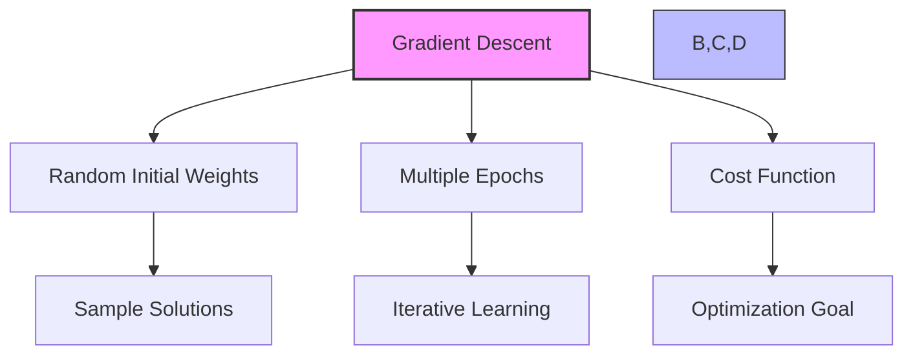
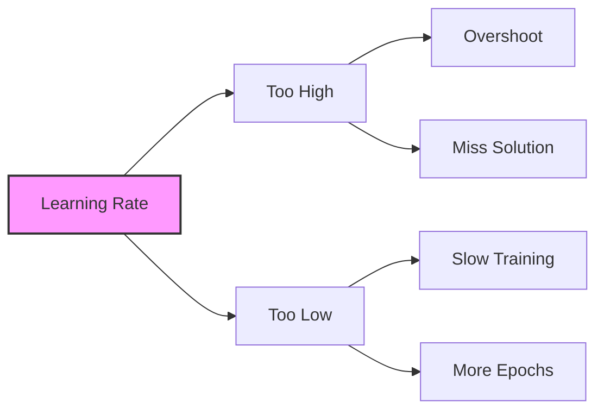
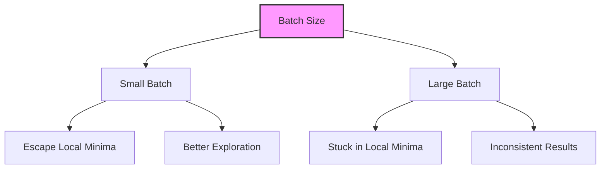
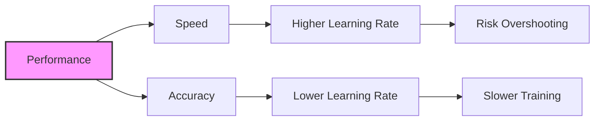
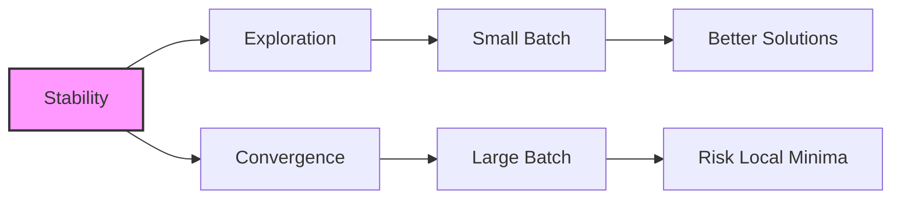

# Tuning Neural Networks - Learning Rate và Batch Size

## 1. Tổng quan về Gradient Descent

## 2. Learning Rate

### 2.1 Khái niệm

### 2.2 Ảnh hưởng:
1. **Learning Rate Cao:**
   - Nhảy quá xa giữa các steps
   - Có thể bỏ qua giải pháp tối ưu
   - Không ổn định trong training

2. **Learning Rate Thấp:**
   - Training chậm hơn
   - Cần nhiều epochs hơn
   - Tốn thời gian và tài nguyên

## 3. Batch Size

### 3.1 Quan hệ với Local Minima

### 3.2 Đặc điểm:
1. **Batch Size Nhỏ:**
   - Dễ thoát local minima
   - Linh hoạt trong exploration
   - Kết quả ổn định hơn

2. **Batch Size Lớn:**
   - Dễ mắc kẹt tại local minima
   - Kết quả không nhất quán
   - Random convergence

## 4. Mối quan hệ và Trade-offs

### 4.1 Learning Rate vs Performance

### 4.2 Batch Size vs Stability

## 5. Lưu ý quan trọng cho kỳ thi

### 5.1 Learning Rate:
1. **High Learning Rate:**
   - CÓ THỂ: Bỏ lỡ giải pháp tối ưu
   - CÓ THỂ: Training không ổn định

2. **Low Learning Rate:**
   - CÓ THỂ: Training quá lâu
   - NHƯNG: Kết quả ổn định hơn

### 5.2 Batch Size:
1. **Small Batch Size:**
   - TỐT: Thoát local minima
   - TỐT: Kết quả nhất quán
   - TỐT: Tìm giải pháp tốt hơn

2. **Large Batch Size:**
   - XẤU: Mắc kẹt local minima
   - XẤU: Kết quả không nhất quán
   - XẤU: Có thể hội tụ sai

## 6. Best Practices

### 6.1 Tuning Strategy:
1. **Bắt đầu với:**
   - Learning rate vừa phải
   - Batch size nhỏ

2. **Điều chỉnh khi:**
   - Training quá chậm → Tăng learning rate
   - Kết quả không ổn định → Giảm batch size

### 6.2 Monitoring:
1. **Theo dõi:**
   - Loss function
   - Convergence speed
   - Result consistency

2. **Red flags:**
   - Kết quả không nhất quán
   - Training không hội tụ
   - Overshooting rõ ràng