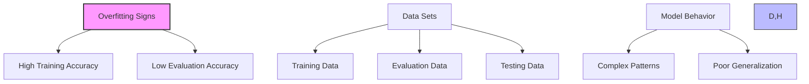
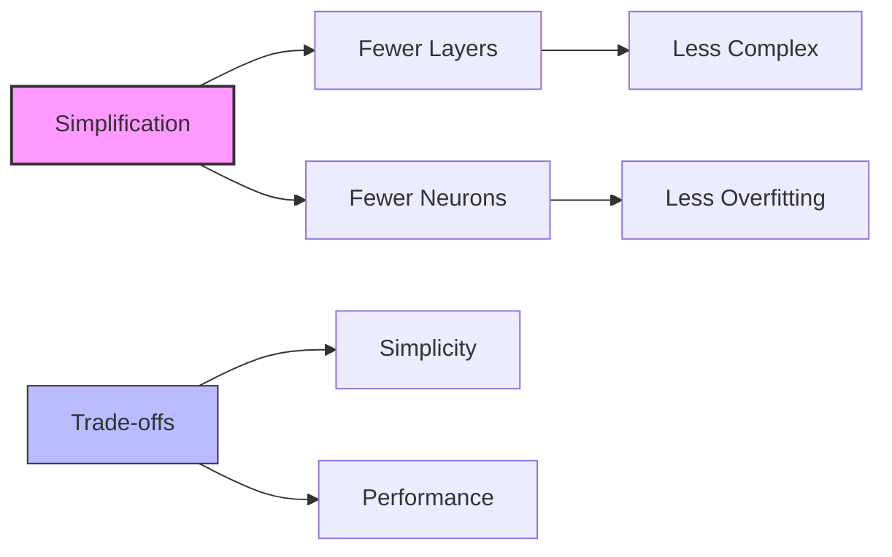
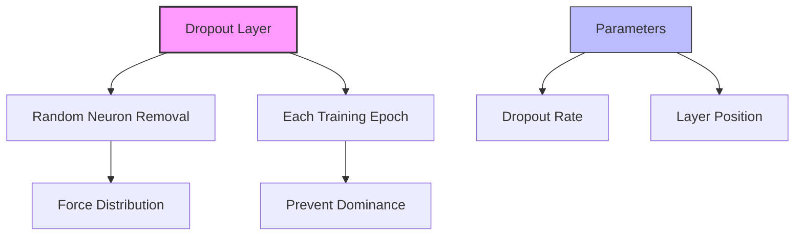
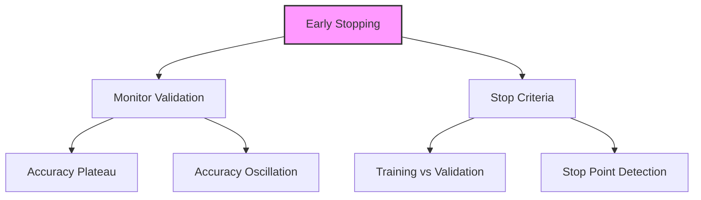

# Regularization Techniques trong Neural Networks

## 1. Tổng quan về Overfitting

## 2. Phân loại dữ liệu

### 2.1 Ba loại dataset:
1. **Training Data:**
   - Dùng cho training
   - Tối ưu weights và biases

2. **Evaluation Data:**
   - Đánh giá trong quá trình training
   - Monitoring overfitting

3. **Testing Data:**
   - Đánh giá mô hình cuối cùng
   - Độc lập với training

## 3. Regularization Techniques

### 3.1 Model Simplification

**Ưu điểm:**
- Đơn giản nhất
- Dễ implement
- Hiệu quả

**Khi nào dùng:**
- Model quá phức tạp
- Overfitting rõ ràng
- Test accuracy thấp

### 3.2 Dropout

**Đặc điểm:**
- Loại bỏ neurons ngẫu nhiên
- Mỗi epoch khác nhau
- Spread learning

**Ứng dụng:**
- CNNs: 50% dropout phổ biến
- Complex networks
- High capacity models

### 3.3 Early Stopping

**Cách hoạt động:**
1. Monitor validation accuracy
2. Detect plateau/oscillation
3. Stop training automatically

**Khi nào áp dụng:**
- Validation accuracy không tăng
- Training accuracy tiếp tục tăng
- Gap widening

## 4. Best Practices

### 4.1 Chọn technique:
1. **Bắt đầu đơn giản:**
   - Thử model simplification
   - Monitor results

2. **Scale up:**
   - Thêm dropout nếu cần
   - Adjust dropout rate

3. **Luôn dùng:**
   - Early stopping
   - Validation monitoring

### 4.2 Monitoring:
1. **Tracking metrics:**
   - Training accuracy
   - Validation accuracy
   - Accuracy gap

2. **Red flags:**
   - Widening gap
   - Oscillating validation
   - Stagnant improvement

## 5. Lưu ý quan trọng cho kỳ thi

### 5.1 Về Overfitting:
1. **Dấu hiệu:**
   - High training accuracy
   - Low validation accuracy
   - Gap increasing

2. **Solutions:**
   - Start simple
   - Add complexity gradually
   - Monitor constantly

### 5.2 Về Techniques:
1. **Model Simplification:**
   - Simplest solution
   - Often overlooked
   - Very effective

2. **Dropout:**
   - Counter-intuitive
   - Very powerful
   - Popular in CNNs

3. **Early Stopping:**
   - Always use
   - Automatic detection
   - No downside