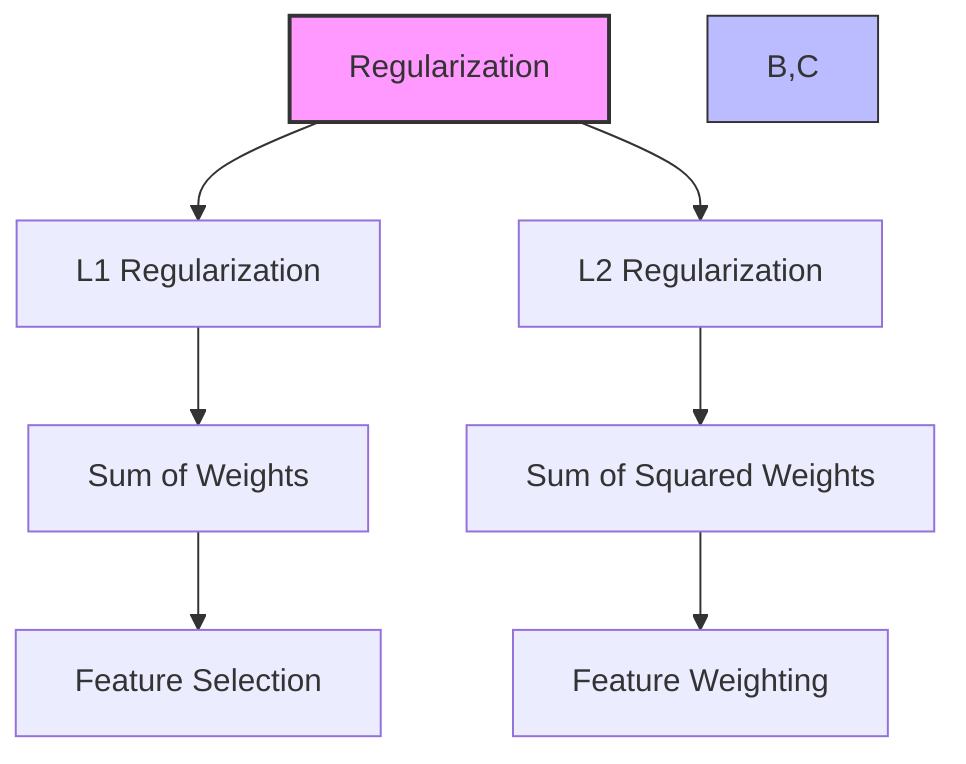
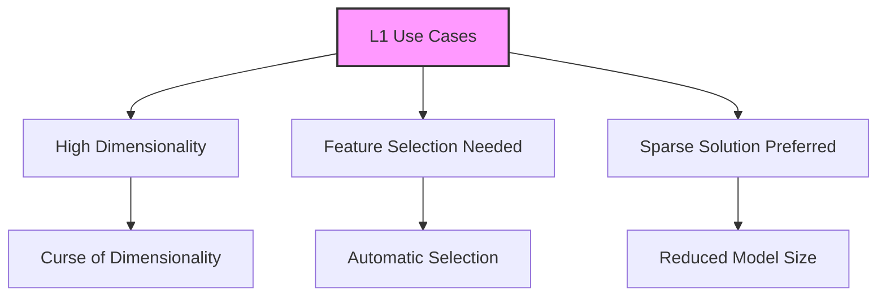
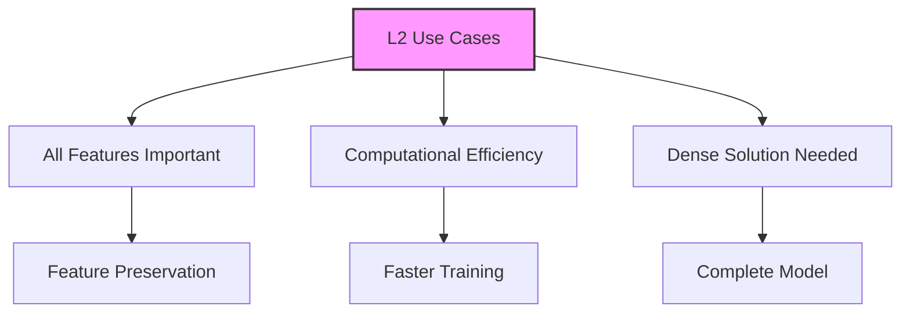
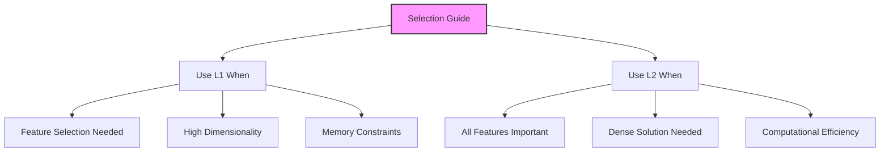

# L1 và L2 Regularization trong Machine Learning

## 1. Tổng quan



## 2. So sánh đặc điểm

### 2.1 Công thức và hình dạng
```mermaid
graph LR
    A[Shape] --> B[L1: Diamond]
    A --> C[L2: Circle]
    
    D[Formula] --> E[L1: Σ|w|]
    D --> F[L2: Σw²]
    
    style A fill:#f9f,stroke:#333,stroke-width:2px
    style D fill:#bbf,stroke:#333
```

## 3. L1 Regularization

### 3.1 Đặc điểm:
1. **Feature Selection:**
   - Có thể đưa weights về 0
   - Loại bỏ features không quan trọng
   - Tự động chọn lọc features

2. **Computational:**
   - Kém hiệu quả hơn
   - Sparse output
   - Giảm dimensionality

### 3.2 Use Cases:


## 4. L2 Regularization

### 4.1 Đặc điểm:
1. **Feature Weighting:**
   - Giữ lại tất cả features
   - Điều chỉnh trọng số
   - Không loại bỏ hoàn toàn

2. **Computational:**
   - Hiệu quả hơn
   - Dense output
   - Duy trì thông tin

### 4.2 Use Cases:


## 5. So sánh hiệu năng

### 5.1 Training Time:
1. **L1:**
   - Chậm hơn trong tính toán
   - Nhanh hơn về tổng thể (ít features)
   - Giảm complexity

2. **L2:**
   - Nhanh hơn trong tính toán
   - Xử lý nhiều features
   - Maintain complexity

### 5.2 Model Output:
1. **L1:**
   - Sparse (nhiều zeros)
   - Feature subset
   - Compact model

2. **L2:**
   - Dense
   - All features
   - Complete model

## 6. Hướng dẫn lựa chọn



### 6.1 Chọn L1 khi:
- Nghi ngờ có nhiều features không quan trọng
- Cần giảm số lượng features
- Sẵn sàng chấp nhận sparse output

### 6.2 Chọn L2 khi:
- Tin rằng mọi feature đều quan trọng
- Cần weighted importance
- Ưu tiên computational efficiency

## 7. Lưu ý quan trọng cho kỳ thi

1. **L1 Regularization:**
   - Feature SELECTION
   - Zeros out weights
   - Sparse output
   - Computationally inefficient

2. **L2 Regularization:**
   - Feature WEIGHTING
   - Keeps all features
   - Dense output
   - Computationally efficient

3. **Trade-offs:**
   - Computational vs Final Model Size
   - Feature Selection vs Feature Weighting
   - Sparse vs Dense Solutions