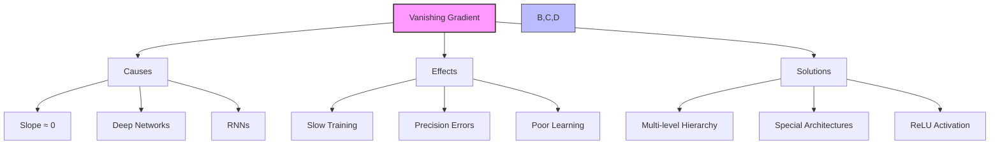
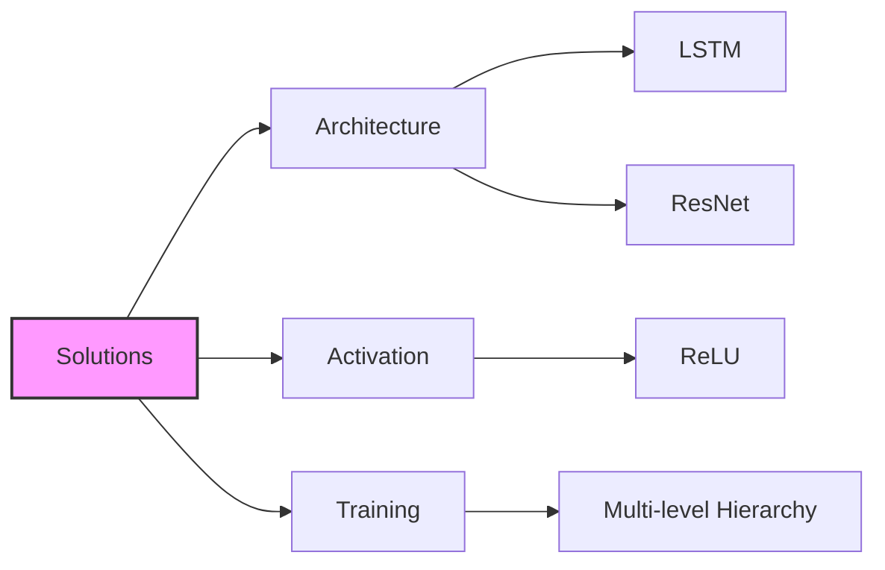
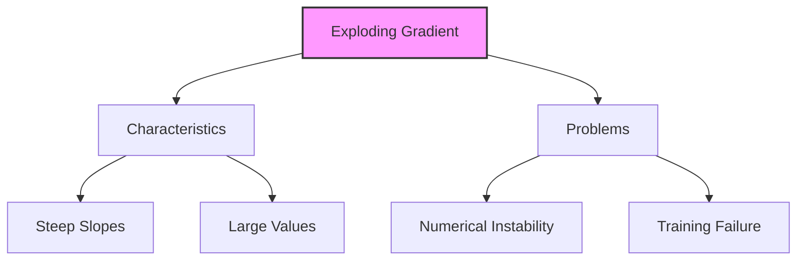
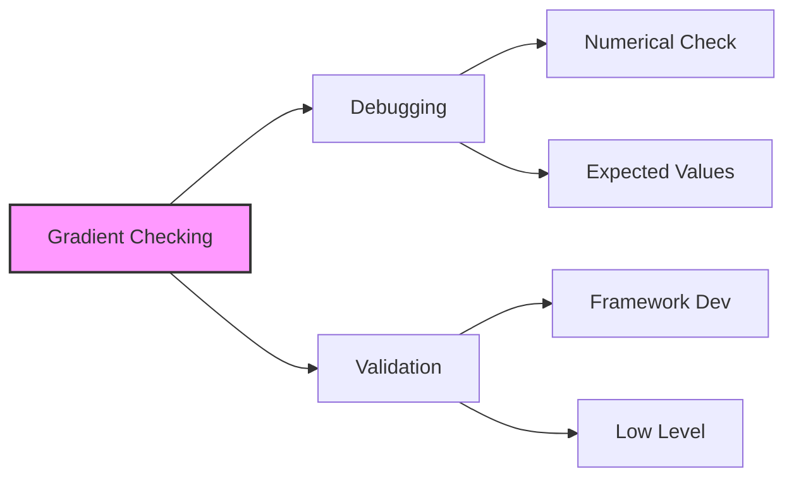

# Gradient Problems trong Neural Networks

## 1. Vanishing Gradient Problem

### 1.1 Nguyên nhân:
- Slope tiến về 0
- Deep networks propagation
- Numerical precision issues

### 1.2 Tác động:
- Training chậm
- CPU precision errors
- Học không hiệu quả

## 2. Giải pháp

### 2.1 Kiến trúc đặc biệt:
1. **LSTM:**
   - Long Short-Term Memory
   - Cho RNNs
   - Memory gates

2. **ResNet:**
   - Residual networks
   - Skip connections
   - Deep learning

### 2.2 Activation Function:
- ReLU
- Positive slope 45°
- Tránh gradient issues

### 2.3 Training Strategy:
- Multi-level hierarchy
- Train từng layer riêng
- Giảm propagation distance

## 3. Exploding Gradient

### 3.1 Đặc điểm:
- Slope rất lớn
- Numerical overflow
- Không ổn định

## 4. Gradient Checking

### 4.1 Mục đích:

### 4.2 Đặc điểm:
- Debugging technique
- Kiểm tra derivatives
- Framework development
- Low-level validation

## 5. Best Practices

### 5.1 Phòng ngừa:
1. **Architecture Choice:**
   - LSTM cho sequences
   - ResNet cho deep networks
   - Proper activation functions

2. **Training Strategy:**
   - Multi-level approach
   - Monitor gradients
   - Early detection

### 5.2 Monitoring:
1. **Signs to Watch:**
   - Training speed
   - Convergence
   - Numerical issues

2. **Action Items:**
   - Adjust architecture
   - Change activation
   - Review training strategy

## 6. Lưu ý quan trọng cho kỳ thi

### 6.1 Vanishing Gradient:
1. **Nhận biết:**
   - Slope ≈ 0
   - Slow training
   - Deep networks

2. **Giải pháp:**
   - ReLU activation
   - LSTM/ResNet
   - Multi-level hierarchy

### 6.2 Gradient Checking:
1. **Mục đích:**
   - Debugging
   - Framework validation
   - Low-level testing

2. **Usage:**
   - Development phase
   - Not production
   - Framework level

### 6.3 Key points:
- Vanishing vs Exploding
- Solutions specific to problems
- Architectural approaches
- Debugging techniques