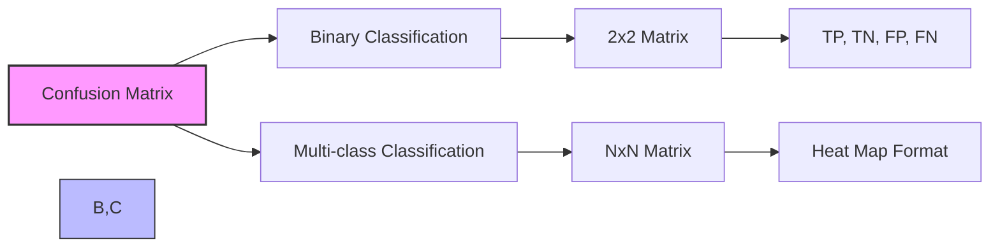
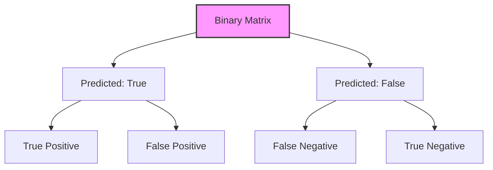
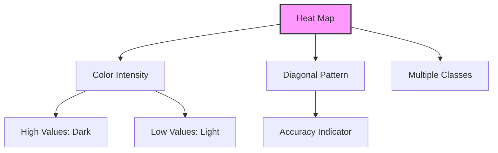
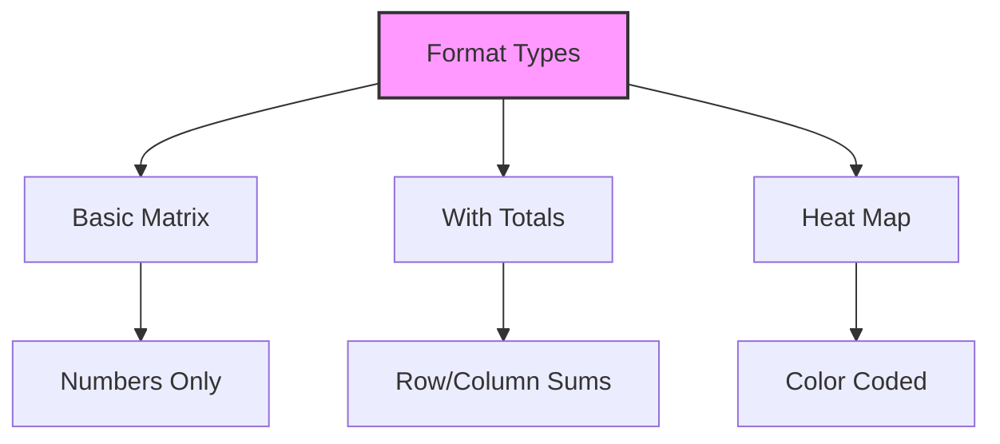

# Confusion Matrix và Đánh giá Mô hình Phân loại

## 1. Khái niệm cơ bản

## 2. Binary Classification Matrix

### 2.1 Cấu trúc cơ bản:

### 2.2 Ví dụ với số liệu:
| Predicted/Actual | Cat | Not Cat |
|-----------------|-----|---------|
| Cat             | 50  | 5       |
| Not Cat         | 10  | 100     |

## 3. Multi-class Matrix

### 3.1 Heat Map Format:
- Sử dụng màu sắc biểu thị số lượng
- Diagonal thể hiện correct predictions
- Độ đậm tương ứng với số lượng

### 3.2 Đặc điểm:

## 4. AWS ML Service Format

### 4.1 Đặc biệt:
1. **Thông tin bổ sung:**
   - F1 score per class
   - True class frequencies
   - Predicted class frequencies

2. **Layout:**
   - Classes on both axes
   - Heat map visualization
   - Additional metrics columns/rows

### 4.2 Đọc hiểu:
- Diagonal: Correct predictions
- Color intensity: Prediction frequency
- Marginal values: Class distributions

## 5. Lưu ý quan trọng

### 5.1 Format variations:

### 5.2 Key points:
1. **Label checking:**
   - Verify axes labels
   - Understand row/column meanings
   - Don't assume standard format

2. **Interpretation:**
   - Focus on diagonal values
   - Compare relative frequencies
   - Consider class imbalance

## 6. Best Practices

### 6.1 Đánh giá:
1. **Look for:**
   - Strong diagonal pattern
   - Low off-diagonal values
   - Balanced predictions

2. **Red flags:**
   - Weak diagonal
   - High false positives/negatives
   - Unbalanced predictions

### 6.2 Analysis:
1. **Metrics derived:**
   - Accuracy
   - Precision/Recall
   - F1 Score

2. **Context matters:**
   - Cost of errors
   - Class distribution
   - Business impact

## 7. Lưu ý cho kỳ thi

1. **Về format:**
   - Check axes labels
   - Understand visualization type
   - Note additional metrics

2. **Về interpretation:**
   - Diagonal significance
   - Color/number meaning
   - Class frequency impact

3. **Về metrics:**
   - Know derived calculations
   - Understand trade-offs
   - Consider context