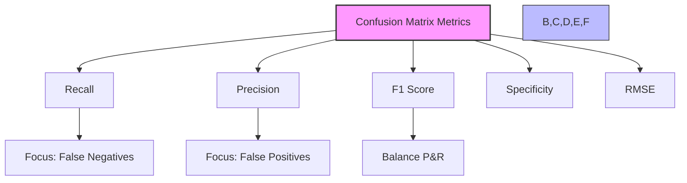
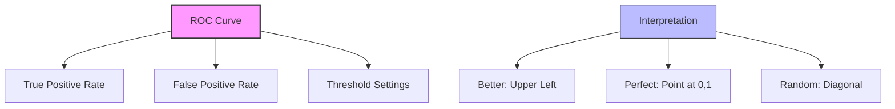
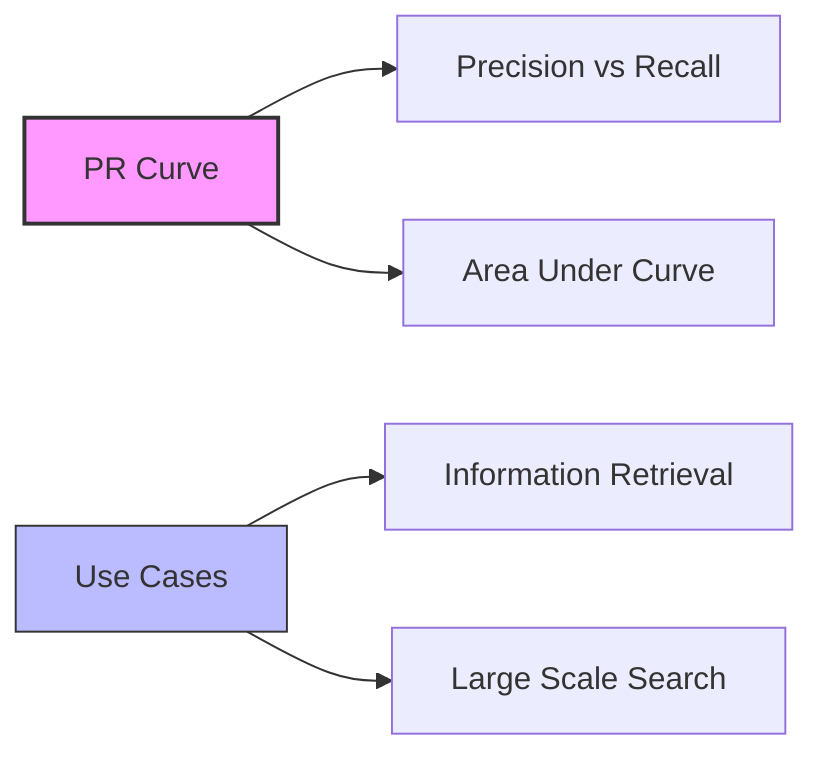

# Đánh giá Model với Confusion Matrix Metrics

## 1. Các Metrics Cơ bản



## 2. Recall (Sensitivity)

### 2.1 Công thức:
```
Recall = TP / (TP + FN)
```

### 2.2 Đặc điểm:
- Tên khác: Sensitivity, True Positive Rate, Completeness
- Focus on False Negatives
- Use case: Fraud Detection

## 3. Precision

### 3.1 Công thức:
```
Precision = TP / (TP + FP)
```

### 3.2 Đặc điểm:
- Tên khác: Correct Positive Rate
- Focus on False Positives
- Use case: Medical Screening, Drug Testing

## 4. F1 Score

### 4.1 Công thức:
```mermaid
graph LR
    A[F1 Score] --> B[2*TP/(2*TP + FP + FN)]
    A --> C[2*P*R/(P + R)]
    
    style A fill:#f9f,stroke:#333,stroke-width:2px
```

### 4.2 Đặc điểm:
- Harmonic mean của Precision và Recall
- Balance giữa P và R
- Use case: Cần cân bằng P&R

## 5. Đường cong ROC và AUC

### 5.1 ROC Curve:


### 5.2 AUC (Area Under Curve):
- Perfect: 1.0
- Random: 0.5
- Interpretable probability

## 6. PR Curve

### 6.1 Đặc điểm:


### 6.2 So với ROC:
- Better for information retrieval
- Handles class imbalance better
- More interpretable for large-scale problems

## 7. Hướng dẫn chọn metric

### 7.1 Focus on False Negatives:
- Use Recall
- Example: Fraud Detection
- Critical missed positives

### 7.2 Focus on False Positives:
- Use Precision
- Example: Drug Testing
- Critical wrong positives

### 7.3 Need Balance:
- Use F1 Score
- Example: General classification
- Equal importance of P&R

## 8. Lưu ý quan trọng cho kỳ thi

### 8.1 Cần nhớ công thức:
1. **Recall:**
   - TP/(TP + FN)
   - Focus: False Negatives

2. **Precision:**
   - TP/(TP + FP)
   - Focus: False Positives

3. **F1 Score:**
   - 2*TP/(2*TP + FP + FN)
   - Balance P&R

### 8.2 Interpret curves:
1. **ROC Curve:**
   - Better: Upper left corner
   - AUC > 0.5 good
   - Random = 0.5

2. **PR Curve:**
   - Higher area better
   - Good for IR
   - Handles imbalance

### 8.3 Use cases:
1. **Fraud:** Recall
2. **Medical:** Precision
3. **Search:** PR Curve
4. **General:** F1 Score