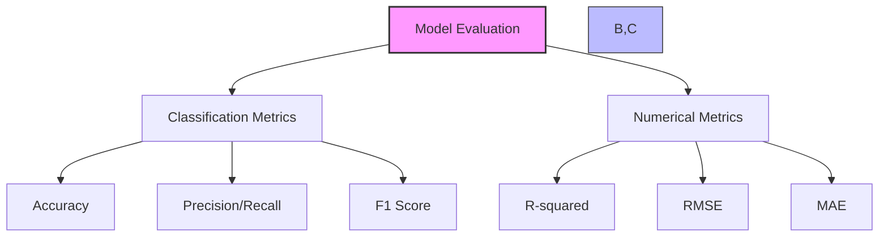
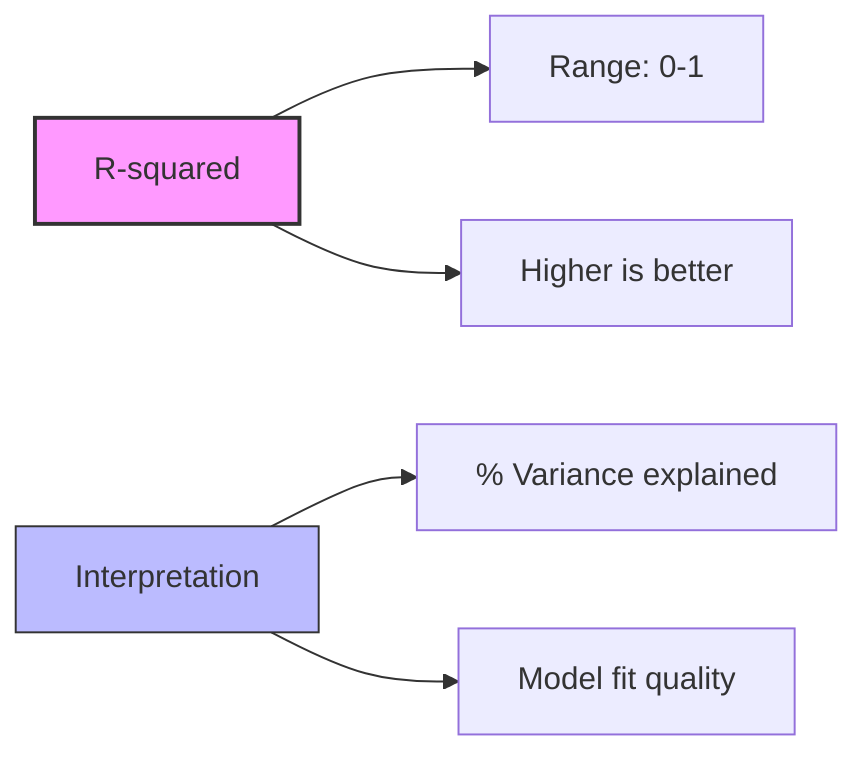
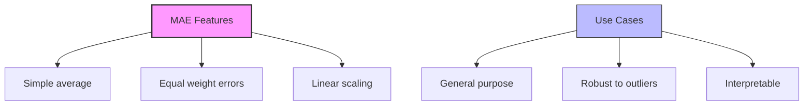

# Metrics cho Numerical Predictions

## 1. So sánh Classification vs Numerical Metrics



## 2. R-squared (R²)

### 2.1 Định nghĩa:
- Square of correlation coefficient
- Between observed và predicted values
- Measure of fit quality

### 2.2 Đặc điểm:


## 3. Root Mean Squared Error (RMSE)

### 3.1 Công thức:
```
RMSE = √(Σ(predicted - actual)²/n)
```

### 3.2 Đặc điểm:
1. **Punishes outliers:**
   - Square of errors
   - Larger penalties
   - Sensitive to extremes

2. **Use cases:**
   - When outliers important
   - Need error magnitude
   - Critical applications

## 4. Mean Absolute Error (MAE)

### 4.1 Công thức:
```
MAE = Σ|predicted - actual|/n
```

### 4.2 Đặc điểm:


## 5. So sánh Metrics

### 5.1 RMSE vs MAE:
1. **RMSE:**
   - Punishes outliers
   - Quadratic scaling
   - Higher values

2. **MAE:**
   - Linear scaling
   - More robust
   - Easier interpretation

### 5.2 R-squared:
- Different perspective
- Relative measure
- Independent of scale

## 6. Hướng dẫn lựa chọn

### 6.1 Use RMSE when:
1. Outliers quan trọng
2. Need sensitivity
3. Critical applications

### 6.2 Use MAE when:
1. Need interpretability
2. Robust measure
3. General purpose

### 6.3 Use R-squared when:
1. Compare models
2. Need relative measure
3. Explain variance

## 7. Lưu ý quan trọng cho kỳ thi

### 7.1 Về Metrics:
1. **Classification:**
   - Accuracy, Precision, Recall
   - Discrete categories
   - Binary/multi-class

2. **Numerical:**
   - RMSE, MAE, R-squared
   - Continuous values
   - Regression problems

### 7.2 Về Use Cases:
1. **RMSE:**
   - Sensitive to outliers
   - Higher penalty for large errors
   - Standard in many fields

2. **MAE:**
   - Simple interpretation
   - Robust measure
   - Average error magnitude

3. **R-squared:**
   - Model comparison
   - Fit quality
   - Scale-independent

### 7.3 Key Differences:
1. **Error Handling:**
   - RMSE: Quadratic
   - MAE: Linear
   - R²: Relative

2. **Interpretation:**
   - RMSE: Same units as data
   - MAE: Same units as data
   - R²: 0-1 scale