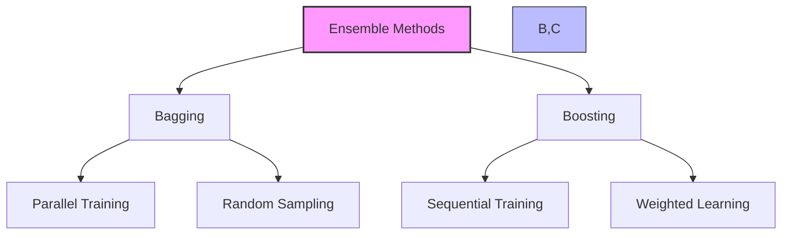
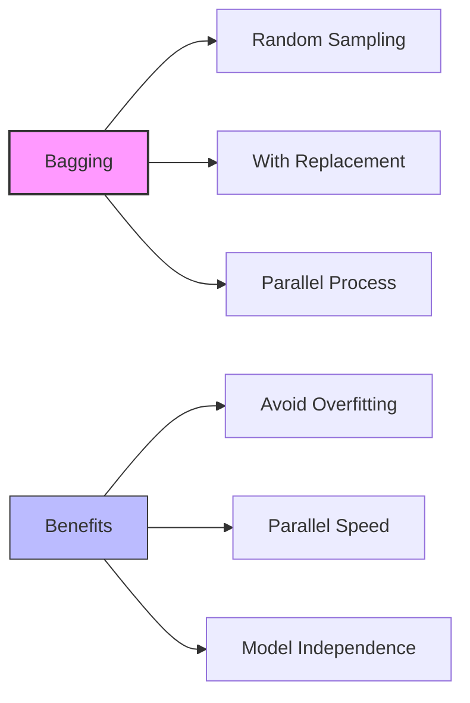
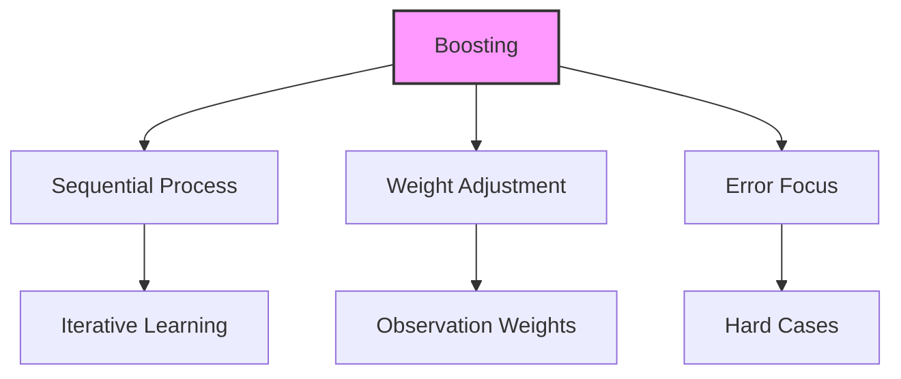
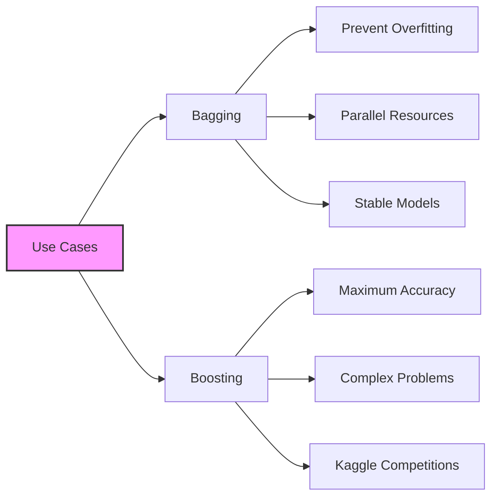

# Ensemble Learning: Bagging và Boosting

## 1. Tổng quan Ensemble Methods

## 2. Bagging (Bootstrap Aggregating)

### 2.1 Đặc điểm:

### 2.2 Quy trình:
1. **Sampling:**
   - Random sampling từ training data
   - With replacement
   - Multiple training sets

2. **Training:**
   - Train models độc lập
   - Parallel processing
   - Combine bằng voting

## 3. Boosting

### 3.1 Đặc điểm:

### 3.2 Quy trình:
1. **Initial:**
   - Equal weights
   - Base model training

2. **Iteration:**
   - Weight adjustment
   - Focus on errors
   - Model refinement

## 4. So sánh

### 4.1 Performance:
1. **Bagging:**
   - Tốt cho overfitting
   - Parallel processing
   - Stable results

2. **Boosting:**
   - Higher accuracy
   - Sequential process
   - Resource intensive

### 4.2 Use Cases:

## 5. Ví dụ thực tế

### 5.1 Random Forest:
1. **Bagging Example:**
   - Multiple decision trees
   - Random feature subsets
   - Voting mechanism

### 5.2 XGBoost:
1. **Boosting Example:**
   - Gradient boosting
   - Popular in competitions
   - High accuracy

## 6. Hướng dẫn lựa chọn

### 6.1 Chọn Bagging khi:
1. **Resources:**
   - Có parallel computing
   - Limited time
   - Need scalability

2. **Problem:**
   - Overfitting concerns
   - Need stability
   - Independent models

### 6.2 Chọn Boosting khi:
1. **Priority:**
   - Maximum accuracy
   - Complex patterns
   - Competition setting

2. **Resources:**
   - Sequential OK
   - Computation available
   - Time not critical

## 7. Lưu ý quan trọng cho kỳ thi

### 7.1 Core Concepts:
1. **Bagging:**
   - Random sampling
   - With replacement
   - Parallel processing
   - Voting mechanism

2. **Boosting:**
   - Sequential learning
   - Weight adjustment
   - Error focus
   - Accuracy priority

### 7.2 Trade-offs:
1. **Performance vs Speed:**
   - Bagging: Faster, parallel
   - Boosting: Better accuracy

2. **Complexity vs Simplicity:**
   - Bagging: Simpler
   - Boosting: More complex

3. **Overfitting vs Accuracy:**
   - Bagging: Better regularization
   - Boosting: Higher accuracy