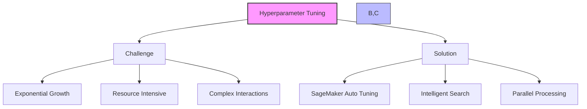
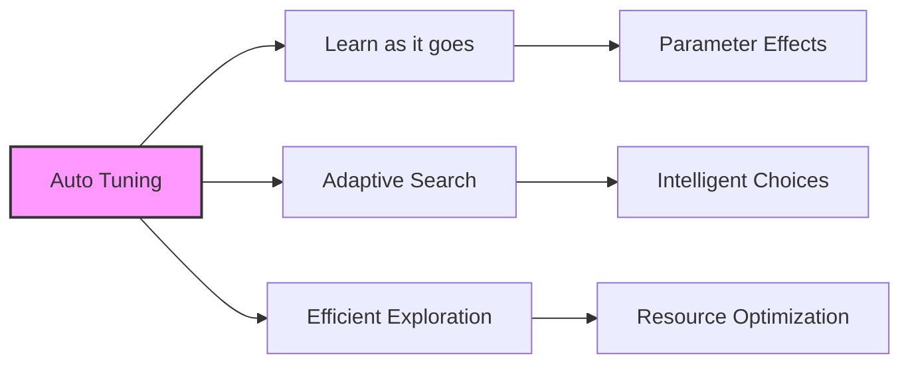
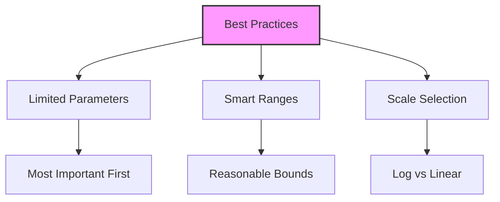
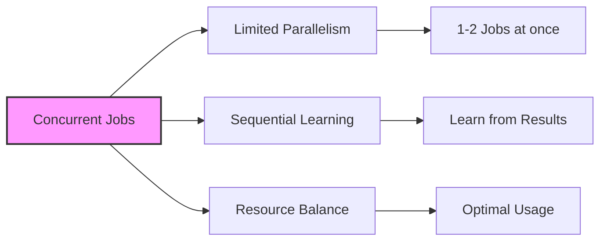
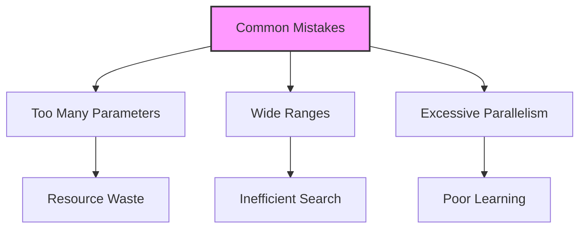

# Automatic Model Tuning trong SageMaker

## 1. Tổng quan về Hyperparameter Tuning

## 2. Đặc điểm và ưu điểm

### 2.1 Smart Learning:

### 2.2 Parallel Processing:
- Spin up multiple instances
- Concurrent training jobs
- Resource management

## 3. Best Practices

### 3.1 Parameter Selection:

### 3.2 Key Guidelines:
1. **Limit Parameters:**
   - Focus on important ones
   - Avoid explosion
   - Iterative approach

2. **Range Selection:**
   - Smaller ranges better
   - Avoid extreme values
   - Use domain knowledge

3. **Scale Choice:**
   - Log scale where appropriate
   - Linear for simple ranges
   - Consider value distribution

## 4. Concurrent Jobs Management

### 4.1 Limitations:

### 4.2 Reasoning:
- Learning requires feedback
- Sequential improvement
- Resource efficiency

## 5. Implementation Tips

### 5.1 Setup:
1. **Definition:**
   - Parameter ranges
   - Optimization metric
   - Resource limits

2. **Configuration:**
   - Job concurrency
   - Maximum trials
   - Time limits

### 5.2 Multi-instance:
1. **Considerations:**
   - Metric aggregation
   - Result reporting
   - Instance coordination

## 6. Common Pitfalls

### 6.1 Avoid:

### 6.2 Solutions:
1. **Parameter Control:**
   - Start small
   - Iterative expansion
   - Focus on impact

2. **Range Management:**
   - Use domain knowledge
   - Start conservative
   - Expand if needed

## 7. Lưu ý quan trọng cho kỳ thi

### 7.1 Must Remember:
1. **Parameter Selection:**
   - Ít parameter một lúc
   - Focus on important ones
   - Iterative approach

2. **Range Control:**
   - Smaller ranges better
   - Use log scale appropriately
   - Avoid extremes

3. **Concurrency:**
   - Limited parallel jobs
   - Sequential learning important
   - 1-2 jobs at once

### 7.2 Best Practices Summary:
1. **DO:**
   - Use small ranges
   - Focus on key parameters
   - Allow sequential learning

2. **DON'T:**
   - Too many parameters
   - Too wide ranges
   - Too much parallelism