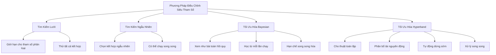

# Điều Chỉnh Siêu Tham Số trong Học Máy

## Giới thiệu

Điều chỉnh siêu tham số là một khía cạnh quan trọng trong việc tối ưu hóa mô hình học máy. Tài liệu này trình bày các kỹ thuật và phương pháp được sử dụng trong quá trình điều chỉnh mô hình tự động.

## Các Kỹ Thuật Chính

### 1. Dừng Sớm (Early Stopping)

- **Mục đích**: Dừng công việc điều chỉnh sớm nếu không cải thiện đáng kể mục tiêu.
- **Lợi ích**:
  - Giảm thời gian tính toán
  - Tránh overfitting
- **Cách sử dụng**: Đặt early stopping thành "auto" trong bảng điều khiển
- **Yêu cầu**: Hoạt động với các thuật toán tạo ra các chỉ số mục tiêu sau mỗi epoch (ví dụ: mạng nơ-ron sâu)

### 2. Khởi Động Nóng (Warm Start)

- **Mục đích**: Sử dụng các công việc điều chỉnh trước đó làm điểm khởi đầu cho các công việc tiếp theo
- **Lợi ích**:
  - Cung cấp thông tin cho các kết hợp siêu tham số trong tương lai
  - Cho phép tiếp tục từ nơi công việc bị gián đoạn
- **Tùy chọn**:
  1. **Dữ liệu và Thuật toán Giống nhau**: Giả định đào tạo trên cùng một bộ dữ liệu qua mỗi lần chạy
  2. **Học Chuyển giao**: Cho phép thử nghiệm với các bộ dữ liệu khác nhau trong khi điều chỉnh siêu tham số

### 3. Giới Hạn Tài Nguyên

- **Mục đích**: Ngăn chặn việc sử dụng tài nguyên và chi phí quá mức
- **Giới hạn mặc định** trên:
  - Số lượng công việc điều chỉnh song song
  - Số lượng siêu tham số đang được điều chỉnh
  - Số lượng công việc đào tạo cho mỗi công việc điều chỉnh
- **Lưu ý**: Tăng giới hạn yêu cầu gửi yêu cầu tăng hạn ngạch từ hỗ trợ AWS

## Các Phương Pháp Điều Chỉnh Siêu Tham Số

### 1. Tìm Kiếm Lưới (Grid Search)

- Giới hạn cho các tham số phân loại
- Tạo lưới của tất cả các kết hợp giá trị tham số có thể
- Thử tất cả các kết hợp (phương pháp vét cạn)
- Có thể rất tốn kém cho nhiều tham số hoặc danh mục

### 2. Tìm Kiếm Ngẫu Nhiên (Random Search)

- Chọn ngẫu nhiên các kết hợp tham số
- Không phụ thuộc vào các lần chạy trước
- Có thể chạy các lần lặp song song
- Hiệu quả nhưng có thể không cung cấp kết quả tối ưu

### 3. Tối Ưu Hóa Bayesian (Bayesian Optimization)

- Xem việc điều chỉnh như một bài toán hồi quy
- Học từ mỗi lần chạy để hội tụ về các giá trị tối ưu
- Hội tụ thông minh hơn
- Khả năng song song hóa hạn chế
- Có thể mất nhiều thời gian hơn do tính chất tuần tự

### 4. Tối Ưu Hóa Hyperband (Hyperband Optimization)

- Phù hợp cho các thuật toán công bố kết quả theo từng bước (ví dụ: mạng nơ-ron)
- Đặc điểm:
  - Phân bổ tài nguyên động
  - Tự động dừng sớm
  - Xử lý song song
- Nhanh hơn so với tìm kiếm ngẫu nhiên hoặc tối ưu hóa Bayesian

## Kết luận

Hiểu các kỹ thuật và phương pháp điều chỉnh siêu tham số này là rất quan trọng để tối ưu hóa mô hình một cách hiệu quả. Việc lựa chọn phương pháp phụ thuộc vào thuật toán cụ thể, tài nguyên có sẵn và cân bằng mong muốn giữa tốc độ và chất lượng tối ưu hóa.
