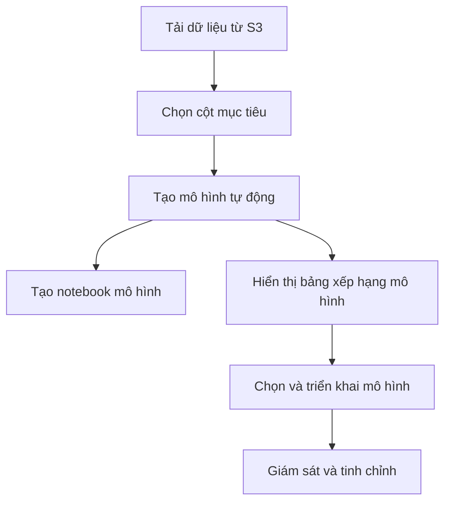

# Điều Chỉnh Siêu Tham Số và SageMaker Autopilot trong Học Máy

[Phần nội dung trước đó giữ nguyên]

## SageMaker Autopilot

### Giới thiệu

SageMaker Autopilot là một công cụ AutoML (Học Máy Tự động) trong AWS SageMaker. Nó tự động hóa quá trình lựa chọn thuật toán, tiền xử lý dữ liệu, và điều chỉnh mô hình, giúp tạo ra mô hình tối ưu với ít can thiệp của con người.

### Quy trình làm việc

1. Tải dữ liệu từ S3
2. Chọn cột mục tiêu để dự đoán
3. Tự động tạo mô hình
4. Tạo notebook mô hình để kiểm tra và tinh chỉnh
5. Hiển thị bảng xếp hạng mô hình
6. Chọn và triển khai mô hình
7. Giám sát và tinh chỉnh nếu cần

### Các loại vấn đề hỗ trợ

1. Phân loại nhị phân
2. Phân loại đa lớp
3. Hồi quy

### Định dạng dữ liệu đầu vào

- Dữ liệu dạng bảng
- CSV
- Parquet

### Chế độ đào tạo

1. **Tối ưu hóa siêu tham số (HPO)**
   - Tự động chọn thuật toán phù hợp (Linear Learner, XGBoost, Deep Learning)
   - Tự động xác định phạm vi siêu tham số tốt nhất
   - Chạy tối đa 100 thử nghiệm
   - Sử dụng tối ưu hóa Bayesian cho dữ liệu < 100MB
   - Sử dụng tối ưu hóa đa độ tin cậy cho dữ liệu > 100MB

2. **Ensemble**
   - Sử dụng thư viện Autogluon
   - Đào tạo nhiều mô hình cơ sở cùng lúc
   - Bao gồm các phương pháp dựa trên cây và mạng nơ-ron
   - Chạy 10 thử nghiệm và kết hợp thành ensemble

3. **Auto**
   - Sử dụng HPO cho dữ liệu > 100MB
   - Sử dụng Ensemble cho dữ liệu < 100MB
   - Mặc định sử dụng HPO nếu không xác định được kích thước dữ liệu

### Tích hợp với SageMaker Clarify

SageMaker Clarify cung cấp tính minh bạch cho các mô hình được tạo bởi Autopilot:

- Xác định mức đóng góp của các đặc trưng vào từng dự đoán
- Giúp phát hiện và giải quyết vấn đề thiên lệch trong dữ liệu
- Sử dụng giá trị Shapley để gán giá trị quan trọng cho mỗi đặc trưng

### Lưu ý quan trọng

- Autopilot cho phép kiểm soát quá trình học máy ở nhiều mức độ khác nhau
- Có thể sử dụng với hoặc không có code
- Quan trọng để hiểu và kiểm tra mô hình được tạo tự động để đảm bảo tính đạo đức và tránh thiên lệch không mong muốn

## Kết luận

SageMaker Autopilot và các kỹ thuật điều chỉnh siêu tham số cung cấp công cụ mạnh mẽ để tự động hóa và tối ưu hóa quá trình học máy. Tuy nhiên, việc hiểu rõ cách thức hoạt động của các công cụ này và áp dụng đánh giá của con người vẫn rất quan trọng để đảm bảo kết quả chính xác và đáng tin cậy.
